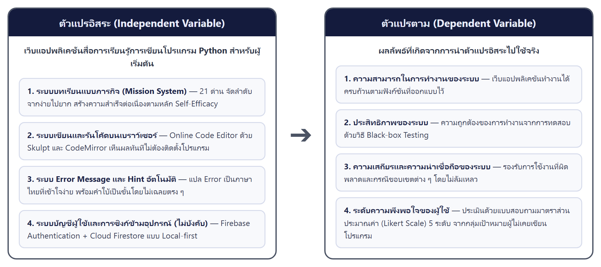

# บทที่ 1

# บทนำ

## 1. ความเป็นมาและความสำคัญของโครงงาน

ปัจจุบันทักษะดิจิทัลมีความสำคัญอย่างมากต่อการประกอบอาชีพและการพัฒนาตนเอง ภาษาโปรแกรม Python จึงได้รับความนิยมอย่างกว้างขวางในฐานะภาษาที่เหมาะสมสำหรับผู้เริ่มต้น อย่างไรก็ตาม ผู้เริ่มต้นจำนวนมากยังคงเลิกเรียนกลางคัน โดยมักไม่ได้เกิดจากความสามารถ แต่เกิดจากอุปสรรคในช่วงแรกของการเรียนรู้ ได้แก่ ความสับสนเมื่อพบ Error ซึ่งระบบทั่วไปแสดงเป็นภาษาอังกฤษทางเทคนิคที่ผู้เริ่มต้นเข้าใจได้ยาก ความกลัวการทำผิดที่ทำให้ผู้เรียนไม่กล้าลงมือเขียนโค้ดด้วยตนเอง และการเรียนแบบทำตามอย่างเดียวจนไม่ได้ฝึกคิดเอง ทำให้เขียนโปรแกรมเองไม่ได้เมื่อไม่มีแบบอย่างให้ดู (Tutorial Hell) อุปสรรคเหล่านี้บั่นทอนความเชื่อมั่นของผู้เรียน และทำให้จำนวนไม่น้อยล้มเลิกก่อนจะค้นพบว่าตนเองทำได้จริง

จากปัญหาดังกล่าว คณะผู้จัดทำจึงพัฒนาเว็บแอปพลิเคชันสอนภาษา Python ที่รันโค้ดบนเบราว์เซอร์ได้ทันทีโดยไม่ต้องติดตั้งโปรแกรม ด้วยเทคโนโลยี Skulpt เพื่อลดอุปสรรคในการเริ่มต้น พร้อมระบบแปล Error เป็นภาษาที่เข้าใจง่ายและชี้แนะแนวทางแก้ไข โดยยังคงให้ผู้เรียนคิดวิธีแก้ด้วยตนเอง แทนการแสดงข้อความทางเทคนิคที่ซับซ้อน เนื้อหาออกแบบในรูปแบบภารกิจ (Mission) ที่แบ่งเป็นภารกิจย่อยซึ่งมุ่งเน้นแนวคิดทีละหนึ่งอย่างและจบลงด้วยความสำเร็จเล็ก ๆ เพื่อค่อย ๆ สร้างความเชื่อมั่นให้ผู้เรียนทีละขั้น อีกทั้งกำหนดให้ทุกภารกิจมีส่วนที่ผู้เรียนต้องลงมือเขียนเอง เพื่อให้ได้ฝึกคิดตั้งแต่ต้นและไม่ติดอยู่กับการทำตามเพียงอย่างเดียว ประกอบกับระบบ Hint ที่ช่วยเมื่อติดขัดโดยไม่เปิดเผยคำตอบโดยตรง ทั้งหมดนี้มุ่งให้ผู้เรียนผ่านช่วงเปราะบางของการเริ่มต้นไปได้โดยไม่ล้มเลิก และเชื่อมั่นว่าตนเองเรียนรู้ต่อไปได้ด้วยตนเอง

ดังนั้น ผู้จัดทำจึงเสนอโครงงานที่ต้องการพัฒนาชื่อว่า **"เว็บแอปพลิเคชันสื่อการเรียนรู้การเขียนโปรแกรม Python สำหรับผู้เริ่มต้น"** ขึ้น

## 2. วัตถุประสงค์ของโครงงาน

2.1 เพื่อพัฒนาเว็บแอปพลิเคชันสื่อการเรียนรู้การเขียนโปรแกรม Python สำหรับผู้เริ่มต้น

2.2 เพื่อทดสอบประสิทธิภาพของเว็บแอปพลิเคชันสื่อการเรียนรู้การเขียนโปรแกรม Python สำหรับผู้เริ่มต้น ที่สร้างขึ้น

2.3 เพื่อศึกษาระดับความพึงพอใจของผู้ใช้งานทั้งหมดที่มีต่อเว็บแอปพลิเคชันสื่อการเรียนรู้การเขียนโปรแกรม Python สำหรับผู้เริ่มต้น

## 3. ขอบเขตของโครงงาน

### 3.1 ด้านฟังก์ชัน/ความสามารถ

เว็บแอปพลิเคชันสื่อการเรียนรู้การเขียนโปรแกรม Python สำหรับผู้เริ่มต้น เป็นเว็บแอปพลิเคชันประสบการณ์การเรียนรู้ภาษา Python สำหรับผู้เริ่มต้นที่ไม่เคยเขียนโปรแกรมมาก่อน ออกแบบให้ทำงานได้ครบถ้วนในเบราว์เซอร์โดยไม่ต้องติดตั้งซอฟต์แวร์ใด ๆ มีฟังก์ชันหลัก 5 ด้าน ได้แก่ ระบบบทเรียน (Mission System) ระบบ Code Editor ระบบ Error Message และ Hint ระบบติดตามความก้าวหน้า และระบบบัญชีผู้ใช้กับการซิงก์ข้อมูลข้ามอุปกรณ์แบบไม่บังคับ

**3.1.1 ระบบบทเรียน (Mission System)**

ระบบบทเรียนแบ่งออกทั้งหมดเป็นด่านปฐมนิเทศ 1 ด่าน ตามด้วย 5 Module รวม 15 Mission 4 Mini Project และ 1 Capstone Project รวมทั้งสิ้น 21 ด่าน ครอบคลุมเนื้อหาพื้นฐานภาษา Python ตั้งแต่การแสดงผล การรับข้อมูล การตัดสินใจ การวนซ้ำ ฟังก์ชัน และการจัดการข้อมูล แต่ละ Module ออกแบบให้ผู้เรียนสามารถตอบได้ว่า ตอนนี้เราสร้างอะไรได้แล้ว

1) ด่านปฐมนิเทศ และ Mission 15 บท แบ่งเป็น 5 Module

ก่อนเข้าสู่เนื้อหาการเขียนโปรแกรม ผู้เรียนจะผ่านด่านปฐมนิเทศ (Module 0) ซึ่งสอนเฉพาะการใช้งานหน้าจอและเครื่องมือ ยังไม่มีแนวคิดโค้ดใด ๆ เพื่อแยกภาระ "เรียนรู้เครื่องมือ" ออกจาก "เรียนรู้แนวคิด" จากนั้นระบบบทเรียน 15 Mission จัดกลุ่มเป็น 5 Module ตามแนวคิดหลักที่ผู้เรียนจะได้รับ โดยแต่ละ Module ประกอบด้วย 3 Mission และ Module 1–4 มี Mini Project ละ 1 ชิ้น (Module 5 ไม่มี Mini Project)

1.1) Module 1: First Contact พูดได้ — สอนแนวคิดพื้นฐาน 3 อย่าง ได้แก่ print() (Mission 1) variable (Mission 2) และ input() (Mission 3) เมื่อจบ Module ผู้เรียนสามารถสร้างโปรแกรมที่รับและแสดงข้อมูลได้ Mini Project คือโปรแกรมแนะนำตัว

1.2) Module 2: ตัวเลขและการคำนวณ — สอนการจัดการตัวเลข ได้แก่ การแปลงชนิดข้อมูล int/float/str (Mission 4) ตัวดำเนินการคำนวณ +, -, *, /, % (Mission 5) และ f-string (Mission 6) เมื่อจบ Module ผู้เรียนสามารถรับตัวเลขมาคำนวณและแสดงผลได้ Mini Project คือเครื่องคำนวณ BMI

1.3) Module 3: การตัดสินใจ — สอนการเขียนเงื่อนไข ได้แก่ if (Mission 7) else (Mission 8) และ elif (Mission 9) เมื่อจบ Module ผู้เรียนสามารถเขียนโปรแกรมที่ตอบสนองต่างกันตามสถานการณ์ได้ Mini Project คือโปรแกรมตัดเกรด

1.4) Module 4: การวนซ้ำและลิสต์ — สอนการวนซ้ำและเก็บข้อมูลเป็นชุด ได้แก่ for/range (Mission 10) while (Mission 11) และ list (Mission 12) เมื่อจบ Module ผู้เรียนสามารถสั่งให้โปรแกรมทำงานซ้ำและจัดการข้อมูลหลายชิ้นได้ Mini Project คือโปรแกรมหาผลรวมและค่าเฉลี่ย

1.5) Module 5: ฟังก์ชันและการรวมร่าง — สอนการสร้างฟังก์ชัน ได้แก่ การนิยามฟังก์ชันด้วย def (Mission 13) parameter และ return (Mission 14) และการรวมทุกแนวคิดเข้าด้วยกัน (Mission 15) เมื่อจบ Module ผู้เรียนสามารถเขียนฟังก์ชันที่นำกลับมาใช้ซ้ำและรวมแนวคิดต่าง ๆ ได้

2) รูปแบบบทเรียน (Mission Template)

แต่ละ Mission ออกแบบตาม Template มาตรฐาน 6 ขั้นตอนเหมือนกันทุกบท เพื่อให้ผู้เรียนคุ้นเคยและไม่สับสน

2.1) ขั้นตอนที่ 1 Hook — ประโยคกระตุ้นความสนใจ 1–2 ประโยค บอกว่าทำไมเรื่องนี้จึงสำคัญ และเชื่อมโยงกับสิ่งที่ผู้เรียนรู้อยู่แล้ว

2.2) ขั้นตอนที่ 2 Show — โค้ดตัวอย่างที่ทำงานได้จริงทันที ผู้เรียนสามารถกด Run เพื่อเห็นผลลัพธ์ก่อนจะต้องเขียนเอง

2.3) ขั้นตอนที่ 3 Explain — คำอธิบายสั้น ตรงประเด็น อธิบายว่าโค้ดแต่ละส่วนทำงานอย่างไร ใช้ภาษาที่ผู้เริ่มต้นเข้าใจได้

2.4) ขั้นตอนที่ 4 Task — สิ่งที่ผู้เรียนต้องลงมือทำด้วยตนเอง เป็นการปรับเปลี่ยนหรือเพิ่มเติมจากโค้ดตัวอย่าง บังคับให้ผู้เรียนคิดและเขียนเอง

2.5) ขั้นตอนที่ 5 Hint — คำใบ้ที่ซ่อนอยู่ ผู้เรียนกดเพื่อดูได้เมื่อต้องการ และระบบจะแสดงโดยอัตโนมัติเมื่อพบ Error เดิมซ้ำติดต่อกันครบตามกำหนด

2.6) ขั้นตอนที่ 6 Win Message — ข้อความแสดงความสำเร็จที่ออกแบบมาเพื่อเสริมสร้างความมั่นใจของผู้เรียน เช่น "คุณเพิ่งสั่งคอมพิวเตอร์ได้เป็นครั้งแรก"

3) Mini Project 4 ชิ้น

เมื่อผู้เรียนผ่านครบ 3 Mission ในแต่ละ Module (Module 1–4) จะได้ทำ Mini Project ซึ่งเป็นโปรแกรมขนาดเล็กที่ต้องนำแนวคิดใน Module นั้นมาใช้รวมกัน ได้แก่ โปรแกรมแนะนำตัว เครื่องคำนวณ BMI โปรแกรมตัดเกรด และโปรแกรมหาผลรวมและค่าเฉลี่ย ระดับ Scaffolding จะค่อย ๆ ลดลงจาก Mini Project แรกที่ให้ตัวอย่างครบถ้วน ไปจนถึงชิ้นท้าย ๆ ที่ให้ผู้เรียนคิดเองมากขึ้น

4) Capstone Project

เมื่อผู้เรียนผ่านครบ 5 Module (15 Mission และ 4 Mini Project) จะได้รับการปลดล็อก Capstone Project ซึ่งเป็นโปรเจกต์ขนาดใหญ่ที่ผู้เรียนเขียนโปรแกรมจริงได้ด้วยตนเอง ไม่มีโค้ดตั้งต้น ผู้เรียนกำหนดหัวข้อ เป้าหมาย และวิธีการทั้งหมดเอง

**3.1.2 ระบบ Code Editor ในเบราว์เซอร์**

ระบบ Code Editor ช่วยให้ผู้เรียนสามารถเขียนและรันโค้ด Python ได้ในเบราว์เซอร์โดยตรง โดยไม่ต้องติดตั้งโปรแกรมใด ๆ หน้าจอแบ่งเป็น 2 ส่วนหลักที่แสดงพร้อมกัน ได้แก่ ส่วน Code Editor และส่วน Output Panel

1) ส่วน Code Editor — ช่องสำหรับพิมพ์โค้ด Python รองรับ Syntax Highlighting (แสดงโค้ดด้วยสีต่าง ๆ ตามประเภทคำสั่ง) และใช้ฟอนต์ monospace เพื่อให้อ่านโค้ดได้ง่าย รองรับการไฮไลต์บรรทัดที่มี Error ด้วยสีแดงอ่อน

2) ส่วน Output Panel — แสดงผลลัพธ์ของโค้ดทันทีเมื่อกด Run หากโค้ดใช้คำสั่ง input() ระบบจะแสดงช่องกรอกข้อมูลโดยอัตโนมัติ และหากมี Error จะแสดง Error Message ฉบับภาษาคนที่ระบบแปลให้ แทนที่จะแสดง Python Error ดิบ

3) ปุ่ม Run — ปุ่มขนาดใหญ่ กดง่าย อยู่ในตำแหน่งที่มองเห็นชัดเจน รองรับ shortcut Ctrl+Enter (หรือ Cmd+Enter บน Mac) เพื่อให้ผู้เรียนรันโค้ดได้สะดวกโดยไม่ต้องย้ายมือออกจากแป้นพิมพ์

4) Task Bar — แถบแสดงโจทย์ที่ติดอยู่ด้านล่างตลอดเวลา บอกชัดเจนว่าผู้เรียนต้องทำอะไรใน Task นั้น ไม่ต้องเลื่อนหน้าจอขึ้นไปอ่านโจทย์ใหม่

**3.1.3 ระบบ Error Message และ Hint**

ระบบ Error Message ทำหน้าที่รับ Python Error ดิบที่เกิดจากการรันโค้ด แล้วแปลงเป็นข้อความที่ผู้เรียนอ่านเข้าใจได้ พร้อมชี้แนะวิธีแก้ไข โดยออกแบบให้ผู้เรียนรู้สึกว่า Error คือสิ่งที่แก้ได้ ไม่ใช่สิ่งที่บ่งบอกว่าตนเองล้มเหลว

1) ระบบ Error Message และ Hint ออกแบบตามหลักการ "Error คือข้อมูล ไม่ใช่ความล้มเหลว" เพื่อให้ผู้เรียนสามารถอ่านและแก้ไข Error ได้ด้วยตนเอง แทนที่จะรู้สึกกลัวหรือท้อแท้

1.1) รูปแบบการแสดงผล Error — เมื่อโค้ดมีข้อผิดพลาด ระบบจะไม่แสดง Python Error ดิบ แต่จะแปลเป็นข้อความภาษาคนที่เข้าใจง่าย พร้อมชี้แนะแนวทางแก้ไขโดยไม่บอกคำตอบตรง ๆ และใช้สีส้ม (ไม่ใช่สีแดง) เพื่อลดความรู้สึกน่ากลัว

1.2) จำนวน Error ที่รองรับ — ระบบรองรับการแปล Error รูปแบบที่ผู้เริ่มต้นพบบ่อย ครอบคลุมทั้ง 5 Module ตั้งแต่ SyntaxError (เช่น ลืมปิดเครื่องหมายคำพูด) NameError (เรียกตัวแปรที่ยังไม่ได้ประกาศ) TypeError (ใช้ชนิดข้อมูลผิด) IndentationError ไปจนถึง Error ที่เกี่ยวกับ list และฟังก์ชัน

**3.1.4 ระบบติดตามความก้าวหน้า (Progress Tracking)**

ระบบติดตามความก้าวหน้าช่วยให้ผู้เรียนทราบว่าตนเองอยู่ที่ไหน และจัดการการเรียนได้อย่างต่อเนื่องโดยไม่สูญเสียข้อมูล แม้จะปิดหน้าต่างหรือออกจากระบบ

1) Mission Map — หน้าแผนที่ภาพรวมของ Mission ทั้งหมด Mission ที่ยังไม่ถึงจะล็อกอยู่จนกว่าจะผ่าน Mission ก่อนหน้า ผู้เรียนสามารถย้อนกลับไป Mission ที่ผ่านแล้วได้โดยคลิกเอง Mini Project จะล็อกจนกว่าจะผ่านครบ 3 Mission ใน Module นั้น Capstone จะล็อกจนกว่าจะผ่านครบ 5 Module

2) Progress Bar — แสดงความก้าวหน้าเป็น dot ที่ค่อย ๆ เต็มขึ้นตามจำนวน Mission ที่ผ่าน โดยจงใจไม่แสดงตัวเลขรวม (เช่น 3/15) เพื่อให้ผู้เรียนโฟกัสกับ Mission ที่กำลังทำอยู่ แทนที่จะรู้สึกท้อกับระยะทางที่เหลือ

3) Auto Save — ระบบบันทึกความก้าวหน้าอัตโนมัติ โดยไม่มีปุ่มบันทึก การบันทึกเกิดขึ้นทุกครั้งที่ผู้เรียนจบ Mission กด Run หรือออกจากหน้า ผู้เรียนจึงไม่ต้องกังวลหรือคิดเรื่องการบันทึกข้อมูลเอง

**3.1.5 ระบบบัญชีผู้ใช้และการซิงก์ข้อมูลข้ามอุปกรณ์ (Optional Account and Cloud Sync)**

เพิ่มเติมจากการออกแบบเดิม ระบบรองรับการเข้าสู่ระบบแบบไม่บังคับผ่านบัญชี Google หรืออีเมล/รหัสผ่าน (Firebase Authentication) เพื่อให้ผู้เรียนที่ต้องการ สามารถซิงก์ความก้าวหน้าระหว่างหลายอุปกรณ์ได้ผ่าน Cloud Firestore โดยยึดหลัก Local-first คือ localStorage ยังเป็นแหล่งข้อมูลหลักเสมอ ผู้เรียนที่ไม่ต้องการสมัครสมาชิกยังคงเรียนได้ครบทุกด่านตามปกติโดยไม่มีข้อจำกัดใด ๆ

### 3.2 ด้านระดับการเข้าถึง/บทบาทของผู้ใช้

ระบบมีสิทธิ์การใช้งาน 3 ระดับ ได้แก่

1) ผู้เยี่ยมชม (Guest) — เข้าถึงและเรียนรู้เนื้อหาทั้งหมดได้ครบทุกด่านโดยไม่ต้องสมัครสมาชิกหรือล็อกอิน รันโค้ดใน Code Editor และรับ Feedback จากระบบ Error/Hint บันทึกและโหลดความก้าวหน้าผ่าน localStorage ของเครื่องนั้นเท่านั้น

2) สมาชิก (Member) — เข้าสู่ระบบด้วยบัญชี Google หรืออีเมล/รหัสผ่าน เข้าถึงเนื้อหาเหมือนผู้เยี่ยมชมทุกประการ เพิ่มเติมคือความก้าวหน้าซิงก์ข้ามอุปกรณ์ผ่าน Cloud Firestore โดยอ่านและเขียนได้เฉพาะข้อมูลของตนเองเท่านั้น

3) ผู้ดูแลระบบ (Administrator) — เจ้าของโครงงานผู้จัดการโครงสร้างฐานข้อมูลและกฎความปลอดภัยผ่าน Firebase Console โดยตรง ไม่มีช่องทางจัดการผ่านหน้าเว็บของผู้เรียน

### 3.3 ด้านฮาร์ดแวร์ และซอฟต์แวร์

**3.3.1 ด้านฮาร์ดแวร์**

1) คอมพิวเตอร์

2) โน้ตบุ๊ก

**3.3.2 ด้านซอฟต์แวร์**

1) Visual Studio Code

2) GitHub

3) Vercel

4) Firebase (Authentication และ Cloud Firestore)

5) Microsoft Word

6) Microsoft Excel

7) Microsoft PowerPoint

8) Claude

### 3.4 ด้านประชากรและกลุ่มตัวอย่าง

3.4.1 ประชากร — นักศึกษาวิทยาลัยเทคโนโลยีไออาร์พีซีที่ไม่เคยเขียนโปรแกรมมาก่อน

3.4.2 กลุ่มตัวอย่าง — นักศึกษาวิทยาลัยเทคโนโลยีไออาร์พีซี เลือกแบบเจาะจง (Purposive Sampling) โดยเลือกผู้ที่ไม่มีประสบการณ์การเขียนโปรแกรมมาก่อน

### 3.5 ด้านระยะเวลา

8 พฤษภาคม 2569 ถึง 28 กุมภาพันธ์ 2570

### 3.6 ด้านการดำเนินงาน/สถานที่ตั้ง

แผนกคอมพิวเตอร์และธุรกิจดิจิทัล วิทยาลัยเทคโนโลยีไออาร์พีซี

## 4. ตัวแปรที่ศึกษา

### 4.1 ตัวแปรอิสระ

ตัวแปรอิสระ คือ เว็บแอปพลิเคชันสื่อการเรียนรู้การเขียนโปรแกรม Python สำหรับผู้เริ่มต้น ที่ผู้จัดทำพัฒนาขึ้น เพื่อลดอุปสรรคในการเรียนรู้ของผู้ที่ไม่เคยเขียนโปรแกรมมาก่อน ประกอบด้วยฟังก์ชันหลัก 4 ส่วน ได้แก่

4.1.1 ระบบบทเรียนแบบภารกิจ (Mission System) — ระบบจัดลำดับเนื้อหาบทเรียนเป็นภารกิจย่อยตามระดับความยาก ให้ผู้เรียนฝึกปฏิบัติทีละขั้น สร้างความสำเร็จต่อเนื่องตามหลัก Self-Efficacy

4.1.2 ระบบเขียนและรันโค้ด Python บนเบราว์เซอร์ (Online Code Editor ด้วย Skulpt) — ระบบเขียนและรันโค้ด Python ได้ทันทีบนเบราว์เซอร์โดยไม่ต้องติดตั้งโปรแกรมเพิ่มเติม ช่วยให้ผู้เรียนเห็นผลลัพธ์การเขียนโค้ดได้แบบ Real-time

4.1.3 ระบบแจ้งข้อผิดพลาดและคำแนะนำอัตโนมัติ (Error Message และ Hint) — ระบบแปลข้อความ Error ดิบจากตัวแปลภาษา Skulpt ให้เป็นภาษาไทยที่เข้าใจง่าย พร้อมคำแนะนำการแก้ไข ช่วยลดความสับสนและความท้อแท้ของผู้เรียนที่ไม่เคยเขียนโปรแกรมมาก่อน

4.1.4 ระบบบัญชีผู้ใช้และการซิงก์ข้อมูลข้ามอุปกรณ์แบบไม่บังคับ (Optional Account and Cloud Sync) — ระบบเข้าสู่ระบบผ่าน Firebase Authentication ที่ผู้เรียนเลือกใช้ได้เอง เพื่อให้ความก้าวหน้าในการเรียนติดตามตัวผู้เรียนไปยังอุปกรณ์อื่นได้ โดยไม่กระทบผู้เรียนที่ไม่ต้องการสมัครสมาชิก

### 4.2 ตัวแปรตาม

ตัวแปรตาม คือ ผลลัพธ์ที่เกิดจากการนำตัวแปรอิสระไปใช้จริง วัดจากกลุ่มเป้าหมายที่ไม่เคยมีประสบการณ์เขียนโปรแกรมมาก่อน (Beginner) ประกอบด้วย 4 ด้าน ได้แก่

4.2.1 ความสามารถในการทำงานของระบบ — ความสามารถของเว็บแอปพลิเคชันในการทำงานได้ครบถ้วนตามฟังก์ชันที่ออกแบบไว้ในหัวข้อ 4.1

4.2.2 ประสิทธิภาพของระบบ (Black-box Testing) — ผลการทดสอบความถูกต้องของการทำงานของระบบโดยไม่พิจารณาโครงสร้างโค้ดภายใน

4.2.3 ความเสถียรและความน่าเชื่อถือของระบบ — ความสามารถในการรองรับการใช้งานที่ผิดพลาดและกรณีขอบเขตต่าง ๆ โดยไม่ล้มเหลว ทดสอบด้วยการจำลองความผิดพลาดจริงของผู้เริ่มต้นและกรณีขอบเขตของระบบ

4.2.4 ระดับความพึงพอใจของผู้ใช้ (Likert 5 ระดับ) — ความพึงพอใจของกลุ่มเป้าหมาย (ผู้ไม่เคยเขียนโปรแกรมมาก่อน) ที่มีต่อการใช้งานเว็บแอปพลิเคชัน ประเมินผ่านแบบสอบถามมาตราส่วนประมาณค่า 5 ระดับ

## 5. ประโยชน์ที่คาดว่าจะได้รับ

5.1 ได้เว็บแอปพลิเคชันสื่อการเรียนการสอนโปรแกรม Python สำหรับผู้เริ่มต้นที่ช่วยให้ผู้เรียนสามารถเข้าถึงความรู้และเรียนรู้ได้อย่างสะดวกมากยิ่งขึ้น

5.2 ได้ข้อมูลจากการทดสอบการใช้งานเว็บแอปพลิเคชัน เพื่อนำไปปรับปรุงและพัฒนาระบบให้มีประสิทธิภาพและตอบสนองต่อการใช้งานของผู้เรียนได้ดียิ่งขึ้น

5.3 ได้ข้อมูลความพึงพอใจของผู้ใช้งาน ซึ่งสามารถนำมาใช้เป็นแนวทางในการพัฒนาสื่อการเรียนการสอนและเพิ่มความคุ้มค่าในการนำเว็บแอปพลิเคชันไปใช้งานในอนาคต

## 6. คำจำกัดความของคำศัพท์สำคัญ

6.1 การเรียนรู้การเขียนโปรแกรม (Python) หมายถึง การเรียนรู้พื้นฐานภาษา Python ผ่านเว็บแอปพลิเคชันที่พัฒนาขึ้นในโครงงานนี้ ครอบคลุมตั้งแต่การแสดงผล การรับข้อมูล การตัดสินใจ การวนซ้ำ ฟังก์ชัน และการจัดการข้อมูล โดยผู้เรียนลงมือเขียนและรันโค้ดจริงในเบราว์เซอร์

6.2 ผู้เริ่มต้น (Beginner) หมายถึง ผู้เรียนที่ไม่เคยมีประสบการณ์การเขียนโปรแกรมมาก่อน ซึ่งเป็นกลุ่มเป้าหมายหลักของโครงงานนี้ โดยเฉพาะนักศึกษาวิทยาลัยเทคโนโลยีไออาร์พีซีที่ยังไม่เคยเรียนการเขียนโปรแกรม

6.3 การรับรู้ความสามารถของตนเอง (Self-Efficacy) หมายถึง ความเชื่อมั่นของผู้เรียนว่าตนเองสามารถเขียนโปรแกรมได้สำเร็จ ซึ่งโครงงานนี้มุ่งสร้างผ่านการให้ผู้เรียนประสบความสำเร็จในการเขียนโค้ดตั้งแต่บทเรียนแรกและในทุกภารกิจ

## 7. ข้อจำกัด

7.1 ระบบรองรับการใช้งานเฉพาะบน PC และ Notebook เป็นหลัก เนื่องจากไม่ได้ออกแบบหน้าจอโดยเน้นประสบการณ์ใช้งานบนมือถือหรือแท็บเล็ตโดยเฉพาะ (แม้โครงสร้างหน้าจอจะไม่ล้มเหลวเมื่อเปิดบนจอแคบ แต่ยังไม่ใช่ประสบการณ์ที่ออกแบบมาให้เหมาะสมที่สุด)

7.2 ระบบยึดหลัก Local-first คือความก้าวหน้าของผู้เรียนถูกบันทึกในเบราว์เซอร์ของเครื่องนั้นเป็นหลัก (localStorage) ผู้เรียนที่เลือกไม่เข้าสู่ระบบ หากล้างข้อมูลเบราว์เซอร์หรือเปลี่ยนเครื่อง ความก้าวหน้าจะหายไป ส่วนผู้เรียนที่เข้าสู่ระบบด้วยบัญชี (ไม่บังคับ) จะมีความก้าวหน้าซิงก์สำรองไว้บน Cloud Firestore ข้ามอุปกรณ์ได้

## 8. งบประมาณในการดำเนินงาน

8.1 ค่าวัสดุในการสร้างโครงงาน จำนวน 1,817 บาท

1) กระดาษ A4 3 รีม

2) ค่าสมัคร Claude Pro (ผู้ช่วยพัฒนาระบบ) จำนวน 2 เดือน

3) ค่าเข้าเล่มรายงาน จำนวน 2 เล่ม

## 9. กรอบแนวคิดในการจัดทำโครงงาน

จากแนวคิด ทฤษฎี เอกสาร และงานวิจัยที่เกี่ยวข้องที่ได้ศึกษามาข้างต้น คณะผู้จัดทำได้สรุปกรอบแนวคิดสำหรับโครงงานนี้ไว้ดังนี้

**รูปที่ 1.1 กรอบแนวคิดสำหรับการพัฒนาโครงงาน**

### 9.1 ตัวแปรอิสระ/ปัจจัยนวัตกรรม ในเว็บแอปพลิเคชันสื่อการเรียนรู้การเขียนโปรแกรม Python สำหรับผู้เริ่มต้น ประกอบด้วย

9.1.1 ฟังก์ชันระบบบทเรียนแบบภารกิจ (Mission System) — ระบบจัดลำดับเนื้อหาบทเรียนเป็นภารกิจย่อยตามระดับความยาก ให้ผู้เรียนฝึกปฏิบัติทีละขั้น สร้างความสำเร็จต่อเนื่องตามหลัก Self-Efficacy

9.1.2 ฟังก์ชัน Online Python Code Editor (Skulpt) — ระบบเขียนและรันโค้ด Python ได้ทันทีบนเบราว์เซอร์โดยไม่ต้องติดตั้งโปรแกรมเพิ่มเติม ช่วยให้ผู้เรียนเห็นผลลัพธ์การเขียนโค้ดได้แบบ Real-time

9.1.3 ฟังก์ชันระบบ Error Message & Hint อัตโนมัติ — ระบบแปลข้อความ Error ดิบจากตัวแปลภาษา Skulpt ให้เป็นภาษาไทยที่เข้าใจง่าย พร้อมคำแนะนำการแก้ไข ช่วยลดความสับสนและความท้อแท้ของผู้เรียนที่ไม่เคยเขียนโปรแกรมมาก่อน

9.1.4 ฟังก์ชันระบบบัญชีผู้ใช้และการซิงก์ข้อมูลข้ามอุปกรณ์แบบไม่บังคับ (Optional Account and Cloud Sync) — ระบบเข้าสู่ระบบผ่าน Firebase Authentication ที่ผู้เรียนเลือกใช้ได้เอง เพื่อให้ความก้าวหน้าในการเรียนติดตามตัวผู้เรียนไปยังอุปกรณ์อื่นได้ โดยไม่กระทบผู้เรียนที่ไม่ต้องการสมัครสมาชิก

### 9.2 ตัวแปรตาม/ผลลัพธ์ที่คาดว่าจะเกิดขึ้นจากเว็บแอปพลิเคชันสื่อการเรียนรู้การเขียนโปรแกรม Python สำหรับผู้เริ่มต้น ประกอบด้วย

9.2.1 ความสามารถในการทำงานของระบบ (ผลลัพธ์ของระบบ) — ความสามารถของเว็บแอปพลิเคชันในการทำงานได้ครบถ้วนตามฟังก์ชันที่ออกแบบไว้ในหัวข้อ 9.1

9.2.2 ประสิทธิภาพของระบบ (Black-box Testing) — ผลการทดสอบความถูกต้องของการทำงานของระบบโดยไม่พิจารณาโครงสร้างโค้ดภายใน

9.2.3 ความเสถียรและความน่าเชื่อถือของระบบ — ความสามารถในการรองรับการใช้งานที่ผิดพลาดและกรณีขอบเขตต่าง ๆ โดยไม่ล้มเหลว ทดสอบด้วยการจำลองความผิดพลาดจริงของผู้เริ่มต้นและกรณีขอบเขตของระบบ

9.2.4 ระดับความพึงพอใจของผู้ใช้ (Likert 5 ระดับ) — ความพึงพอใจของกลุ่มเป้าหมาย (ผู้ไม่เคยเขียนโปรแกรมมาก่อน) ที่มีต่อการใช้งานเว็บแอปพลิเคชัน ประเมินผ่านแบบสอบถามมาตราส่วนประมาณค่า 5 ระดับ
