# บทที่ 3

# วิธีการดำเนินโครงงาน

โครงงานนี้มีชื่อว่า "เว็บแอปพลิเคชันสื่อการเรียนรู้การเขียนโปรแกรม Python สำหรับผู้เริ่มต้น" จัดอยู่ในประเภทอื่น ๆ (เว็บแอปพลิเคชันสื่อการเรียนรู้) ระเบียบวิธีดำเนินงานประกอบด้วยการวิเคราะห์ความต้องการอย่างครอบคลุมจากการศึกษาอุปสรรคของผู้เริ่มต้นเรียนเขียนโปรแกรมและทฤษฎีการเรียนรู้ที่เกี่ยวข้อง ตามด้วยขั้นตอนการออกแบบและพัฒนาระบบเพื่อสร้างนวัตกรรมที่ตรงตามข้อกำหนดที่ระบุไว้ มีการทดสอบระบบอย่างเป็นระบบระหว่างการพัฒนา และการเก็บรวบรวมข้อมูลการประเมินผลหลังการพัฒนาด้วยแบบทดสอบประสิทธิภาพและแบบสอบถามความพึงพอใจ เพื่อเป็นกรอบสำหรับการเพิ่มประสิทธิภาพระบบในอนาคต โดยขั้นตอนการดำเนินโครงงานทั้งหมดสรุปดังภาพที่ 3.1

**ภาพที่ 3.1 ผังขั้นตอนการทำโครงงานตั้งแต่เริ่มจนจบ**

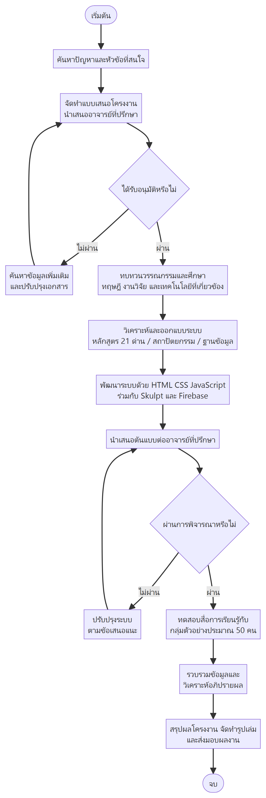

## 1. ขอบเขตการศึกษา

### 1.1 ขอบเขตโครงงาน

เว็บแอปพลิเคชันสื่อการเรียนรู้การเขียนโปรแกรม Python สำหรับผู้เริ่มต้น เป็นเว็บแอปพลิเคชันที่ทำงานได้ครบถ้วนในเบราว์เซอร์โดยไม่ต้องติดตั้งซอฟต์แวร์ ประกอบด้วยฟังก์ชันหลัก 5 ด้าน ได้แก่ ระบบบทเรียนแบบภารกิจ (ด่านปฐมนิเทศ 1 ด่าน บทเรียน 15 ด่านใน 5 Module มินิโปรเจกต์ 4 ชิ้น และ Capstone Project 1 ด่าน รวม 21 ด่าน) ระบบ Code Editor พร้อมการรันโค้ดด้วย Skulpt ระบบ Error Message ภาษาไทยและคำใบ้ 3 ระดับ ระบบติดตามความก้าวหน้าอัตโนมัติ และระบบบัญชีผู้ใช้กับการซิงก์ข้อมูลข้ามอุปกรณ์แบบไม่บังคับด้วย Firebase โดยรองรับผู้ใช้ 3 ระดับ คือ ผู้เยี่ยมชม สมาชิก และผู้ดูแลระบบ รายละเอียดขอบเขตทั้งหมดเป็นไปตามที่กำหนดไว้ในบทที่ 1

### 1.2 ขอบเขตกลุ่มเป้าหมาย

**1.2.1 ประชากร**

นักศึกษาวิทยาลัยเทคโนโลยีไออาร์พีซีที่ไม่เคยเขียนโปรแกรมมาก่อน

**1.2.2 กลุ่มตัวอย่าง**

นักศึกษาวิทยาลัยเทคโนโลยีไออาร์พีซี จำนวนประมาณ 50 คน ได้มาโดยการเลือกแบบเจาะจง (Purposive Sampling) โดยเลือกผู้ที่ไม่มีประสบการณ์การเขียนโปรแกรมมาก่อน

### 1.3 ระยะเวลาในการดำเนินงาน

8 พฤษภาคม 2569 ถึง 28 กุมภาพันธ์ 2570

### 1.4 งบประมาณ

งบประมาณในการดำเนินงานรวม 1,817 บาท ประกอบด้วย ค่ากระดาษ A4 จำนวน 3 รีม (315 บาท) ค่าสมัครใช้งาน Claude Pro สำหรับเป็นผู้ช่วยพัฒนาระบบ จำนวน 2 เดือน (1,302 บาท) และค่าเข้าเล่มรายงาน จำนวน 2 เล่ม (200 บาท)

## 2. วัสดุอุปกรณ์ที่ใช้ในการดำเนินงาน

### 2.1 ด้านซอฟต์แวร์

1) ระบบปฏิบัติการ Windows 11

2) Visual Studio Code — เขียนและแก้ไขโค้ดของระบบ

3) Git และ GitHub — ควบคุมเวอร์ชันและจัดเก็บซอร์สโค้ด

4) Vercel — เผยแพร่เว็บแอปพลิเคชันบนอินเทอร์เน็ต

5) Firebase (Authentication และ Cloud Firestore, Spark Plan) — ระบบบัญชีผู้ใช้และฐานข้อมูลคลาวด์

6) Node.js — รันชุดทดสอบอัตโนมัติของโมดูลตรรกะ

7) Google Chrome — ทดสอบการทำงานของระบบ

8) Claude — ปัญญาประดิษฐ์ผู้ช่วยพัฒนาระบบและจัดทำเอกสาร

9) Microsoft Word, Excel และ PowerPoint — จัดทำรายงาน คำนวณสถิติ และสื่อนำเสนอ

ไลบรารีหลักที่ใช้ในระบบ ได้แก่ Skulpt 1.2.0 (ตัวแปลภาษา Python บนเบราว์เซอร์) และ CodeMirror 5.65.16 (ตัวแก้ไขโค้ดบนเว็บ)

### 2.2 ด้านฮาร์ดแวร์

1) เครื่องคอมพิวเตอร์ตั้งโต๊ะ

2) เครื่องคอมพิวเตอร์โน้ตบุ๊ก

### 2.3 วัสดุอุปกรณ์อื่น ๆ

กระดาษ A4 สำหรับจัดทำเอกสาร และวัสดุการเข้าเล่มรายงาน

## 3. ขั้นตอนการดำเนินงาน

### 3.1 กระบวนการเตรียมข้อมูล

คณะผู้จัดทำเตรียมข้อมูลก่อนการพัฒนาระบบสี่ส่วน ส่วนแรกคือการศึกษาแนวคิด ทฤษฎีการเรียนรู้ และงานวิจัยที่เกี่ยวข้องทั้งในและต่างประเทศรวม 6 ฉบับ ตามที่เรียบเรียงไว้ในบทที่ 2 เพื่อใช้เป็นกรอบในการออกแบบระบบ ส่วนที่สองคือการวิเคราะห์อุปสรรคหลักของผู้เริ่มต้นสามประการ (ความสับสนเมื่อพบ Error ความกลัวการทำผิด และภาวะติดกับดักบทเรียน) เพื่อแปลงเป็นข้อกำหนดของระบบ ส่วนที่สามคือการทดสอบยืนยันความสามารถของตัวแปลภาษา Skulpt ก่อนพัฒนาจริง (Smoke Test) ครบ 19 รายการ ครอบคลุมตั้งแต่ f-string การรับข้อมูลด้วย input() ไปจนถึงชนิดของข้อผิดพลาดที่ระบบต้องดักจับ เพื่อยืนยันว่าขอบเขตเนื้อหาที่วางไว้ทำงานได้จริงบนเทคโนโลยีที่เลือก และส่วนที่สี่คือการกำหนดขอบเขตเนื้อหาภาษา Python เฉพาะแนวคิดพื้นฐานที่จำเป็น 10 กลุ่ม ตั้งแต่ print() จนถึงการนิยามฟังก์ชัน

### 3.2 วิเคราะห์ข้อมูล

**3.2.1 สถิติที่ใช้ในการวิเคราะห์ข้อมูล**

การวิเคราะห์ข้อมูลความพึงพอใจของกลุ่มตัวอย่างใช้สถิติพื้นฐาน ได้แก่ ค่าเฉลี่ย (Mean) และส่วนเบี่ยงเบนมาตรฐาน (Standard Deviation) โดยรายละเอียดของสูตรและเกณฑ์การแปลผลอธิบายไว้ในข้อ 5

**3.2.2 เกี่ยวกับระบบที่พัฒนา**

การวิเคราะห์คุณภาพของระบบใช้การทดสอบแบบกล่องดำ (Black-box Testing) ซึ่งตรวจสอบความถูกต้องของผลลัพธ์จากมุมมองผู้ใช้โดยไม่พิจารณาโครงสร้างโค้ดภายใน ร่วมกับชุดทดสอบอัตโนมัติที่พัฒนาขึ้นเอง 3 ชุด ได้แก่ ชุดทดสอบความถูกต้องของเกณฑ์การผ่านทุกด่าน ชุดทดสอบเชิงปรปักษ์ (Adversarial Testing) ที่จำลองความผิดพลาดจริงของผู้เริ่มต้น และชุดทดสอบกรณีขอบเขตของระบบ รายละเอียดผลการทดสอบสรุปในหัวข้อ 3.6 และข้อ 6

### 3.3 ออกแบบโครงงาน

หัวข้อนี้นำเสนอผลการออกแบบระบบทั้งหมดของโครงงาน ซึ่งแปลงกรอบทฤษฎีที่ศึกษาไว้ในบทที่ 2 มาเป็นข้อกำหนดที่สร้างได้จริง แบ่งเป็นสามกลุ่ม กลุ่มแรกคือการออกแบบหลักสูตรและบทเรียน (หัวข้อ 3.3.1 ถึง 3.3.6) กลุ่มที่สองคือการออกแบบบทบาทผู้ใช้ ฐานข้อมูล และการซิงก์ข้อมูล (หัวข้อ 3.3.7 ถึง 3.3.12) และกลุ่มที่สามคือการออกแบบสถาปัตยกรรมระบบและส่วนติดต่อผู้ใช้ (หัวข้อ 3.3.13 ถึง 3.3.14)

### 3.3.1 แผนผังหลักสูตรทั้ง 21 ด่าน

เพื่อให้เห็นภาพรวมของหลักสูตรทั้งหมดในคราวเดียว ตารางที่ 3.1 แสดงแผนผังของทั้ง 21 ด่านเรียงตามลำดับการเรียน พร้อมหน่วยการเรียน แนวคิดหลักที่แต่ละด่านสอน และประเภทของด่าน โดยรหัสด่าน `m` หมายถึงบทเรียน (Mission) รหัส `mp` หมายถึงมินิโปรเจกต์ (Mini Project) และรหัส `cap` หมายถึงโปรเจกต์อิสระปลายทาง (Capstone)

**ตารางที่ 3.1 แผนผังหลักสูตรทั้ง 21 ด่านของโครงงาน**

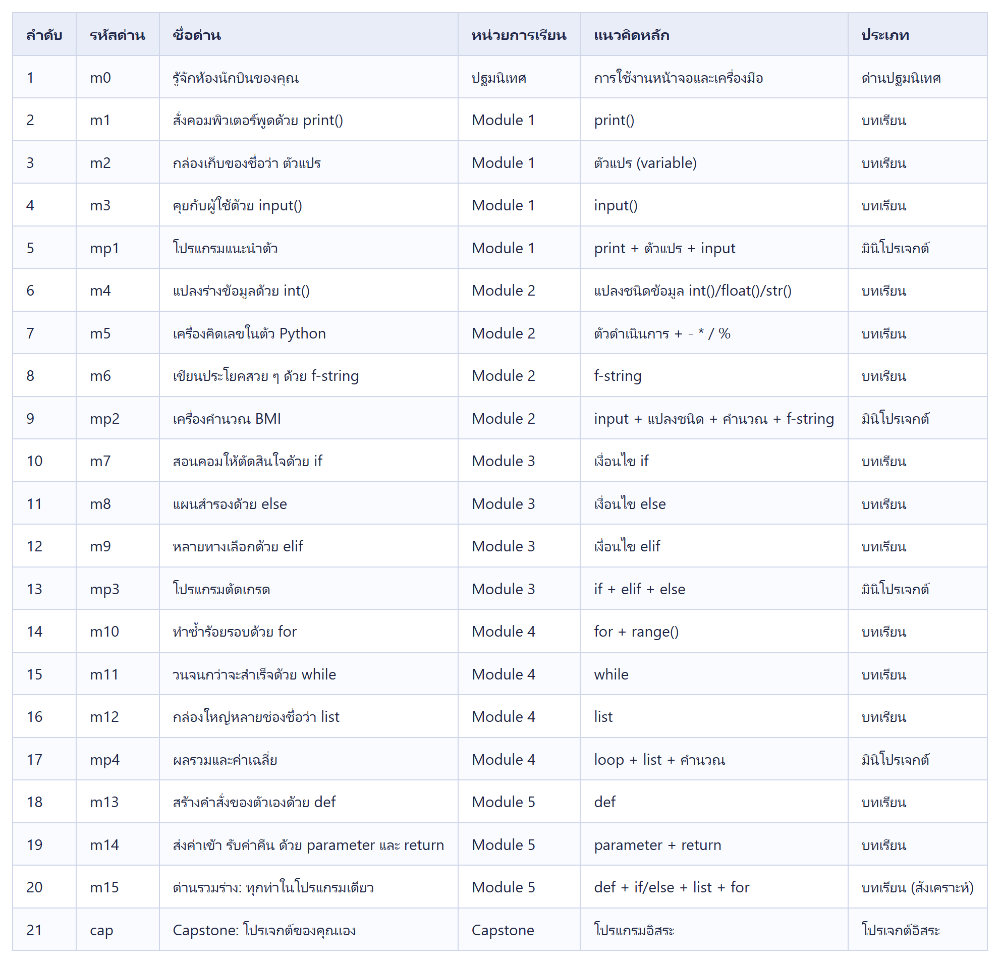

### 3.3.2 ผลลัพธ์การเรียนรู้ของแต่ละหน่วย (Learning Outcomes)

หลักสูตรกำหนดผลลัพธ์การเรียนรู้ (Learning Outcome) ไว้ชัดเจนสำหรับแต่ละหน่วย โดยผลลัพธ์ทุกข้อเขียนในรูป "สิ่งที่ผู้เรียนทำได้จริง" ไม่ใช่ "สิ่งที่ผู้เรียนได้เรียน" เพื่อให้ผู้เรียนเห็นความก้าวหน้าเป็นความสามารถที่จับต้องได้ทุกครั้งที่จบหน่วย ดังแสดงในตารางที่ 3.2

**ตารางที่ 3.2 ผลลัพธ์การเรียนรู้ที่คาดหวังเมื่อจบแต่ละหน่วย**

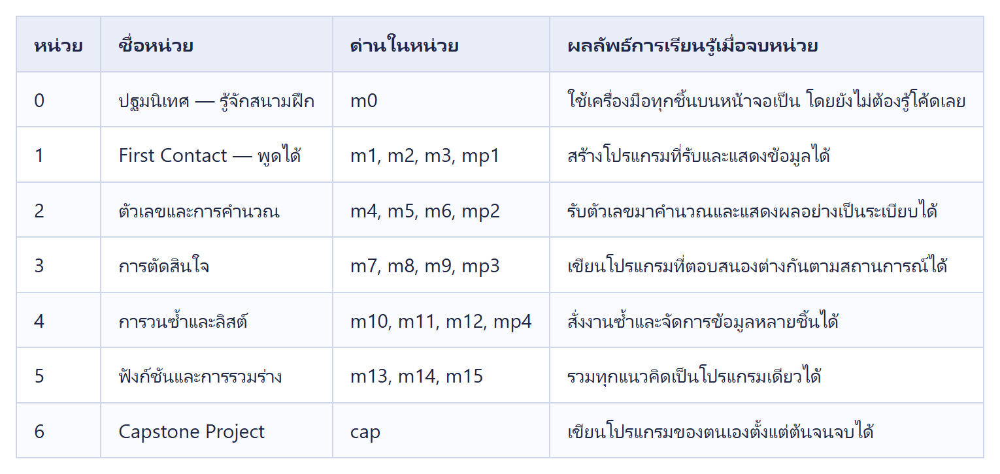

### 3.3.3 แม่แบบบทเรียน 6 ส่วน และตัวอย่างจริง

ทุกบทเรียนของโครงงานถูกสร้างขึ้นตามแม่แบบเดียวกันซึ่งประกอบด้วยองค์ประกอบ 6 ส่วนเรียงลำดับตายตัว เสริมด้วยองค์ประกอบสนับสนุนอีก 2 ส่วน ความสม่ำเสมอของแม่แบบนี้ช่วยให้ผู้เรียนไม่ต้องเรียนรู้วิธีใช้บทเรียนใหม่ในทุกด่าน สมาธิทั้งหมดจึงทุ่มไปที่เนื้อหาได้เต็มที่ องค์ประกอบทั้งหมดสรุปในตารางที่ 3.3

**ตารางที่ 3.3 องค์ประกอบของแม่แบบบทเรียน**

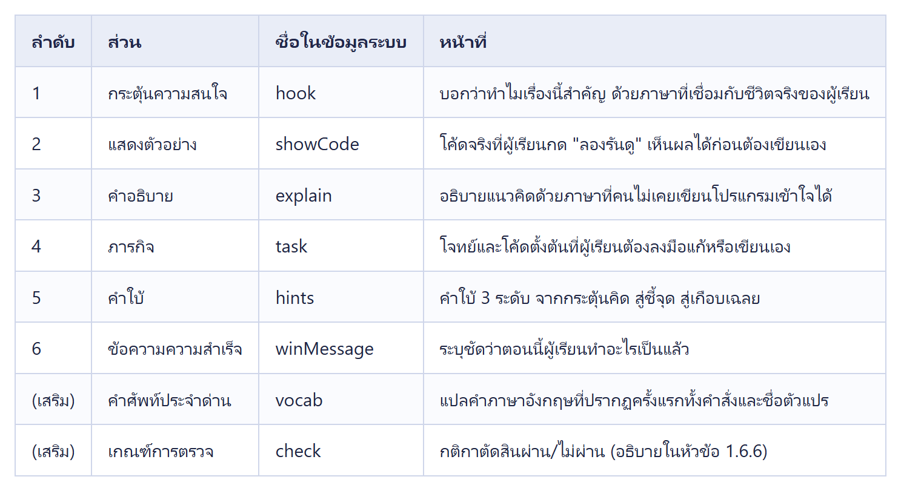

เพื่อให้เห็นเป็นรูปธรรม ตัวอย่างต่อไปนี้แสดงองค์ประกอบทั้งหกส่วนของด่าน m4 "แปลงร่างข้อมูลด้วย int()" ซึ่งเป็นด่านที่ออกแบบตามหลักความล้มเหลวที่สร้างสรรค์ (Productive Failure) โดยจงใจฝังจุดบกพร่องไว้ในโค้ดตั้งต้นให้ผู้เรียนได้เผชิญและแก้ด้วยตนเอง

ก. ส่วนกระตุ้นความสนใจ (hook): "ระวัง! ด่านนี้มีกับดักซ่อนอยู่ในโค้ดตั้งต้น ลองกด Run ดูก่อนเลยแล้วมาช่วยกันแก้ — จำไว้ว่า Error ไม่ใช่ความล้มเหลว แต่คือข้อมูลชั้นดีที่บอกเราว่าต้องแก้ตรงไหน"

ข. ส่วนแสดงตัวอย่าง (showCode) — โค้ดที่ผู้เรียนกดรันดูผลได้ก่อน:

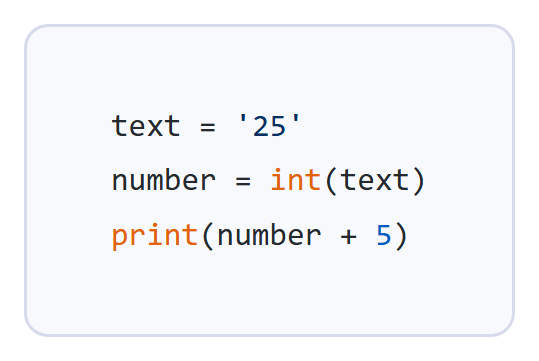

ค. ส่วนคำอธิบาย (explain): อธิบายว่าทุกอย่างที่ได้จาก `input()` เป็น "ข้อความ" เสมอ แม้ผู้ใช้จะพิมพ์ตัวเลข การนำข้อความไปบวกเลขตรง ๆ จะเกิด `TypeError` และต้องแปลงชนิดข้อมูลก่อนด้วย `int()`, `float()` หรือ `str()`

ง. ส่วนภารกิจ (task) — โค้ดตั้งต้นที่จงใจฝังบั๊กไว้ให้ผู้เรียนแก้:

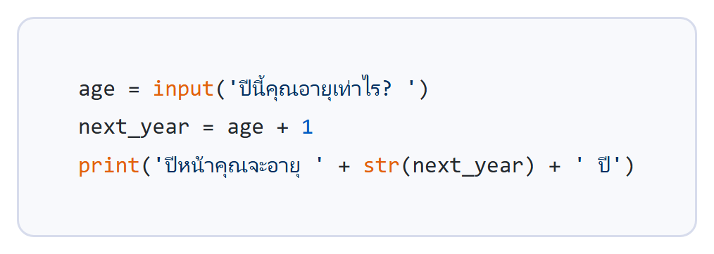

จ. ส่วนคำใบ้ (hints) 3 ระดับ ไล่จากกระตุ้นคิดไปเกือบเฉลย:

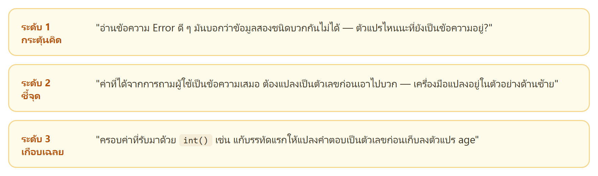

ฉ. ส่วนข้อความความสำเร็จ (winMessage): "คุณเพิ่งผ่านด่านที่ตั้งใจวางกับดักไว้! ตอนนี้คุณอ่าน TypeError เป็น และแปลงชนิดข้อมูลด้วย int() ได้เอง — เห็นไหมว่า Error ไม่น่ากลัวอย่างที่คิด"

นอกจากหกส่วนหลัก ด่าน m4 ยังมีข้อความแสดงข้อผิดพลาดเฉพาะด่าน (errorOverride) สำหรับ `TypeError` ที่อธิบายกับดักตรง ๆ ว่า "ตอนนี้ age เป็นข้อความอยู่ Python เลยเอาไปบวกกับเลข 1 ไม่ได้" และตั้งค่าให้เปิดคำใบ้อัตโนมัติช้ากว่าด่านอื่น (เมื่อ Error เดิมซ้ำครบ 3 ครั้งแทนที่จะเป็น 2) เพื่อเปิดพื้นที่ให้ผู้เรียนได้ต่อสู้กับปัญหาด้วยตนเองก่อนตามเจตนาของหลักความล้มเหลวที่สร้างสรรค์

### 3.3.4 การไล่ระดับความช่วยเหลือตลอดหลักสูตร (Scaffolding Progression)

ระดับความช่วยเหลือของหลักสูตรถูกออกแบบให้ค่อย ๆ ลดลงอย่างเป็นระบบตลอดเส้นทาง เพื่อถอนนั่งร้าน (Scaffolding) ออกทีละน้อยจนผู้เรียนยืนได้ด้วยตนเองในโปรเจกต์อิสระ การไล่ระดับนี้สะท้อนผ่าน "ปริมาณของโค้ดตั้งต้นที่ระบบเตรียมไว้ให้" ดังสรุปในตารางที่ 3.4

**ตารางที่ 3.4 การลดระดับความช่วยเหลือตามช่วงของหลักสูตร**

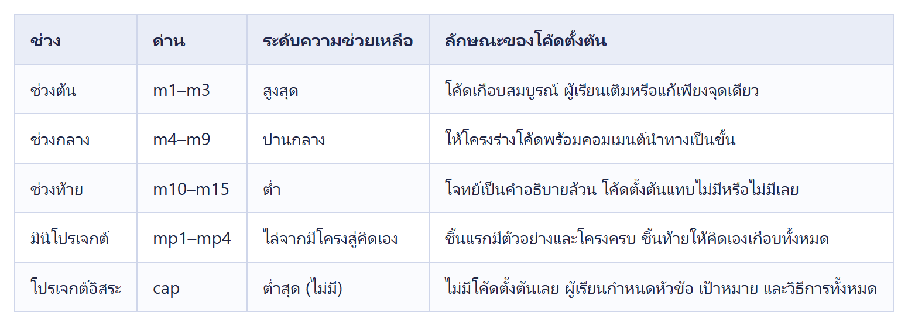

### 3.3.5 ลำดับการแนะนำแนวคิดและโค้ดตัวอย่างประจำด่าน

ตารางที่ 3.5 แสดงลำดับการแนะนำแนวคิดของภาษา Python ตลอดหลักสูตร คู่กับโค้ดตัวอย่าง (showCode) ที่แต่ละด่านใช้แนะนำแนวคิดนั้น จะเห็นว่าโค้ดตัวอย่างเรียงจากคำสั่งเดี่ยว ๆ ในด่านต้น ไปสู่การประกอบหลายแนวคิดเข้าด้วยกันในด่านท้าย ซึ่งสะท้อนหลักการเพิ่มความซับซ้อนทีละขั้น

**ตารางที่ 3.5 ลำดับการแนะนำแนวคิดและโค้ดตัวอย่างที่ใช้แนะนำ**

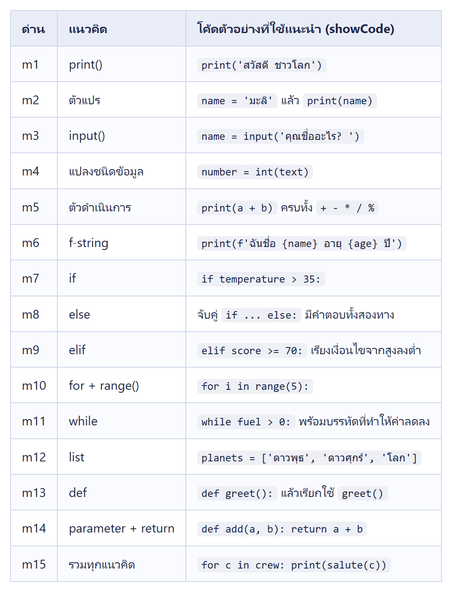

### 3.3.6 สรุปเกณฑ์การผ่านของแต่ละด่าน (Pass Criteria)

ทุกด่านมีกลไกตรวจสอบการผ่านที่ประกอบด้วยกติกาหลายข้อซึ่งต้องเป็นจริงพร้อมกันทั้งหมด (เชื่อมด้วยเงื่อนไข AND) หลักการออกแบบสำคัญคือ ทุกด่านมีกติกาข้อแรกเหมือนกันคือ "โค้ดต้องแตกต่างจากโค้ดตั้งต้นและต้องไม่ว่าง" (codeChanged) ซึ่งทำให้การกดรันโดยไม่แก้ไขอะไรเลยไม่มีทางผ่านด่านได้ อันเป็นมาตรการตรงต่ออุปสรรค "ภาวะติดกับดักบทเรียน" ที่อธิบายในหัวข้อ 1.7 ในบทที่ 2 นอกจากนี้กติกาฝั่งที่ตรวจตัวโค้ดทุกข้อจะตรวจกับโค้ดที่ตัดคอมเมนต์ออกแล้ว เพื่อกันไม่ให้คำที่ปรากฏในคอมเมนต์นำทางของโค้ดตั้งต้นทำให้ผ่านโดยบังเอิญ และบางด่านที่ล็อกข้อมูลให้แล้ว เช่น mp4 และ m14 ยังตรวจเข้มเป็นพิเศษว่าผู้เรียนต้องไม่พิมพ์คำตอบลงไปตรง ๆ แต่ต้องให้โปรแกรมคำนวณเอง เกณฑ์การผ่านของทุกด่านสรุปในตารางที่ 3.6

**ตารางที่ 3.6 สรุปเกณฑ์การผ่านของแต่ละด่าน**

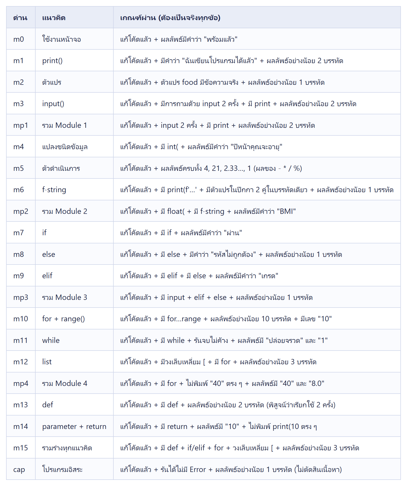

### 3.3.7 บทบาทและระดับสิทธิ์ของผู้ใช้ (User Roles and Access Levels)

ระบบจำแนกผู้ใช้ออกเป็นสามบทบาทตามระดับการเข้าถึงข้อมูล การจำแนกนี้เป็นรากฐานของการกำหนดกฎความปลอดภัยในหัวข้อ 3.3 ในบทที่ 2.12 โดยมีรายละเอียดดังนี้

1) ผู้เยี่ยมชม (Guest) — ผู้เรียนที่ยังไม่ได้เข้าสู่ระบบ

1.1) เข้าถึงเนื้อหาบทเรียนได้ครบทุกด่านเช่นเดียวกับสมาชิก ไม่มีการจำกัดเนื้อหาใด ๆ

1.2) ความก้าวหน้าจัดเก็บใน localStorage ของเครื่องนั้นเท่านั้น ไม่ถูกส่งขึ้นคลาวด์

1.3) ไม่สามารถซิงก์ข้ามอุปกรณ์ได้ และไม่มีข้อมูลใดของผู้เยี่ยมชมอยู่บนฐานข้อมูล

2) สมาชิก (Member) — ผู้เรียนที่เข้าสู่ระบบด้วยบัญชี Google หรืออีเมล

2.1) เข้าถึงเนื้อหาบทเรียนได้ครบทุกด่านเช่นเดียวกับผู้เยี่ยมชม

2.2) ความก้าวหน้าถูกซิงก์ระหว่าง localStorage กับเอกสารของตนเองใน Cloud Firestore

2.3) อ่านและเขียนได้เฉพาะเอกสารข้อมูลของตนเอง (เอกสารที่มีรหัสตรงกับ uid ของตน) เท่านั้น ไม่สามารถเข้าถึงข้อมูลของสมาชิกคนอื่นได้

3) ผู้ดูแลระบบ (Administrator) — เจ้าของโครงงานผู้ดูแลระบบ

3.1) จัดการโครงสร้างฐานข้อมูล กฎความปลอดภัย และการตั้งค่าโครงการผ่านคอนโซลของ Firebase (Firebase Console)

3.2) การเข้าถึงระดับผู้ดูแลกระทำผ่านการยืนยันตัวตนของบัญชีเจ้าของโครงการโดยตรง ไม่ได้เปิดช่องจัดการผ่านหน้าเว็บของผู้เรียน จึงไม่มีเส้นทางให้ผู้ใช้ทั่วไปยกระดับสิทธิ์ตนเองเป็นผู้ดูแลได้

การจำแนกบทบาทข้างต้นสรุปเป็นตารางที่ 3.7 เพื่อให้เห็นขอบเขตสิทธิ์ของแต่ละบทบาทเปรียบเทียบกัน

**ตารางที่ 3.7 บทบาทผู้ใช้ ระดับการเข้าถึง และที่จัดเก็บข้อมูล**

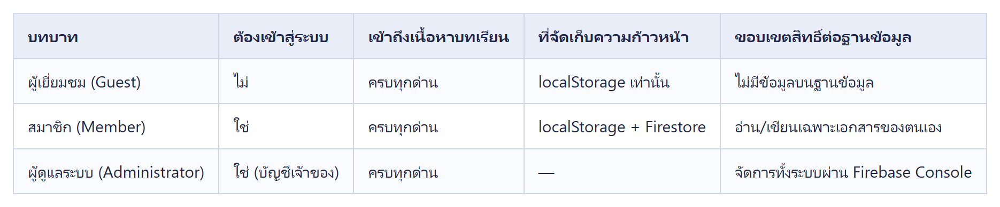

### 3.3.8 สถาปัตยกรรมการซิงก์ข้อมูลและการผสานข้อมูล (Synchronization and Data Merging)

หัวใจของระบบบัญชีคือกลไกการซิงก์ข้อมูลระหว่าง localStorage ในเครื่องกับเอกสารของผู้ใช้ใน Cloud Firestore ให้สอดคล้องกันเสมอ ความท้าทายเชิงออกแบบที่สำคัญคือกรณีที่ผู้เรียนมีความก้าวหน้าค้างอยู่ทั้งในเครื่อง (จากตอนที่ยังเป็นผู้เยี่ยมชม) และบนคลาวด์ (จากอุปกรณ์อื่น) พร้อมกัน หากเลือกใช้ข้อมูลฝั่งใดฝั่งหนึ่งแล้วเขียนทับอีกฝั่งโดยตรง ความก้าวหน้าบางส่วนจะสูญหาย ระบบจึงใช้กลยุทธ์การผสานข้อมูล (Data Merging) ที่รักษาความก้าวหน้าจากทั้งสองฝั่งไว้ให้มากที่สุด ลำดับการทำงานของระบบเมื่อผู้เรียนเข้าสู่ระบบแสดงในภาพที่ 3.2

**ภาพที่ 3.2 แผนภาพลำดับการทำงานของสถาปัตยกรรม Local-first และการซิงก์ข้ามอุปกรณ์**

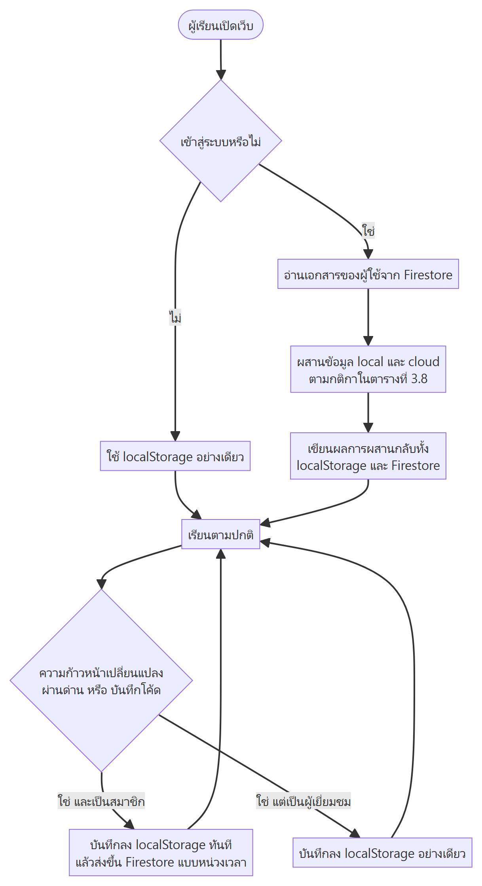

กติกาการผสานข้อมูลถูกออกแบบให้ทุกฟิลด์มีวิธีตัดสินที่ชัดเจนและให้ผลลัพธ์ที่รักษาความก้าวหน้าไว้มากที่สุดเสมอ ดังแสดงในตารางที่ 3.8

**ตารางที่ 3.8 กติกาการผสานข้อมูลระหว่าง localStorage กับ Cloud Firestore**

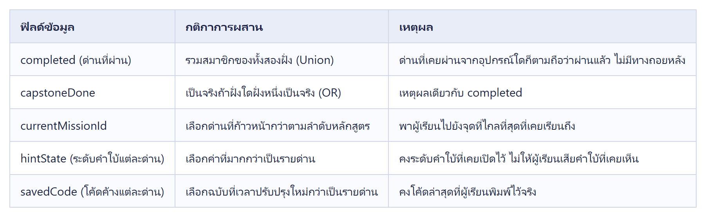

นอกจากนี้ ตัวนับข้อผิดพลาดสำหรับระบบคำใบ้อัตโนมัติ (errorTracking ตามที่อธิบายในหัวข้อ 4.6 ในบทที่ 2) จงใจไม่ถูกซิงก์ขึ้นคลาวด์ เพราะเป็นข้อมูลชั่วคราวระดับรอบการเรียนที่รีเซ็ตเมื่อผ่านด่าน การเก็บข้อมูลนี้ไว้เฉพาะในเครื่องช่วยลดจำนวนการเขียนข้อมูลลงคลาวด์โดยไม่จำเป็น ซึ่งสอดคล้องกับหลักการเก็บข้อมูลเท่าที่จำเป็นในตารางที่ 2-3 ในบทที่ 2 การส่งข้อมูลขึ้นคลาวด์ยังใช้เทคนิคการหน่วงเวลา (Debounce) คือรวบการเปลี่ยนแปลงที่เกิดถี่ ๆ ในช่วงเวลาสั้น ๆ ให้เขียนขึ้นคลาวด์เพียงครั้งเดียว เพื่อประหยัดโควตาการเขียนของแผนฟรีและลดภาระเครือข่าย

### 3.3.9 โครงสร้างการจัดเก็บข้อมูลใน Cloud Firestore (Collection Structure)

โครงงานออกแบบโครงสร้างการจัดเก็บให้เรียบง่ายที่สุดเท่าที่รองรับความต้องการได้ โดยใช้คอลเลกชันเดียวชื่อ `users` ซึ่งภายในประกอบด้วยเอกสารของผู้เรียนแต่ละคน หนึ่งเอกสารต่อหนึ่งผู้ใช้ โดยใช้รหัสประจำตัวผู้ใช้ (uid) จาก Firebase Authentication เป็นรหัสประจำเอกสาร การออกแบบให้ข้อมูลของผู้ใช้หนึ่งคนอยู่ในเอกสารเดียวแบบนี้ทำให้การอ่านและเขียนความก้าวหน้าทั้งหมดใช้การเข้าถึงฐานข้อมูลเพียงครั้งเดียว ซึ่งประหยัดโควตาและทำให้การซิงก์ทำได้ในการดำเนินการเดียว โครงสร้างโดยรวมแสดงในภาพที่ 3.3

**ภาพที่ 3.3 โครงสร้างคอลเลกชันและเอกสารใน Cloud Firestore**

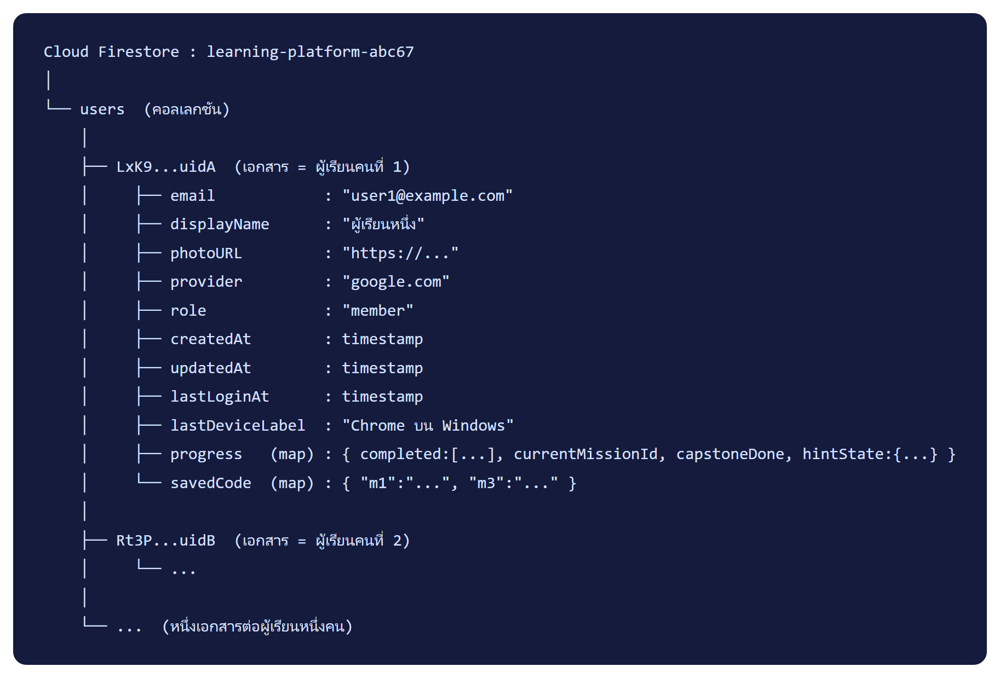

ตัวอย่างข้อมูลจริงของเอกสารผู้เรียนหนึ่งคนในรูปแบบ JSON แสดงในภาพที่ 3.4 ซึ่งมีโครงสร้างสอดคล้องกับข้อมูลที่ระบบเดิมเก็บไว้ใน localStorage (หัวข้อ 4.6 ในบทที่ 2) โดยเพิ่มเฉพาะฟิลด์ข้อมูลบัญชีและเวลาเข้ามา

**ภาพที่ 3.4 ตัวอย่างเอกสารข้อมูลผู้เรียนหนึ่งคนในรูปแบบ JSON**

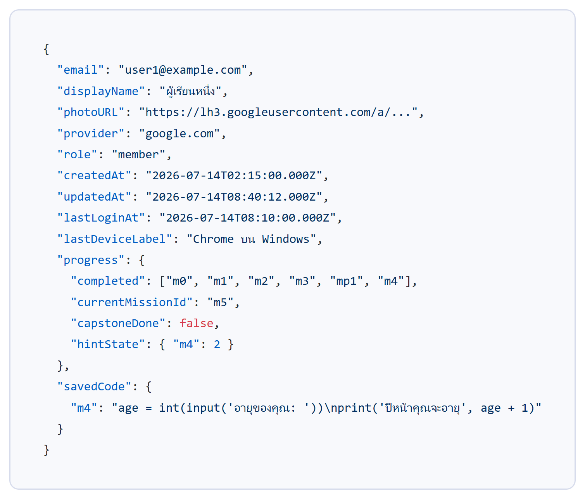

### 3.3.10 แผนภาพความสัมพันธ์ของข้อมูล (Entity Relationship Diagram)

แม้ Cloud Firestore จะจัดเก็บข้อมูลแบบเอกสารที่ฝังข้อมูลย่อยไว้ในเอกสารเดียว แต่เพื่อประโยชน์ในการอธิบายความสัมพันธ์เชิงตรรกะของข้อมูล คณะผู้จัดทำได้จำลองข้อมูลของระบบเป็นแผนภาพความสัมพันธ์ของข้อมูล (Entity Relationship Diagram) ในระดับแนวคิด (Conceptual Level) ดังภาพที่ 3.5 โดยจำแนกข้อมูลออกเป็นสามกลุ่มเอนทิตี (Entity) ได้แก่ ผู้ใช้ (USER) ความก้าวหน้า (PROGRESS) และโค้ดที่บันทึก (SAVED_CODE) พร้อมด้วยเอนทิตีอ้างอิง (Reference Entity) คือด่านบทเรียน (MISSION) ซึ่งเป็นข้อมูลเนื้อหาที่เก็บอยู่ในไฟล์ `data/missions.js` ของระบบ ไม่ได้อยู่ในฐานข้อมูล แต่ถูกอ้างอิงด้วยรหัสด่าน

**ภาพที่ 3.5 แผนภาพความสัมพันธ์ของข้อมูลระดับแนวคิด (Conceptual ER Diagram)**

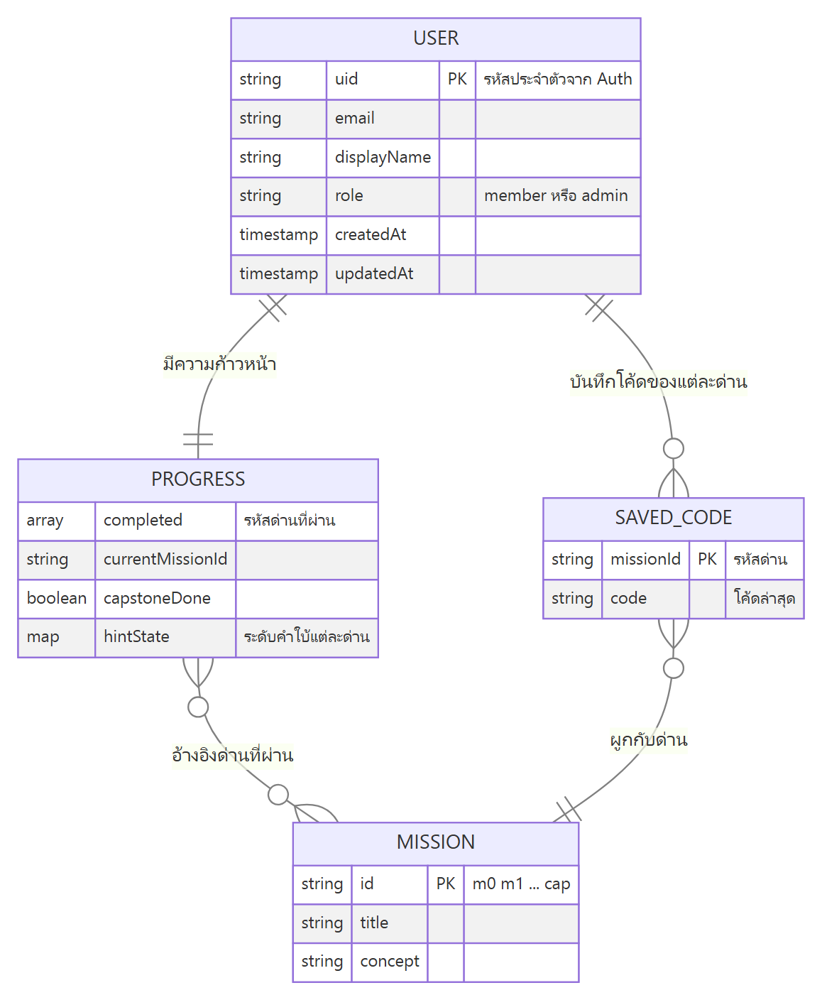

จากภาพที่ 3.5 อธิบายความสัมพันธ์ได้ว่า ผู้ใช้หนึ่งคนมีความก้าวหน้าหนึ่งชุด (ความสัมพันธ์แบบหนึ่งต่อหนึ่ง) และมีโค้ดที่บันทึกได้หลายรายการ รายการละหนึ่งด่าน (ความสัมพันธ์แบบหนึ่งต่อกลุ่ม) ส่วนความก้าวหน้าอ้างอิงถึงด่านหลายด่านที่ผู้เรียนผ่าน และโค้ดที่บันทึกแต่ละรายการผูกกับด่านหนึ่งด่าน ทั้งนี้ในการจัดเก็บจริงบน Firestore เอนทิตี PROGRESS และ SAVED_CODE ไม่ได้แยกเป็นตารางหรือคอลเลกชันต่างหาก แต่ถูกฝัง (Embed) เป็นแผนที่ข้อมูลย่อยภายในเอกสารของผู้ใช้ตามที่แสดงในหัวข้อ 3.3 ในบทที่ 2.9 การนำเสนอเป็นแผนภาพ ER ในระดับแนวคิดเช่นนี้มีจุดประสงค์เพื่อสื่อสารตรรกะของข้อมูลให้ชัดเจนในเชิงเอกสาร ส่วนการจัดเก็บเชิงกายภาพ (Physical Level) เลือกฝังข้อมูลไว้ในเอกสารเดียวเพื่อประสิทธิภาพในการอ่านเขียนตามธรรมชาติของฐานข้อมูลเชิงเอกสาร

### 3.3.11 พจนานุกรมข้อมูล (Data Dictionary)

พจนานุกรมข้อมูลอธิบายรายละเอียดของทุกฟิลด์ในฐานข้อมูล ทั้งชื่อฟิลด์ ชนิดข้อมูล ความหมาย และแหล่งที่มา เพื่อให้เอกสารโครงงานสามารถใช้เป็นข้อมูลอ้างอิงในการพัฒนาและบำรุงรักษาระบบได้ ตารางที่ 3.9 อธิบายฟิลด์ในระดับเอกสารของผู้ใช้ ตารางที่ 3.10 อธิบายฟิลด์ย่อยในแผนที่ข้อมูล progress ตารางที่ 3.11 อธิบายแผนที่ข้อมูล savedCode และตารางที่ 3.12 อธิบายเอนทิตีอ้างอิง MISSION

**ตารางที่ 3.9 พจนานุกรมข้อมูล: เอกสารผู้ใช้ในคอลเลกชัน users**

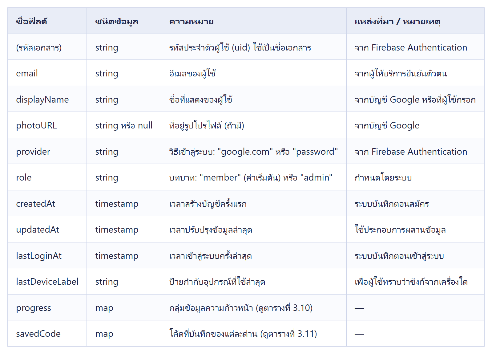

**ตารางที่ 3.10 พจนานุกรมข้อมูล: แผนที่ข้อมูล progress (ความก้าวหน้า)**

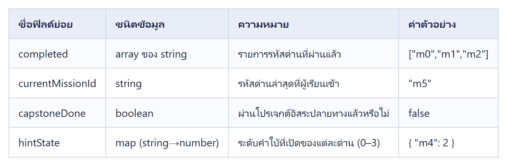

**ตารางที่ 3.11 พจนานุกรมข้อมูล: แผนที่ข้อมูล savedCode**

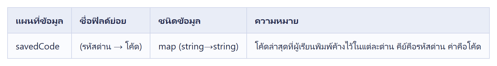

**ตารางที่ 3.12 พจนานุกรมข้อมูล: เอนทิตีอ้างอิง MISSION (ข้อมูลเนื้อหาในไฟล์ระบบ ไม่ได้อยู่ในฐานข้อมูล)**

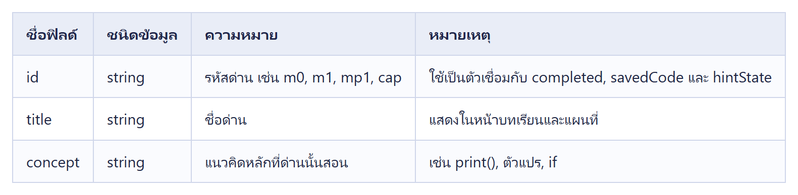

พจนานุกรมข้อมูลข้างต้นสะท้อนหลักการแยกข้อมูลออกจากตรรกะที่โครงงานยึดถือมาตั้งแต่ต้น (หัวข้อ 4.8 ในบทที่ 2) กล่าวคือ ฐานข้อมูลบนคลาวด์เก็บเฉพาะ "สถานะการเรียนของผู้ใช้" ที่เปลี่ยนแปลงไปตามบุคคล ในขณะที่ "เนื้อหาบทเรียน" ทั้งหมดยังคงอยู่ในไฟล์ระบบและอ้างอิงถึงกันด้วยรหัสด่านเท่านั้น การออกแบบเช่นนี้ทำให้แก้ไขหรือเพิ่มเนื้อหาบทเรียนได้โดยไม่กระทบต่อโครงสร้างฐานข้อมูล และในทางกลับกัน การเปลี่ยนแปลงข้อมูลผู้ใช้ก็ไม่กระทบต่อเนื้อหา

### 3.3.12 กฎความปลอดภัยของฐานข้อมูลและการคุ้มครองข้อมูลส่วนบุคคล (Security Rules and Data Privacy)

เนื่องจากระบบเป็นเว็บแอปพลิเคชันฝั่งผู้ใช้ที่โค้ดทั้งหมดเปิดเผยต่อสาธารณะโดยธรรมชาติ ความปลอดภัยของข้อมูลจึงไม่สามารถอาศัยการซ่อนโค้ดได้ แต่ต้องบังคับใช้ที่ชั้นฐานข้อมูลโดยตรงผ่านกลไกที่เรียกว่ากฎความปลอดภัย (Security Rules) ของ Cloud Firestore กฎเหล่านี้ทำงานบนเซิร์ฟเวอร์ของ Google ทุกครั้งที่มีการร้องขออ่านหรือเขียนข้อมูล และไม่สามารถถูกข้ามผ่านจากฝั่งผู้ใช้ได้ กฎความปลอดภัยที่โครงงานกำหนดแสดงในภาพที่ 3.6

**ภาพที่ 3.6 กฎความปลอดภัยของ Cloud Firestore**

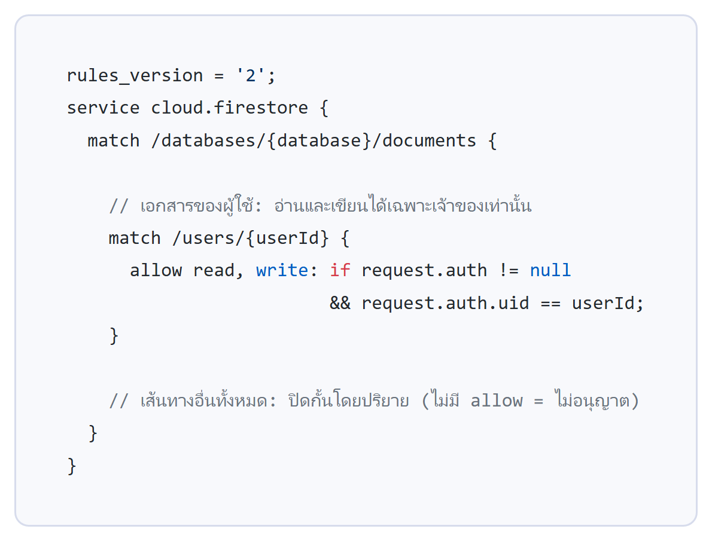

กฎในภาพที่ 3.6 มีหลักการทำงานคือ การอ่านหรือเขียนเอกสารในเส้นทาง `users/{userId}` จะได้รับอนุญาตก็ต่อเมื่อผู้ร้องขอผ่านการเข้าสู่ระบบแล้ว (`request.auth != null`) และรหัสประจำตัวของผู้ร้องขอ (`request.auth.uid`) ตรงกับรหัสเอกสารที่ต้องการเข้าถึง (`userId`) เท่านั้น เงื่อนไขข้อหลังนี้เองที่รับประกันว่าผู้ใช้แต่ละคนเข้าถึงได้เฉพาะเอกสารของตนเอง ไม่มีทางอ่านหรือแก้ไขข้อมูลของผู้ใช้คนอื่นได้เลย แม้จะทราบรหัสเอกสารของผู้อื่นก็ตาม และเนื่องจาก Firestore ใช้หลักปิดกั้นโดยปริยาย (Deny by Default) เส้นทางใดที่ไม่มีการเขียนกฎอนุญาตไว้จะถูกปฏิเสธการเข้าถึงทั้งหมดโดยอัตโนมัติ ทำให้ไม่มีข้อมูลส่วนใดของระบบเปิดให้เข้าถึงโดยไม่ได้ตั้งใจ

ในด้านการคุ้มครองข้อมูลส่วนบุคคลตามพระราชบัญญัติคุ้มครองข้อมูลส่วนบุคคล พ.ศ. 2562 (PDPA) โครงงานยึดหลักเก็บข้อมูลเท่าที่จำเป็นต่อการให้บริการซิงก์ความก้าวหน้าเท่านั้น ตารางที่ 3.13 สรุปข้อมูลส่วนบุคคลที่ระบบจัดเก็บพร้อมวัตถุประสงค์

**ตารางที่ 3.13 ข้อมูลส่วนบุคคลที่จัดเก็บและวัตถุประสงค์**

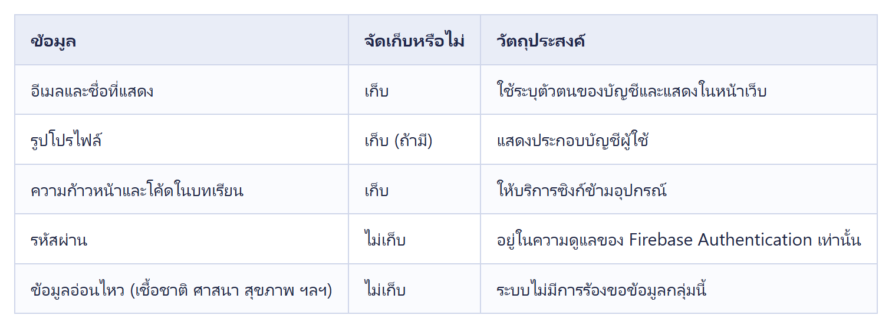

มาตรการคุ้มครองข้อมูลส่วนบุคคลของโครงงานประกอบด้วยสี่ประการ ประการแรกคือการเก็บข้อมูลขั้นต่ำเท่าที่จำเป็นตามตารางที่ 3.13 ประการที่สองคือการจำกัดการเข้าถึงด้วยกฎความปลอดภัยให้เจ้าของข้อมูลเท่านั้นที่อ่านเขียนได้ ประการที่สามคือการให้สิทธิ์ผู้ใช้ควบคุมข้อมูลของตนเอง โดยผู้ใช้สามารถลบความก้าวหน้าและออกจากระบบได้ทุกเมื่อ และประการที่สี่คือการไม่ส่งต่อข้อมูลให้บุคคลที่สามเพื่อวัตถุประสงค์ทางการตลาดใด ๆ โดยมี Google ในฐานะผู้ประมวลผลข้อมูล (Data Processor) ที่ได้รับมาตรฐานความปลอดภัยระดับสากลเป็นผู้ดูแลโครงสร้างพื้นฐาน มาตรการทั้งหมดนี้สอดคล้องกับหลักการคุ้มครองความเป็นส่วนตัวของผู้เรียนโดยการออกแบบ (Privacy by Design) ที่โครงงานยึดถือมาตั้งแต่การเลือกสถาปัตยกรรมฝั่งผู้ใช้ในหัวข้อ 1.1 ในบทที่ 2

### 3.3.13 สถาปัตยกรรมการทำงานของระบบและผังการไหลของข้อมูล (System Architecture and Data Flow)

ตามหลักการแยกข้อมูลออกจากตรรกะที่อธิบายในหัวข้อ 4.8 ในบทที่ 2 ระบบของโครงงานถูกแบ่งออกเป็นโมดูลย่อยที่มีหน้าที่ชัดเจนและทำงานประสานกันภายในเบราว์เซอร์ทั้งหมด โดยไม่มีการประมวลผลที่ฝั่งเซิร์ฟเวอร์ ภาพที่ 3.7 แสดงองค์ประกอบทั้งหมดของระบบและความสัมพันธ์ระหว่างกัน

**ภาพที่ 3.7 แผนภาพองค์ประกอบของระบบ (System Component Diagram)**

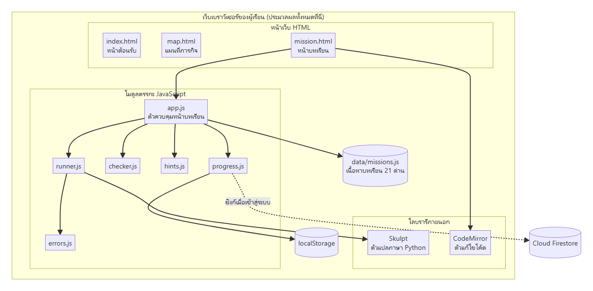

หน้าที่ของแต่ละโมดูลสรุปในตารางที่ 3.14 การแบ่งหน้าที่เช่นนี้ทำให้แก้ไขหรือทดสอบส่วนใดส่วนหนึ่งได้โดยไม่กระทบส่วนอื่น และทำให้นำโมดูลตรรกะไปทดสอบอัตโนมัตินอกเบราว์เซอร์ได้ตามที่จะกล่าวในหัวข้อ 5.4

**ตารางที่ 3.14 หน้าที่ของโมดูลหลักในระบบ**

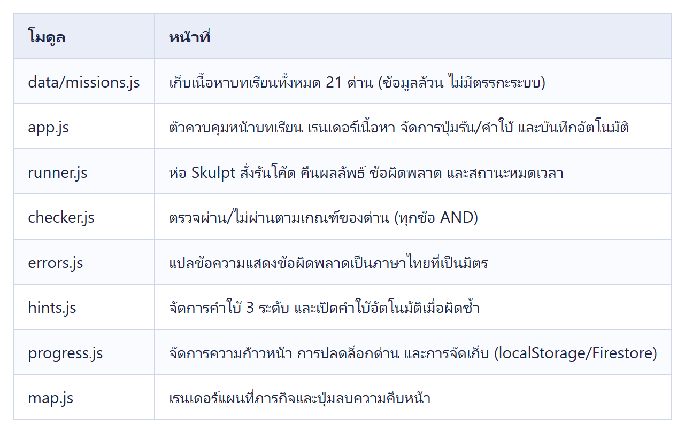

เมื่อผู้เรียนกดปุ่มรันโค้ด ระบบจะประมวลผลตามลำดับขั้นที่ออกแบบไว้เป็นสองชั้น คือชั้นตรวจข้อผิดพลาดของการรัน และชั้นตรวจเกณฑ์ผ่านของด่าน ดังแสดงในภาพที่ 3.8

**ภาพที่ 3.8 ผังการไหลของการทำงานเมื่อผู้เรียนกดรันโค้ด (Run-time Data Flow)**

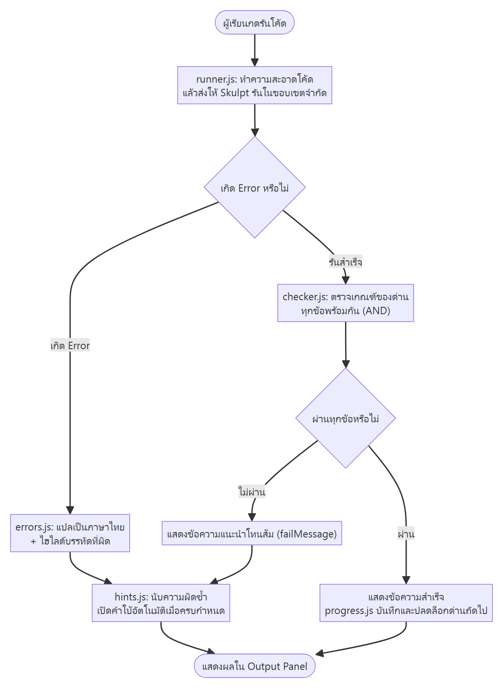

จากภาพที่ 3.8 จะเห็นว่าไม่ว่าผลลัพธ์จะเป็นข้อผิดพลาดของการรัน (Error) หรือการรันสำเร็จแต่ไม่ผ่านเกณฑ์ (CheckFail) ระบบจะนำทั้งสองกรณีไปนับรวมในกลไกคำใบ้อัตโนมัติเหมือนกัน เพราะทั้งสองกรณีสะท้อนว่าผู้เรียน "ติด" อยู่และควรได้รับความช่วยเหลือเช่นเดียวกัน ทั้งหมดนี้เป็นการนำหลักผลป้อนกลับทันที (หัวข้อ 1.2 ในบทที่ 2) และหลักนั่งร้านการเรียนรู้ (หัวข้อ 2.5 ในบทที่ 2) มาปฏิบัติในระดับสถาปัตยกรรมของระบบ

### 3.3.14 การออกแบบส่วนติดต่อผู้ใช้และโครงหน้าจอ (User Interface and Wireframe Design)

การออกแบบส่วนติดต่อผู้ใช้ของโครงงานยึดหลักความสะอาดตาและการลดสิ่งรบกวนที่ไม่จำเป็น (Avoiding Seductive Details) ตามที่อธิบายในหัวข้อ 1.2 ในบทที่ 2 และ 2.2 กล่าวคือ หน้าจอแสดงเฉพาะองค์ประกอบที่ทำหน้าที่ทางการเรียนรู้จริง ใช้โทนสีน้ำเงินเข้มแบบอวกาศเข้ากับธีม "First Contact" ไม่มีของตกแต่งที่ดึงความสนใจ และไม่ใช้อีโมจิใด ๆ ทั้งเว็บ (เลือกใช้ไอคอนแบบเวกเตอร์แทน) ระบบประกอบด้วยหน้าหลักสามหน้าดังสรุปในตารางที่ 3.15 ส่วนโครงหน้าจอ (Wireframe) ของแต่ละหน้าเป็นแบบร่างที่แสดงการจัดวางองค์ประกอบในเชิงหลักการ แสดงในภาพที่ 3.9 ถึงภาพที่ 3.11

**ตารางที่ 3.15 หน้าหลักสามหน้าของระบบและองค์ประกอบ**

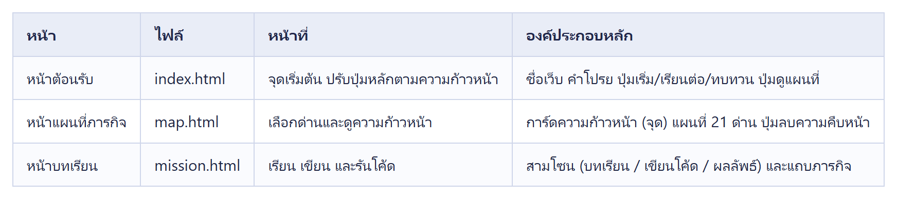

**ภาพที่ 3.9 โครงหน้าจอ (Wireframe) ของหน้าต้อนรับ (Welcome)**

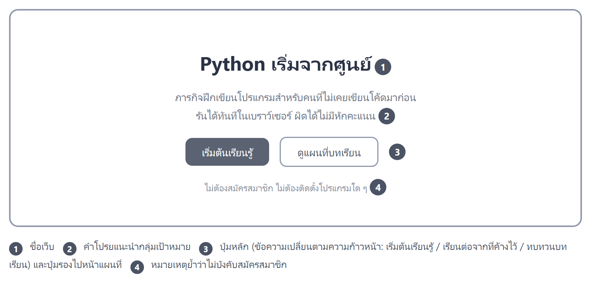

ปุ่มหลักของหน้าต้อนรับเปลี่ยนข้อความและปลายทางอัตโนมัติตามความก้าวหน้าของผู้เรียน คือแสดง "เริ่มต้นเรียนรู้" สำหรับผู้เข้าใหม่ "เรียนต่อจากที่ค้างไว้" สำหรับผู้ที่มีความก้าวหน้าค้างอยู่ และ "ทบทวนบทเรียน" สำหรับผู้ที่เรียนจบครบทุกด่านแล้ว การออกแบบนี้ลดภาระการตัดสินใจของผู้เรียนและพาผู้เรียนกลับเข้าสู่จุดที่ค้างไว้ได้ทันทีตามหลักการประคับประคองในหัวข้อ 1.3 ในบทที่ 2

**ภาพที่ 3.10 โครงหน้าจอ (Wireframe) ของหน้าแผนที่ภารกิจ (Mission Map)**

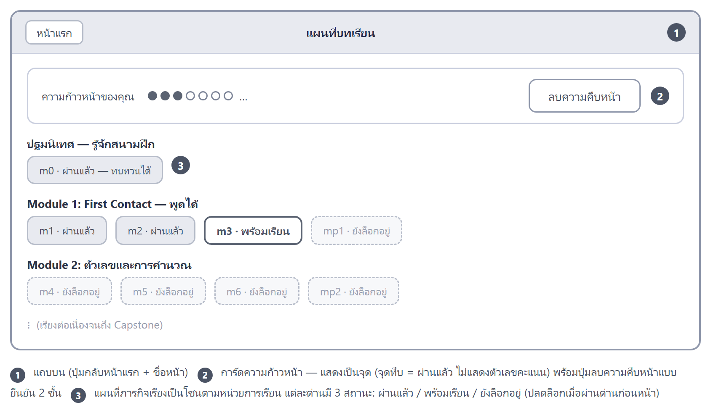

แผนที่ภารกิจแสดงความก้าวหน้าด้วย "จุด" (Dot) แทนตัวเลขเปอร์เซ็นต์ตามหลักการหลีกเลี่ยงการเปรียบเทียบเชิงคะแนนในหัวข้อ 3.2 ในบทที่ 2 และด่านถูกแสดงเป็นสามสถานะคือผ่านแล้ว กำลังเรียน (ปลดล็อก) และล็อกอยู่ โดยด่านจะปลดล็อกทีละด่านเมื่อผ่านด่านก่อนหน้า ปุ่มลบความคืบหน้ามีหน้าต่างยืนยันสองชั้นเพื่อป้องกันการลบโดยไม่ตั้งใจ

**ภาพที่ 3.11 โครงหน้าจอ (Wireframe) ของหน้าบทเรียน (Mission) — การจัดวางสามโซน**

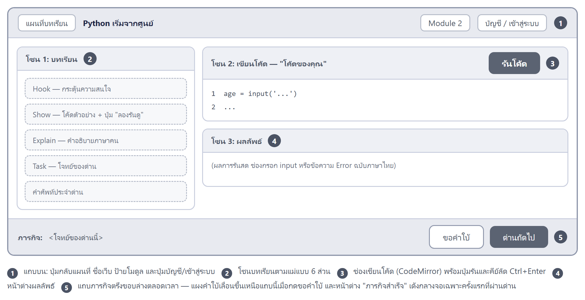

การจัดวางสามโซนของหน้าบทเรียนสรุปในตารางที่ 3.16 หลักคิดเบื้องหลังคือการวางบทเรียน (โซน 1) ไว้คู่กับพื้นที่เขียนโค้ด (โซน 2) และผลลัพธ์ (โซน 3) บนหน้าจอเดียว เพื่อให้ผู้เรียนอ่านโจทย์ ลงมือเขียน และเห็นผลได้โดยไม่ต้องสลับหน้า อันเป็นการย่นวงรอบผลป้อนกลับทันทีตามหัวข้อ 1.2 ในบทที่ 2 ให้สั้นที่สุด ส่วนแถบภารกิจที่ตรึงอยู่ขอบล่างตลอดเวลาทำให้เป้าหมายของด่านปรากฏต่อสายตาเสมอ ลดภาระความจำของผู้เรียน (Cognitive Load) ตามหัวข้อ 2.2 ในบทที่ 2

**ตารางที่ 3.16 องค์ประกอบสามโซนของหน้าบทเรียน**

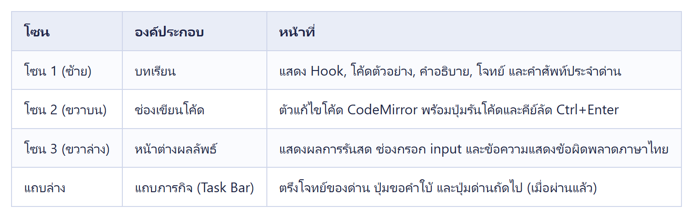
### 3.4 ขั้นตอนการปฏิบัติงานและการบูรณาการระบบ

การพัฒนาระบบแบ่งการปฏิบัติงานออกเป็น 7 ช่วง ดังนี้

ช่วงที่ 1 การเตรียมการและการออกแบบ — กำหนดข้อกำหนดของระบบจากกรอบทฤษฎี ทดสอบยืนยันความสามารถของ Skulpt (Smoke Test 19 รายการ) วางโครงสร้างไฟล์ของระบบตามหลักการแยกข้อมูลออกจากตรรกะ (เนื้อหาบทเรียนทั้งหมดอยู่ในไฟล์ข้อมูลเดียว แก้เนื้อหาได้โดยไม่แตะโค้ดระบบ) และออกแบบหลักสูตร 21 ด่านตามหัวข้อ 3.3

ช่วงที่ 2 การพัฒนาโมดูลแกนของระบบ — พัฒนาหน้าเว็บหลัก 3 หน้า (หน้าต้อนรับ หน้าแผนที่ภารกิจ หน้าบทเรียน) และโมดูลตรรกะหลัก ได้แก่ ตัวรันโค้ดที่ห่อ Skulpt พร้อมการจำกัดเวลารัน 3 วินาทีและเพดานผลลัพธ์ 2,000 บรรทัด ตัวตรวจเกณฑ์การผ่านแบบสองชั้น ระบบแปลข้อผิดพลาดเป็นภาษาไทย ระบบคำใบ้ 3 ระดับพร้อมการเปิดอัตโนมัติเมื่อผิดซ้ำ และระบบบันทึกความก้าวหน้าอัตโนมัติผ่าน localStorage

ช่วงที่ 3 การพัฒนาเนื้อหาและการรองรับผู้เริ่มต้น — เขียนเนื้อหาบทเรียนครบ 21 ด่านตามแม่แบบ 6 ส่วน เพิ่มด่านปฐมนิเทศและมาตรการรองรับผู้เรียนที่เพิ่งเริ่มใช้คอมพิวเตอร์ (การทำความสะอาดโค้ดอัตโนมัติ การตรวจจับอักษรไทยนอกเครื่องหมายคำพูด ตัวช่วยปิดวงเล็บ และคำศัพท์ประจำด่าน) และขยายระบบแปลข้อผิดพลาดให้ครอบคลุม 13 ชนิด รวมตัววิเคราะห์ SyntaxError แบบแยกย่อย 17 กรณี และระบบเดาคำที่ตั้งใจพิมพ์ (Did-you-mean)

ช่วงที่ 4 การทดสอบและปรับปรุง — รันชุดทดสอบอัตโนมัติทุกด่าน (เฉลยต้องผ่านและโค้ดตั้งต้นต้องไม่ผ่าน ครบ 21 ด่าน) ทดสอบเชิงปรปักษ์รวม 44 สถานการณ์ ทดสอบกรณีขอบเขต 14 กรณี และทดลองใช้ตามบุคลิกผู้ใช้จำลอง 8 แบบครอบคลุมสุดขอบของกลุ่มเป้าหมาย พร้อมแก้ไขข้อบกพร่องที่พบในแต่ละรอบ

ช่วงที่ 5 การเผยแพร่ระบบ — นำซอร์สโค้ดขึ้น GitHub และเชื่อมต่อกับ Vercel เพื่อเผยแพร่ระบบบนอินเทอร์เน็ตแบบอัตโนมัติ ระบบใช้กลยุทธ์โหลดไลบรารีจาก CDN ก่อนแล้วสำรองด้วยสำเนาในโครงการ ทำให้เปิดใช้งานได้ทั้งแบบออนไลน์และออฟไลน์

ช่วงที่ 6 การเพิ่มระบบบัญชีผู้ใช้และการซิงก์ข้ามอุปกรณ์ — ตั้งค่าโครงการ Firebase (เปิดการยืนยันตัวตนด้วย Google และอีเมล/รหัสผ่าน สร้างฐานข้อมูล Cloud Firestore และกำหนดกฎความปลอดภัยให้เจ้าของข้อมูลเท่านั้นที่เข้าถึงได้) พัฒนาโมดูลซิงก์ตามกติกาการผสานข้อมูลในตารางที่ 3.8 ทดสอบการเข้าสู่ระบบและการซิงก์บนเว็บจริง พบและแก้ไขข้อบกพร่องสำคัญสองรายการ คือการรีโหลดวนจากการเปรียบเทียบข้อมูลที่ลำดับฟิลด์ไม่คงที่ และการรีโหลดวนเมื่อผู้เรียนกลับไปทบทวนด่านที่ผ่านแล้ว พร้อมเพิ่มกลไกบังคับโหลดไฟล์เวอร์ชันใหม่เพื่อป้องกันเบราว์เซอร์ใช้ไฟล์เก่าจากแคช

ช่วงที่ 7 การจัดทำเอกสารประกอบโครงงาน — บันทึกการตัดสินใจเชิงออกแบบและผลการทดสอบระหว่างพัฒนาอย่างต่อเนื่อง แล้วเรียบเรียงเป็นเอกสารโครงงานบทที่ 1 ถึงบทที่ 3 พร้อมภาพประกอบและตารางที่สร้างจากข้อมูลจริงของระบบ

### 3.5 เก็บรวบรวมข้อมูลการพัฒนาโครงงาน

**3.5.1 เสนอโครงงาน**

จัดทำแบบเสนอโครงงานนวัตกรรม/สิ่งประดิษฐ์ นำเสนอต่ออาจารย์ผู้สอนประจำรายวิชา อาจารย์ที่ปรึกษาร่วม และผู้ฝึกสอน ได้รับอนุมัติหัวข้อ "เว็บแอปพลิเคชันสื่อการเรียนรู้การเขียนโปรแกรม Python สำหรับผู้เริ่มต้น" (วันที่ส่ง: ................)

**3.5.2 ความคืบหน้า 25%**

รายงานความคืบหน้าต่อผู้สอน ที่ปรึกษาร่วม และผู้ฝึกสอน สถานะงาน ณ จุดนี้คือ ออกแบบหลักสูตรและสถาปัตยกรรมระบบแล้วเสร็จ พัฒนาโมดูลแกนของระบบ (การรันโค้ดบนเบราว์เซอร์ การตรวจเกณฑ์การผ่าน และการบันทึกความก้าวหน้า) ทำงานได้จริง (วันที่ส่ง: ................)

**3.5.3 ความคืบหน้า 50%**

รายงานความคืบหน้าต่อผู้สอน ที่ปรึกษาร่วม และผู้ฝึกสอน สถานะงาน ณ จุดนี้คือ เนื้อหาบทเรียนครบทั้ง 21 ด่าน ระบบแปลข้อผิดพลาดและคำใบ้ทำงานครบถ้วน ผ่านการทดสอบอัตโนมัติทุกด่านและการทดสอบเชิงปรปักษ์ 44 สถานการณ์ (วันที่ส่ง: ................)

**3.5.4 ความคืบหน้า 75%**

รายงานความคืบหน้าต่อผู้สอน ที่ปรึกษาร่วม และผู้ฝึกสอน สถานะงาน ณ จุดนี้คือ ระบบเผยแพร่ใช้งานจริงบนอินเทอร์เน็ตผ่าน Vercel เพิ่มระบบบัญชีผู้ใช้และการซิงก์ข้ามอุปกรณ์ด้วย Firebase ทดสอบการเข้าสู่ระบบด้วยบัญชีจริงสำเร็จ และจัดทำเอกสารโครงงานบทที่ 1 ถึงบทที่ 3 (วันที่ส่ง: ................)

**3.5.5 สอบจบโครงงาน**

................ (รอดำเนินการ — เติมเมื่อสอบจบ พร้อมสรุปข้อเสนอแนะจากคณะกรรมการ) ................

### 3.6 ทดสอบการทำงาน

การทดสอบการทำงานของระบบดำเนินการต่อเนื่องตลอดการพัฒนา ประกอบด้วยสี่ระดับ ระดับแรกคือชุดทดสอบอัตโนมัติของเกณฑ์การผ่านทุกด่าน ซึ่งตรวจว่าโค้ดเฉลยต้องผ่านและโค้ดตั้งต้นต้องไม่ผ่านครบทั้ง 21 ด่าน ระดับที่สองคือการทดสอบเชิงปรปักษ์ที่จำลองความผิดพลาดจริงของผู้เริ่มต้น 44 สถานการณ์ เพื่อยืนยันว่าข้อความแสดงข้อผิดพลาดชี้ตรงสาเหตุทุกกรณี ระดับที่สามคือการทดสอบกรณีขอบเขต 14 กรณี เช่น ลูปวนไม่จบ พื้นที่จัดเก็บถูกปิด และการเข้าด่านที่ล็อกผ่าน URL โดยตรง และระดับที่สี่คือการทดลองใช้จริงผ่านเบราว์เซอร์ตามบุคลิกผู้ใช้จำลอง 8 แบบ ตั้งแต่ผู้เพิ่งมีคอมพิวเตอร์เครื่องแรกจนถึงนักทดลองที่ใช้ความสามารถนอกบทเรียน รวมถึงการทดสอบระบบบัญชีและการซิงก์ข้อมูลบนเว็บที่เผยแพร่จริง ผลการทดสอบที่เป็นทางการสรุปในข้อ 6

## 4. เครื่องมือที่ใช้ในการวิจัย

### 4.1 เครื่องมือที่ใช้ในการวิจัย

เครื่องมือเก็บรวบรวมข้อมูลของโครงงานมี 2 ชิ้น ได้แก่

1) แบบทดสอบประสิทธิภาพของระบบ — แบบบันทึกผลการทดสอบแบบกล่องดำ (Black-box Testing) ตามฟังก์ชันหลักของระบบ ครอบคลุมระบบบทเรียน ระบบรันโค้ด ระบบข้อผิดพลาดและคำใบ้ ระบบติดตามความก้าวหน้า และระบบบัญชีกับการซิงก์ข้อมูล โดยระบุค่าเป้าหมายและผลการทดสอบจริงเพื่อเปรียบเทียบ

2) แบบสอบถามความพึงพอใจของผู้ใช้งาน — แบบสอบถามมาตราส่วนประมาณค่า (Likert Scale) 5 ระดับ แบ่งเป็น 3 ตอน คือ ตอนที่ 1 ข้อมูลทั่วไปของผู้ตอบ ตอนที่ 2 ความพึงพอใจต่อเว็บแอปพลิเคชัน 3 ด้าน (ด้านเนื้อหาบทเรียน ด้านการใช้งานระบบ และด้านประโยชน์ที่ได้รับ) และตอนที่ 3 ข้อเสนอแนะเพิ่มเติม

### 4.2 การสร้างเครื่องมือสำหรับการรวบรวมข้อมูล

การสร้างเครื่องมือดำเนินการตามขั้นตอน ดังนี้ (1) ศึกษาเอกสารและงานวิจัยที่เกี่ยวข้องกับการประเมินสื่อการเรียนรู้ (2) ร่างข้อคำถามให้ครอบคลุมฟังก์ชันของระบบและวัตถุประสงค์ของโครงงาน (3) นำเสนอร่างเครื่องมือต่ออาจารย์ที่ปรึกษาเพื่อพิจารณาความเหมาะสม (4) ปรับปรุงตามข้อเสนอแนะ และ (5) จัดทำเครื่องมือฉบับจริงสำหรับเก็บข้อมูลกับกลุ่มตัวอย่าง

### 4.3 การตรวจสอบคุณภาพเครื่องมือ

นำแบบสอบถามความพึงพอใจให้ผู้เชี่ยวชาญจำนวน 3 ท่าน ตรวจสอบความตรงเชิงเนื้อหาด้วยดัชนีความสอดคล้องระหว่างข้อคำถามกับวัตถุประสงค์ (Index of Item-Objective Congruence: IOC) โดยคัดเลือกเฉพาะข้อคำถามที่มีค่า IOC ตั้งแต่ 0.50 ขึ้นไป (ผลการตรวจสอบ: ................ รอดำเนินการ ................)

## 5. การวิเคราะห์ข้อมูลเชิงสถิติ

ข้อมูลจากแบบสอบถามความพึงพอใจนำมาวิเคราะห์ด้วยสถิติพื้นฐาน 2 ค่า ได้แก่ ค่าเฉลี่ย (Mean) ซึ่งคำนวณจากผลรวมของคะแนนทั้งหมดหารด้วยจำนวนผู้ตอบ และส่วนเบี่ยงเบนมาตรฐาน (Standard Deviation) ซึ่งแสดงการกระจายของคำตอบรอบค่าเฉลี่ย จากนั้นแปลผลค่าเฉลี่ยตามเกณฑ์ 5 ระดับ ดังตารางที่ 3.17

**ตารางที่ 3.17 เกณฑ์การแปลผลค่าเฉลี่ยระดับความพึงพอใจ**

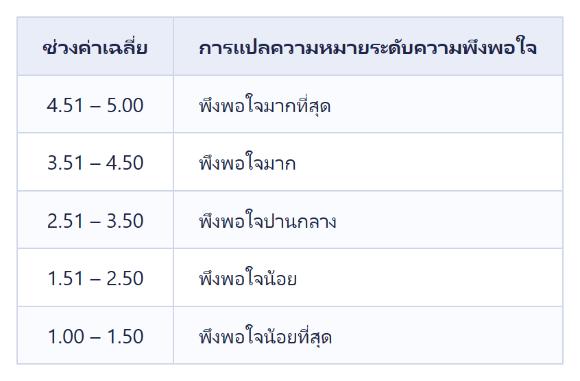

## 6. การตรวจสอบและรับรองการทำงาน

ฟังก์ชันของระบบได้รับการทดสอบใน 5 รายการทดสอบแบบควบคุม เพื่อยืนยันความน่าเชื่อถือและความสม่ำเสมอของประสิทธิภาพ โดยแต่ละรายการระบุค่าเป้าหมายและผลการทดสอบจริงเพื่อเปรียบเทียบ พร้อมหมายเหตุข้อสังเกตที่พบระหว่างการทดสอบ ดังตารางที่ 3.18

**ตารางที่ 3.18 ผลการตรวจสอบและรับรองการทำงานของระบบ**

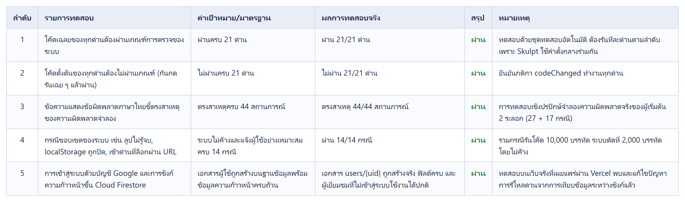

ผลการทดสอบทั้ง 5 รายการผ่านตามค่าเป้าหมายครบถ้วน ข้อสังเกตสำคัญที่บันทึกไว้ระหว่างการทดสอบ ได้แก่ ข้อจำกัดของ Skulpt ที่ใช้ค่าตั้งกลางร่วมกันทำให้ต้องรันชุดทดสอบทีละด่านตามลำดับ และข้อบกพร่องด้านการซิงก์ข้อมูลสองรายการที่ตรวจพบจากการใช้งานจริงและแก้ไขแล้วตามที่อธิบายในหัวข้อ 3.4 ช่วงที่ 6 ทั้งนี้เนื้อหาการดำเนินงานในบทนี้สอดคล้องกับขอบเขตที่กำหนดไว้ในบทที่ 1 และเป็นวิธีการที่นำไปสู่การรายงานผลในบทที่ 4 ต่อไป
