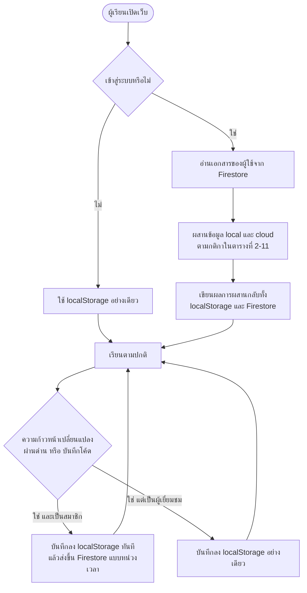
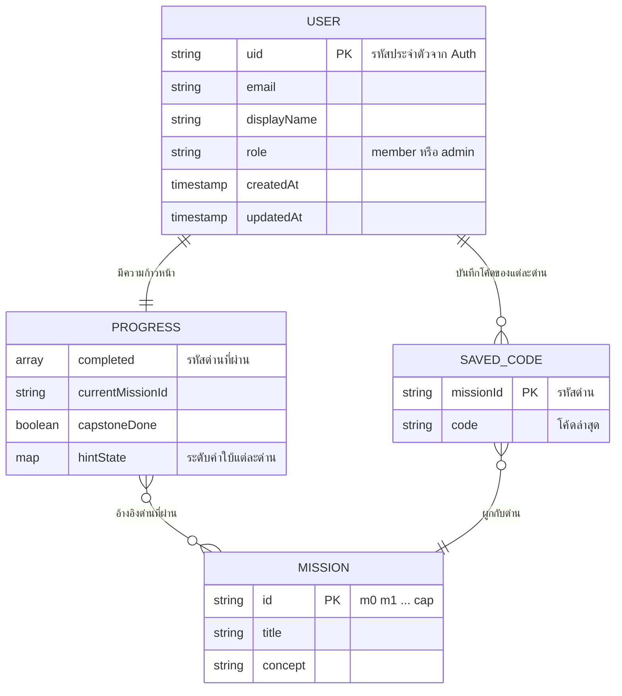
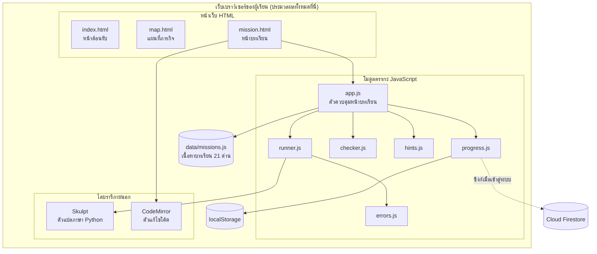
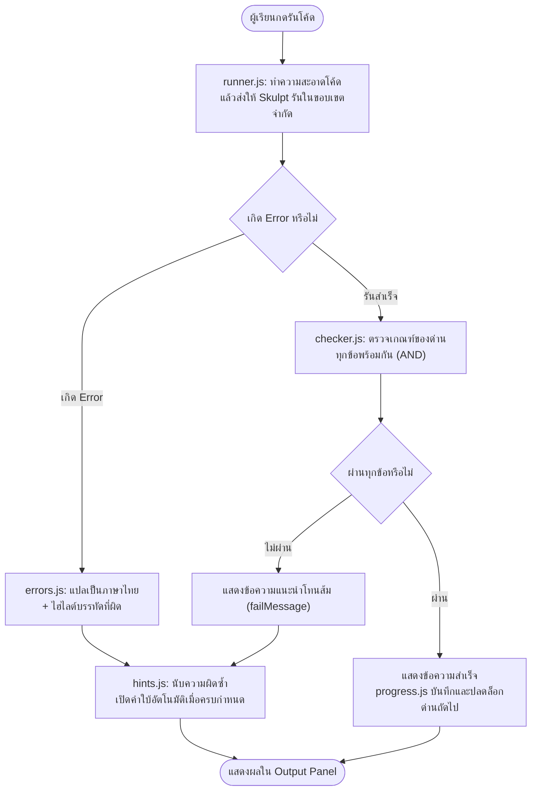

# บทที่ 2 เอกสารและงานวิจัยที่เกี่ยวข้อง

โครงงานนี้มีชื่อว่า "เว็บแอปพลิเคชันสื่อการเรียนรู้การเขียนโปรแกรม Python สำหรับผู้เริ่มต้น" โดยมีเป้าหมายหลักคือการสร้างสื่อการเรียนรู้ที่ช่วยให้ผู้ที่ไม่เคยเขียนโปรแกรมมาก่อนสามารถเริ่มต้นเขียนภาษา Python ได้ด้วยตนเอง พร้อมทั้งเสริมสร้างความเชื่อมั่นในความสามารถของตนเองและรักษาแรงจูงใจในการเรียนรู้ให้คงอยู่ตลอดเส้นทางการเรียน ระบบที่พัฒนาขึ้นจริงประกอบด้วยบทเรียนแบบภารกิจรวม 21 ด่าน แบ่งเป็นด่านปฐมนิเทศ 1 ด่าน บทเรียนหลัก 15 ด่านใน 5 หน่วยการเรียน มินิโปรเจกต์ 4 ชิ้น และโปรเจกต์อิสระปลายทาง (Capstone Project) 1 ด่าน ทำงานทั้งหมดบนเว็บเบราว์เซอร์ฝั่งผู้ใช้โดยไม่ต้องติดตั้งโปรแกรมหรือพึ่งพาเซิร์ฟเวอร์ พร้อมระบบแปลข้อความแสดงข้อผิดพลาดเป็นภาษาไทย ระบบคำใบ้แบบเป็นลำดับขั้น และระบบติดตามความก้าวหน้าอัตโนมัติ

เพื่อให้การออกแบบและการดำเนินงานของโครงงานตั้งอยู่บนรากฐานทางวิชาการที่ตรวจสอบได้ คณะผู้จัดทำได้ศึกษาและสังเคราะห์ความรู้จากเอกสาร ตำรา บทความวิชาการ และงานวิจัยที่เกี่ยวข้อง แล้วเรียบเรียงเป็นกรอบทฤษฎีสำหรับการออกแบบระบบ โดยเนื้อหาของบทนี้แบ่งออกเป็น 7 หัวข้อหลัก ดังต่อไปนี้

1. แนวคิดและทฤษฎีเกี่ยวกับเว็บแอปพลิเคชันสื่อการเรียนรู้การเขียนโปรแกรม Python สำหรับผู้เริ่มต้น
2. แนวคิดและทฤษฎีเกี่ยวกับจิตวิทยาการเรียนรู้และแรงจูงใจ
3. แนวคิดและทฤษฎีเกี่ยวกับรูปแบบการจัดการเรียนรู้
4. แนวคิดและทฤษฎีเกี่ยวกับเทคโนโลยีที่ใช้ในการพัฒนาระบบ
5. เครื่องมือและซอฟต์แวร์ที่ใช้ในการพัฒนาโครงงาน
6. งานวิจัยที่เกี่ยวข้อง
7. สรุปแนวคิด ทฤษฎี และงานวิจัยที่เกี่ยวข้อง

## สารบัญละเอียดของบทที่ 2

**หัวข้อที่ 1 แนวคิดและทฤษฎีเกี่ยวกับเว็บแอปพลิเคชันสื่อการเรียนรู้การเขียนโปรแกรม Python สำหรับผู้เริ่มต้น**
- 1.1 เว็บแอปพลิเคชัน (Web Application)
- 1.2 สื่อการเรียนรู้และสื่อดิจิทัลแบบโต้ตอบ (Learning Media and Interactive Media)
- 1.3 การเรียนรู้ผ่านเว็บและการเรียนรู้แบบนำตนเอง (Web-based Learning and Self-directed Learning)
- 1.4 การเขียนโปรแกรมคอมพิวเตอร์และการคิดเชิงคำนวณ (Computer Programming and Computational Thinking)
- 1.5 ภาษา Python และเหตุผลที่เลือกใช้เป็นภาษาแรกของผู้เริ่มต้น
- 1.6 โครงสร้างหลักสูตรของโครงงาน: จากด่านปฐมนิเทศสู่โปรเจกต์อิสระ
  - 1.6.1 แผนผังหลักสูตรทั้ง 21 ด่าน
  - 1.6.2 ผลลัพธ์การเรียนรู้ของแต่ละหน่วย (Learning Outcomes)
  - 1.6.3 แม่แบบบทเรียน 6 ส่วน และตัวอย่างจริง
  - 1.6.4 การไล่ระดับความช่วยเหลือตลอดหลักสูตร (Scaffolding Progression)
  - 1.6.5 ลำดับการแนะนำแนวคิดและโค้ดตัวอย่างประจำด่าน
  - 1.6.6 สรุปเกณฑ์การผ่านของแต่ละด่าน (Pass Criteria)
- 1.7 ผู้เรียนระดับเริ่มต้นและอุปสรรคของการเรียนเขียนโปรแกรมในระยะแรก
- 1.8 ทักษะก่อนการเขียนโปรแกรม (Pre-coding Skills) *(หัวข้อที่เสนอเพิ่มจากข้อค้นพบระหว่างการพัฒนา)*
- 1.9 การออกแบบข้อความแสดงข้อผิดพลาดสำหรับผู้เริ่มต้น (Programming Error Message Design)

**หัวข้อที่ 2 แนวคิดและทฤษฎีเกี่ยวกับจิตวิทยาการเรียนรู้และแรงจูงใจ**
- 2.1 ทฤษฎีการรับรู้ความสามารถของตนเอง (Self-Efficacy Theory)
- 2.2 ทฤษฎีภาระทางปัญญา (Cognitive Load Theory)
- 2.3 ทฤษฎีการกำหนดตนเองและแรงจูงใจภายใน (Self-Determination Theory)
- 2.4 ความยากที่พึงปรารถนา (Desirable Difficulties)
- 2.5 นั่งร้านการเรียนรู้และเขตพัฒนาการใกล้เคียง (Scaffolding and Zone of Proximal Development)
- 2.6 แนวคิดความล้มเหลวที่สร้างสรรค์ (Productive Failure)
- 2.7 ทฤษฎีภาวะลื่นไหล (Flow Theory)
- 2.8 สรุปการเชื่อมโยงทฤษฎีจิตวิทยาการเรียนรู้กับการออกแบบโครงงาน

**หัวข้อที่ 3 แนวคิดและทฤษฎีเกี่ยวกับรูปแบบการจัดการเรียนรู้**
- 3.1 การเรียนรู้แบบใช้ภารกิจเป็นฐาน (Mission-based Learning)
- 3.2 เกมมิฟิเคชัน (Gamification): องค์ประกอบที่เลือกใช้และเลือกไม่ใช้
- 3.3 การเรียนรู้แบบรอบรู้ (Mastery Learning)
- 3.4 อนุกรมวิธานทางการศึกษาของบลูมกับการจัดลำดับความซับซ้อนของภารกิจ
- 3.5 การเรียนรู้เชิงรุกและการเรียนเพื่อสร้างผลงาน (Active Learning and Learning by Building)

**หัวข้อที่ 4 แนวคิดและทฤษฎีเกี่ยวกับเทคโนโลยีที่ใช้ในการพัฒนาระบบ**
- 4.1 HTML5
- 4.2 CSS3
- 4.3 JavaScript
- 4.4 Skulpt: ตัวแปลภาษา Python บนเบราว์เซอร์
- 4.5 CodeMirror: ตัวแก้ไขโค้ดบนเว็บ
- 4.6 Web Storage API (localStorage) กับการจัดเก็บความก้าวหน้าของผู้เรียน
- 4.7 การประมวลผลข้อความ: การปรับรูปอักขระภาษาไทยและอัลกอริทึมระยะการสะกด *(หัวข้อที่เสนอเพิ่ม)*
- 4.8 สถาปัตยกรรมระบบฝั่งผู้ใช้ทั้งหมดและหลักการแยกข้อมูลออกจากตรรกะ
- 4.9 ความปลอดภัยของการรันโค้ดฝั่งผู้ใช้ (Client-side Execution Safety)
- 4.10 การต่อยอดจากการจัดเก็บฝั่งผู้ใช้สู่ฐานข้อมูลบนคลาวด์ *(หัวข้อที่เสนอเพิ่ม — ระบบบัญชีและการซิงก์ข้ามอุปกรณ์)*
- 4.11 Firebase: แพลตฟอร์มบริการเบื้องหลังสำเร็จรูป (Backend as a Service)
- 4.12 Firebase Authentication: การยืนยันตัวตนแบบไม่บังคับ
- 4.13 Cloud Firestore: ฐานข้อมูลเอกสารแบบ NoSQL
- 4.14 บทบาทและระดับสิทธิ์ของผู้ใช้ (User Roles and Access Levels)
- 4.15 สถาปัตยกรรมการซิงก์ข้อมูลและการผสานข้อมูล (Synchronization and Data Merging)
- 4.16 โครงสร้างการจัดเก็บข้อมูลใน Cloud Firestore (Collection Structure)
- 4.17 แผนภาพความสัมพันธ์ของข้อมูล (Entity Relationship Diagram)
- 4.18 พจนานุกรมข้อมูล (Data Dictionary)
- 4.19 กฎความปลอดภัยของฐานข้อมูลและการคุ้มครองข้อมูลส่วนบุคคล (Security Rules and Data Privacy)
- 4.20 สถาปัตยกรรมการทำงานของระบบและผังการไหลของข้อมูล (System Architecture and Data Flow)
- 4.21 การออกแบบส่วนติดต่อผู้ใช้และโครงหน้าจอ (User Interface and Wireframe Design)

**หัวข้อที่ 5 เครื่องมือและซอฟต์แวร์ที่ใช้ในการพัฒนาโครงงาน**
- 5.1 Visual Studio Code
- 5.2 Git และ GitHub
- 5.3 Vercel
- 5.4 Node.js ในฐานะเครื่องมือทดสอบอัตโนมัติ *(หัวข้อที่เสนอเพิ่ม)*
- 5.5 Claude: ปัญญาประดิษฐ์ผู้ช่วยพัฒนา
- 5.6 Microsoft Word, Excel และ PowerPoint

**หัวข้อที่ 6 งานวิจัยที่เกี่ยวข้อง** (งานวิจัยในประเทศ 3 ฉบับ งานวิจัยต่างประเทศ 3 ฉบับ พร้อมตารางสังเคราะห์)

**หัวข้อที่ 7 สรุปแนวคิด ทฤษฎี และงานวิจัยที่เกี่ยวข้อง** (สรุป 3 ด้าน และกรอบแนวคิดในการวิจัย)

*หมายเหตุ: หัวข้อที่ระบุว่า "เสนอเพิ่ม" คือหัวข้อที่ไม่มีในโครงร่างเดิม แต่คณะผู้จัดทำเห็นควรเพิ่มเข้ามาเพราะระบบที่พัฒนาจริงมีองค์ประกอบเหล่านี้อยู่ การละไว้จะทำให้รายงานไม่ครอบคลุมสิ่งที่สร้างขึ้นจริง*

---

# 1. แนวคิดและทฤษฎีเกี่ยวกับเว็บแอปพลิเคชันสื่อการเรียนรู้การเขียนโปรแกรม Python สำหรับผู้เริ่มต้น

การพัฒนาสื่อการเรียนรู้ในรูปแบบเว็บแอปพลิเคชันจำเป็นต้องเข้าใจทั้งลักษณะของเทคโนโลยีเว็บในฐานะช่องทางการเรียนรู้ ธรรมชาติของการเรียนเขียนโปรแกรม และสภาพจริงของผู้เรียนกลุ่มเป้าหมาย หัวข้อนี้จึงอธิบายความหมายของคำสำคัญที่ประกอบขึ้นเป็นชื่อโครงงานทีละส่วน ตั้งแต่เว็บแอปพลิเคชัน สื่อการเรียนรู้ การเขียนโปรแกรม ภาษา Python ไปจนถึงลักษณะเฉพาะของผู้เริ่มต้น พร้อมทั้งอธิบายว่าแต่ละแนวคิดถูกนำมาประยุกต์ใช้ในระบบที่พัฒนาขึ้นจริงอย่างไร

## 1.1 เว็บแอปพลิเคชัน (Web Application)

เว็บแอปพลิเคชัน หมายถึง โปรแกรมประยุกต์ที่ทำงานผ่านเว็บเบราว์เซอร์ ผู้ใช้สามารถเข้าถึงและใช้งานได้ทันทีโดยไม่ต้องดาวน์โหลดหรือติดตั้งซอฟต์แวร์ลงบนเครื่องของตน ซึ่งแตกต่างจากโปรแกรมประยุกต์แบบติดตั้ง (Desktop Application) ที่ผูกติดกับระบบปฏิบัติการใดระบบปฏิบัติการหนึ่งและต้องผ่านขั้นตอนการติดตั้งก่อนใช้งาน จุดเด่นสำคัญของเว็บแอปพลิเคชันคือความสามารถในการเข้าถึงจากทุกอุปกรณ์ที่มีเว็บเบราว์เซอร์ การปรับปรุงระบบจากส่วนกลางที่ทำให้ผู้ใช้ทุกคนได้รับเวอร์ชันล่าสุดโดยอัตโนมัติ และการไม่สร้างภาระด้านการดูแลรักษาเครื่องให้แก่ผู้ใช้

เว็บแอปพลิเคชันมีความแตกต่างจากเว็บไซต์ทั่วไป (Static Website) ในเชิงหน้าที่ กล่าวคือ เว็บไซต์ทั่วไปมุ่งนำเสนอข้อมูลให้อ่านเป็นหลัก การโต้ตอบกับผู้ใช้มีน้อยหรือแทบไม่มี ในขณะที่เว็บแอปพลิเคชันเน้นการโต้ตอบและการประมวลผลตามการกระทำของผู้ใช้เป็นสำคัญ เช่น การรับข้อมูลเข้า การคำนวณ และการแสดงผลลัพธ์ที่เปลี่ยนแปลงไปตามสิ่งที่ผู้ใช้ทำ โครงงานนี้จัดเป็นเว็บแอปพลิเคชันเต็มรูปแบบ เพราะกิจกรรมหลักของผู้เรียนคือการพิมพ์โค้ด สั่งรัน รับผลลัพธ์ และรับคำแนะนำจากระบบ ซึ่งล้วนเป็นวงจรโต้ตอบที่เกิดขึ้นตลอดเวลา ไม่ใช่การอ่านเนื้อหาทางเดียว

เมื่อพิจารณาในเชิงสถาปัตยกรรม เว็บแอปพลิเคชันแบ่งได้เป็นสองแบบใหญ่ แบบแรกคือแบบที่อาศัยเซิร์ฟเวอร์ฝั่งหลังบ้าน (Server-side) ซึ่งการประมวลผลสำคัญเกิดขึ้นบนเครื่องแม่ข่าย ข้อมูลของผู้ใช้ถูกส่งไปกลับผ่านเครือข่าย และมักต้องมีระบบฐานข้อมูลส่วนกลางรองรับ แบบที่สองคือแบบที่ทำงานฝั่งผู้ใช้ทั้งหมด (Client-side) ซึ่งการประมวลผลทุกอย่างเกิดขึ้นภายในเบราว์เซอร์ของผู้ใช้เอง โครงงานนี้เลือกออกแบบเป็นแบบฝั่งผู้ใช้ทั้งหมดอย่างเคร่งครัด กล่าวคือ ระบบไม่มีเซิร์ฟเวอร์ประมวลผล ไม่มีฐานข้อมูลส่วนกลาง ไม่มีส่วนต่อประสานโปรแกรมประยุกต์ (API) ฝั่งแม่ข่าย และไม่มีระบบสมัครสมาชิกหรือการยืนยันตัวตนใด ๆ การรันโค้ด Python ของผู้เรียนเกิดขึ้นภายในเบราว์เซอร์ผ่านตัวแปลภาษา Skulpt และความก้าวหน้าทั้งหมดถูกบันทึกไว้ในเครื่องของผู้เรียนเองผ่าน localStorage

เหตุผลที่โครงงานเลือกสถาปัตยกรรมเช่นนี้มีสามประการ ประการแรกคือการเข้าถึง ผู้เริ่มต้นเพียงเปิดลิงก์ในเบราว์เซอร์ก็เริ่มเขียนโค้ดได้ทันที ซึ่งขจัดอุปสรรคทางเทคนิคขั้นแรกสุดที่ทำให้ผู้เริ่มต้นจำนวนมากล้มเลิกตั้งแต่ยังไม่ได้เขียนโค้ดจริง นั่นคือการติดตั้งภาษา Python และโปรแกรมแก้ไขโค้ดบนเครื่องตนเอง ประการที่สองคือความคุ้มค่า ระบบแบบสถิต (Static) เผยแพร่ได้โดยไม่มีค่าใช้จ่ายด้านเซิร์ฟเวอร์เลย เหมาะกับการนำไปใช้ในห้องคอมพิวเตอร์ของสถานศึกษาโดยไม่ต้องติดตั้งซอฟต์แวร์เพิ่มในทุกเครื่อง ประการที่สามคือความเป็นส่วนตัวของผู้เรียน เมื่อข้อมูลความก้าวหน้าอยู่ในเครื่องของผู้เรียนเองทั้งหมด จึงไม่มีข้อมูลส่วนบุคคลใดถูกส่งออกไปเก็บที่ศูนย์กลาง ซึ่งสอดคล้องกับหลักการคุ้มครองข้อมูลของผู้เรียนโดยการออกแบบ

อย่างไรก็ตาม สถาปัตยกรรมนี้มีข้อจำกัดที่ต้องยอมรับอย่างตรงไปตรงมา คือความก้าวหน้าของผู้เรียนผูกอยู่กับเบราว์เซอร์ของเครื่องนั้น หากผู้เรียนล้างข้อมูลเบราว์เซอร์หรือย้ายเครื่อง ความก้าวหน้าจะไม่ติดตามไปด้วย และผู้สอนไม่สามารถติดตามภาพรวมของผู้เรียนทั้งชั้นจากศูนย์กลางได้ คณะผู้จัดทำพิจารณาแล้วเห็นว่าข้อจำกัดนี้ยอมรับได้สำหรับขอบเขตของโครงงานซึ่งเน้นการเรียนรู้ด้วยตนเองรายบุคคล และได้ระบุไว้เป็นแนวทางการพัฒนาต่อยอดในอนาคต

## 1.2 สื่อการเรียนรู้และสื่อดิจิทัลแบบโต้ตอบ (Learning Media and Interactive Media)

สื่อการเรียนรู้ หมายถึง สิ่งที่ทำหน้าที่เป็นตัวกลางในการถ่ายทอดความรู้ ทักษะ และประสบการณ์จากผู้สอนหรือจากเนื้อหาไปยังผู้เรียน เพื่อช่วยให้ผู้เรียนเกิดการเรียนรู้ได้ง่ายขึ้น เร็วขึ้น และลึกซึ้งขึ้น สื่อการเรียนรู้จำแนกได้หลายประเภทตามลักษณะของตัวกลาง ตั้งแต่สื่อสิ่งพิมพ์ สื่อภาพและเสียง ไปจนถึงสื่อดิจิทัล โดยในกลุ่มสื่อดิจิทัลนั้น สื่อแบบโต้ตอบ (Interactive Media) ซึ่งเปิดโอกาสให้ผู้เรียนลงมือกระทำและได้รับผลป้อนกลับจากระบบ ได้รับความนิยมเพิ่มขึ้นอย่างต่อเนื่อง เพราะเปลี่ยนบทบาทของผู้เรียนจากผู้รับข้อมูลทางเดียวมาเป็นผู้มีส่วนร่วมในการสร้างประสบการณ์การเรียนรู้ของตนเอง

หลักการสำคัญของสื่อการเรียนรู้ที่ดีประกอบด้วยหลายประการ ได้แก่ การมีเป้าหมายการเรียนรู้ที่ชัดเจนในแต่ละหน่วยย่อย การนำเสนอเนื้อหาเป็นลำดับขั้นจากง่ายไปยาก การใช้ภาษาที่เหมาะสมกับระดับของผู้เรียน การกระตุ้นให้ผู้เรียนมีส่วนร่วมมากกว่าการเป็นผู้รับชม และการลดสิ่งรบกวนที่ไม่จำเป็นออกเพื่อให้ผู้เรียนมีสมาธิอยู่กับแก่นของเนื้อหา หลักการข้อสุดท้ายนี้สำคัญเป็นพิเศษสำหรับสื่อดิจิทัล เพราะความสามารถทางเทคนิคที่มีมากอาจชักจูงให้ผู้พัฒนาใส่องค์ประกอบตกแต่งเกินจำเป็นจนกลายเป็นสิ่งรบกวนการเรียนรู้เสียเอง

คุณสมบัติที่ทำให้สื่อแบบโต้ตอบเหมาะสมอย่างยิ่งกับการเรียนเขียนโปรแกรมคือผลป้อนกลับทันที (Immediate Feedback) การเขียนโปรแกรมเป็นทักษะเชิงปฏิบัติที่ผู้เรียนต้องทดลอง สังเกตผล และปรับแก้ซ้ำ ๆ ในวงรอบสั้น ๆ หากผู้เรียนต้องรอผู้สอนตรวจงานจึงจะรู้ว่าโค้ดของตนถูกหรือผิด วงรอบการเรียนรู้จะยืดยาวจนความเชื่อมโยงระหว่างการกระทำกับผลลัพธ์ขาดหายไป สื่อแบบโต้ตอบที่ให้ผลทันทีจึงย่นวงรอบนี้ให้เหลือเพียงไม่กี่วินาที ผู้เรียนกดรันแล้วเห็นผลลัพธ์หรือคำแนะนำการแก้ไขได้ทันที ทำให้เกิดวงรอบการเรียนรู้แบบลงมือทำ เห็นผล และปรับแก้ ที่กระชับและต่อเนื่อง

โครงงานนี้นำหลักการทั้งหมดข้างต้นมาปฏิบัติอย่างเป็นรูปธรรม ทุกด่านมีเป้าหมายการเรียนรู้เดียวที่ระบุชัดในแถบภารกิจ (Task Bar) ซึ่งติดอยู่ด้านล่างของจอตลอดเวลา เนื้อหาเรียงลำดับจากการแสดงผลข้อความไปจนถึงการเขียนฟังก์ชัน ภาษาที่ใช้เป็นภาษาไทยที่เป็นมิตรและหลีกเลี่ยงศัพท์เทคนิคที่ยังไม่ได้สอน ผู้เรียนต้องลงมือเขียนโค้ดเองในทุกด่านโดยระบบออกแบบให้การกดรันโดยไม่แก้ไขอะไรเลยไม่สามารถผ่านด่านได้ และหน้าจอถูกออกแบบให้สะอาด มีเพียงสามส่วนหลักคือส่วนบทเรียน ส่วนเขียนโค้ด และส่วนแสดงผลลัพธ์ ไม่มีองค์ประกอบตกแต่งที่ไม่ทำหน้าที่ทางการเรียนรู้ ส่วนผลป้อนกลับทันทีนั้นปรากฏในทุกจังหวะของการใช้งาน ทั้งผลลัพธ์ของโค้ดที่แสดงสดในหน้าต่างผลลัพธ์ ข้อความแสดงข้อผิดพลาดฉบับภาษาไทยที่ปรากฏพร้อมตำแหน่งบรรทัดที่ต้องแก้ และข้อความยืนยันความสำเร็จเมื่อผ่านด่าน

## 1.3 การเรียนรู้ผ่านเว็บและการเรียนรู้แบบนำตนเอง (Web-based Learning and Self-directed Learning)

การเรียนรู้ผ่านเว็บ หมายถึง การจัดประสบการณ์การเรียนรู้โดยใช้เทคโนโลยีเว็บเป็นช่องทางหลักในการนำเสนอเนื้อหา กิจกรรม และการประเมินผล ข้อได้เปรียบเชิงโครงสร้างของการเรียนรู้ผ่านเว็บคือการปลดข้อจำกัดด้านเวลาและสถานที่ ผู้เรียนสามารถเข้าถึงบทเรียนเมื่อใดก็ได้ตามจังหวะของตนเอง ทบทวนเนื้อหาซ้ำได้ไม่จำกัด และไม่ต้องเผชิญแรงกดดันจากการเรียนพร้อมกันเป็นกลุ่มใหญ่ ลักษณะเหล่านี้ทำให้การเรียนรู้ผ่านเว็บเชื่อมโยงอย่างแนบแน่นกับแนวคิดการเรียนรู้แบบนำตนเอง (Self-directed Learning) ซึ่งผู้เรียนเป็นผู้ควบคุมจังหวะ ลำดับ และปริมาณของการเรียนด้วยตนเอง

อย่างไรก็ตาม อิสระที่มาพร้อมการเรียนรู้ผ่านเว็บก็เป็นดาบสองคม งานวิจัยเชิงทบทวนอย่างเป็นระบบเกี่ยวกับการเรียนออนไลน์แบบเปิด (MOOC) พบว่าอัตราการเลิกเรียนกลางคันอยู่ในระดับสูงอย่างต่อเนื่อง โดยปัจจัยด้านอารมณ์และคุณลักษณะของบทเรียนเป็นสาเหตุสำคัญ และการหลุดออกจากระบบมักเกิดขึ้นในช่วงต้นของการเรียน (Huang, Jew และ Qi, 2023) ข้อค้นพบนี้ชี้ว่าการออกแบบสื่อเรียนรู้ผ่านเว็บที่ดีไม่อาจอาศัยเพียงการนำเนื้อหาขึ้นเว็บ แต่ต้องออกแบบประสบการณ์ช่วงเริ่มต้นอย่างประณีตเพื่อประคับประคองผู้เรียนผ่านช่วงเปราะบางที่สุดไปให้ได้

โครงงานนี้ตอบสนองข้อค้นพบดังกล่าวด้วยการทุ่มน้ำหนักการออกแบบไปที่ประสบการณ์แรกพบของผู้เรียนอย่างชัดเจน ระบบจัดให้มีด่านปฐมนิเทศก่อนบทเรียนแรก เพื่อให้ผู้เรียนคุ้นเคยกับหน้าจอและเครื่องมือโดยยังไม่ต้องเผชิญแนวคิดการเขียนโปรแกรมใด ๆ บทเรียนแรกออกแบบให้ผู้เรียนประสบความสำเร็จได้ภายในเวลาไม่กี่นาที ระบบบันทึกความก้าวหน้าอัตโนมัติในทุกจังหวะสำคัญโดยไม่มีปุ่มบันทึกให้ต้องกังวล ผู้เรียนที่ปิดเบราว์เซอร์กลางคันสามารถกลับมาเรียนต่อจากจุดเดิมได้ทันที โค้ดที่พิมพ์ค้างไว้และระดับคำใบ้ที่เปิดไว้ยังคงอยู่ครบ การออกแบบเหล่านี้ทำให้อิสระของการเรียนรู้แบบนำตนเองไม่กลายเป็นช่องทางของการหลุดหายไปจากระบบ

## 1.4 การเขียนโปรแกรมคอมพิวเตอร์และการคิดเชิงคำนวณ (Computer Programming and Computational Thinking)

การเขียนโปรแกรมคอมพิวเตอร์ หมายถึง กระบวนการออกแบบและเรียบเรียงชุดคำสั่งเพื่อสั่งให้คอมพิวเตอร์ทำงานตามที่ต้องการ กระบวนการนี้ประกอบด้วยขั้นตอนย่อยหลายขั้น ได้แก่ การทำความเข้าใจปัญหา การออกแบบขั้นตอนวิธี (Algorithm) การแปลงขั้นตอนวิธีเป็นโค้ดตามไวยากรณ์ของภาษาที่เลือกใช้ การทดสอบ และการแก้ไขข้อบกพร่อง (Debugging) สิ่งที่ทำให้การเขียนโปรแกรมแตกต่างจากการท่องจำเนื้อหาวิชาทั่วไปคือ ความรู้เชิงไวยากรณ์เพียงอย่างเดียวไม่เพียงพอ ผู้เรียนต้องพัฒนาทักษะการคิดอย่างเป็นระบบควบคู่กันไป ซึ่งทักษะกลุ่มนี้เรียกรวมว่าการคิดเชิงคำนวณ (Computational Thinking)

การคิดเชิงคำนวณประกอบด้วยองค์ประกอบหลักสี่ด้าน ได้แก่ การย่อยปัญหา (Decomposition) คือการแตกปัญหาใหญ่ให้เป็นปัญหาย่อยที่จัดการได้ทีละส่วน การจดจำรูปแบบ (Pattern Recognition) คือการสังเกตความคล้ายคลึงระหว่างปัญหาเพื่อนำวิธีแก้เดิมกลับมาใช้ การคิดเชิงนามธรรม (Abstraction) คือการตัดรายละเอียดที่ไม่จำเป็นออกเพื่อมองเห็นแก่นของปัญหา และการออกแบบขั้นตอนวิธี (Algorithm Design) คือการเรียบเรียงวิธีแก้เป็นลำดับขั้นที่ชัดเจน องค์ประกอบทั้งสี่ไม่ได้เกิดขึ้นเองจากการอ่านหนังสือ แต่พัฒนาผ่านการลงมือแก้ปัญหาจริงซ้ำ ๆ

โครงงานนี้ออกแบบให้การคิดเชิงคำนวณค่อย ๆ ก่อตัวขึ้นผ่านโครงสร้างของภารกิจ ในด่านต้น ๆ ผู้เรียนฝึกออกแบบขั้นตอนวิธีอย่างง่ายผ่านการเรียงลำดับคำสั่งรับข้อมูล ประมวลผล และแสดงผล เมื่อถึงหน่วยการตัดสินใจและการวนซ้ำ ผู้เรียนเริ่มฝึกการจดจำรูปแบบ เช่น การสังเกตว่าปัญหาการตัดเกรดกับปัญหาตรวจรหัสผ่านใช้โครงสร้างเงื่อนไขแบบเดียวกัน ส่วนการคิดเชิงนามธรรมถูกฝึกอย่างเข้มข้นในหน่วยฟังก์ชัน ที่ผู้เรียนต้องห่อตรรกะที่ใช้ซ้ำไว้ภายใต้ชื่อเดียว และการย่อยปัญหาปรากฏชัดที่สุดในมินิโปรเจกต์และโปรเจกต์อิสระ ซึ่งระบบจงใจให้โจทย์เป็นคำอธิบายภาพรวม ผู้เรียนต้องแตกเป็นขั้นตอนย่อยเอง โดยมีคำใบ้ระดับแรกของด่านเหล่านี้ทำหน้าที่ชี้แนะวิธีย่อยปัญหา เช่น การแนะให้แบ่งงานเป็นสามก้อนคือข้อมูล ตรรกะ และการแสดงผล ก่อนที่จะลงมือเขียนโค้ดจริง

## 1.5 ภาษา Python และเหตุผลที่เลือกใช้เป็นภาษาแรกของผู้เริ่มต้น

Python เป็นภาษาโปรแกรมระดับสูงที่ออกแบบโดยเน้นความอ่านง่ายของโค้ดเป็นหลัก ไวยากรณ์ของ Python ใกล้เคียงภาษาอังกฤษทั่วไป ใช้การย่อหน้าเป็นตัวกำหนดขอบเขตของบล็อกคำสั่งแทนวงเล็บปีกกา และตัดพิธีกรรมทางไวยากรณ์ที่ภาษาอื่นบังคับ เช่น การประกาศชนิดตัวแปรล่วงหน้าหรือการปิดท้ายทุกบรรทัดด้วยอัฒภาค ออกไป คุณสมบัติเหล่านี้ลดจำนวนสิ่งที่ผู้เริ่มต้นต้องจดจำในช่วงแรกลงอย่างมาก ทำให้สมาธิของผู้เรียนมุ่งไปที่ตรรกะการแก้ปัญหาซึ่งเป็นแก่นแท้ของการเขียนโปรแกรมได้เร็วกว่า

นอกจากความง่ายต่อการเริ่มต้นแล้ว Python ยังเป็นภาษาที่ได้รับความนิยมสูงในการใช้งานจริงทั้งภาคการศึกษาและภาคอุตสาหกรรม ตั้งแต่การพัฒนาเว็บ การวิเคราะห์ข้อมูล ไปจนถึงปัญญาประดิษฐ์ พื้นฐานที่ผู้เรียนได้จากหลักสูตรนี้จึงไม่ใช่ความรู้เฉพาะทางที่ใช้ได้ในห้องเรียนเท่านั้น แต่ต่อยอดไปสู่การเรียนขั้นสูงหรือการประกอบอาชีพได้โดยตรง ข้อเท็จจริงนี้ยังส่งผลเชิงแรงจูงใจด้วย เพราะผู้เรียนรับรู้ได้ว่าสิ่งที่กำลังฝึกเป็นทักษะเดียวกับที่มืออาชีพใช้จริง

โครงงานนี้ไม่ได้สอนภาษา Python ทั้งภาษา แต่คัดเลือกเฉพาะแนวคิดพื้นฐานที่จำเป็นต่อการสร้างโปรแกรมด้วยตนเอง ได้แก่ การแสดงผลด้วย print() ตัวแปร การรับข้อมูลด้วย input() การแปลงชนิดข้อมูล ตัวดำเนินการคำนวณ การจัดรูปแบบข้อความด้วย f-string เงื่อนไข if / elif / else การวนซ้ำด้วย for และ while โครงสร้างข้อมูลลิสต์ และการนิยามฟังก์ชันด้วย def พร้อม parameter และ return หัวข้อขั้นสูงอย่างการเขียนโปรแกรมเชิงวัตถุ การจัดการไฟล์ หรือการเชื่อมต่อฐานข้อมูล ถูกตัดออกอย่างจงใจ เพื่อไม่ให้ปริมาณเนื้อหาสร้างภาระทางปัญญาเกินความจำเป็นแก่ผู้เริ่มต้น ทั้งนี้ขอบเขตเนื้อหาที่เลือกยังสอดคล้องพอดีกับความสามารถของตัวแปลภาษา Skulpt ที่ใช้รันโค้ดบนเบราว์เซอร์ ซึ่งรองรับคุณลักษณะพื้นฐานของ Python 3 ครบถ้วนตามที่หลักสูตรต้องใช้ โดยคณะผู้จัดทำได้ทดสอบยืนยันก่อนพัฒนา (Smoke Test) ครบทั้ง 19 รายการ ตั้งแต่ f-string ตัวดำเนินการเศษเหลือ ไปจนถึงชนิดของข้อผิดพลาดที่ระบบต้องดักจับ

## 1.6 โครงสร้างหลักสูตรของโครงงาน: จากด่านปฐมนิเทศสู่โปรเจกต์อิสระ

หลักสูตรของโครงงานประกอบด้วยด่านทั้งหมด 21 ด่าน เรียงเป็นเส้นทางเดียวต่อเนื่อง เริ่มจากด่านปฐมนิเทศ 1 ด่าน ตามด้วยหน่วยการเรียน 5 หน่วย หน่วยละ 3 บทเรียน รวม 15 บทเรียน โดยหน่วยที่ 1 ถึง 4 ปิดท้ายด้วยมินิโปรเจกต์หน่วยละ 1 ชิ้น รวม 4 ชิ้น และปลายทางของหลักสูตรคือโปรเจกต์อิสระ (Capstone Project) 1 ด่าน การเรียงลำดับนี้ไม่ได้จัดตามหัวข้อในตำราภาษา Python ทั่วไป แต่ออกแบบจากหลักจิตวิทยาการเรียนรู้ที่จะกล่าวถึงในหัวข้อที่ 2 โดยยึดเส้นทาง "จากประสบการณ์สำเร็จ สู่ความซับซ้อนที่เพิ่มขึ้นทีละขั้น"

ด่านปฐมนิเทศ (ด่านที่ 0) เป็นด่านที่ไม่สอนแนวคิดการเขียนโปรแกรมใด ๆ เลย หน้าที่ของมันคือแนะนำให้ผู้เรียนรู้จักหน้าจอทั้งสามส่วน ปุ่มรันโค้ด แถบภารกิจ วิธีสลับภาษาแป้นพิมพ์ระหว่างไทยกับอังกฤษ และข้อเท็จจริงสำคัญที่ว่าสนามฝึกแห่งนี้ไม่มีคะแนน ไม่มีการจับเวลา และไม่มีสิ่งใดพังได้ ภารกิจเดียวของด่านนี้คือพิมพ์โค้ดหนึ่งบรรทัดตามแบบแล้วกดรัน การแยก "การเรียนรู้เครื่องมือ" ออกจาก "การเรียนรู้แนวคิด" เช่นนี้เป็นการประยุกต์ทฤษฎีภาระทางปัญญาในระดับโครงสร้างหลักสูตร เพื่อไม่ให้ผู้เรียนต้องแบกภาระสองอย่างพร้อมกันในนาทีแรกที่เข้าใช้งาน

หน่วยที่ 1 (First Contact) ประกอบด้วยการแสดงผลด้วย print() ตัวแปร และการรับข้อมูลด้วย input() เมื่อจบหน่วยผู้เรียนสร้างโปรแกรมที่รับและแสดงข้อมูลได้ มินิโปรเจกต์คือโปรแกรมแนะนำตัว หน่วยที่ 2 (ตัวเลขและการคำนวณ) ประกอบด้วยการแปลงชนิดข้อมูล ตัวดำเนินการคำนวณทั้งห้า และ f-string มินิโปรเจกต์คือเครื่องคำนวณดัชนีมวลกาย ซึ่งเชื่อมโยงคณิตศาสตร์เข้ากับชีวิตจริงของผู้เรียน หน่วยที่ 3 (การตัดสินใจ) ประกอบด้วย if, else และ elif โดยใช้บริบทการตัดเกรดที่ผู้เรียนคุ้นเคย มินิโปรเจกต์คือโปรแกรมตัดเกรดที่ผู้เรียนออกแบบเงื่อนไขเองทั้งหมด หน่วยที่ 4 (การวนซ้ำและลิสต์) ประกอบด้วย for คู่กับ range(), while ซึ่งจงใจให้ผู้เรียนเผชิญปัญหาลูปไม่รู้จบในสภาพแวดล้อมที่ปลอดภัย และลิสต์ที่ผสมการวนซ้ำจากด่านก่อนกลับมาใช้ มินิโปรเจกต์คือโปรแกรมหาผลรวมและค่าเฉลี่ย หน่วยที่ 5 (ฟังก์ชันและการรวมร่าง) ประกอบด้วยการนิยามฟังก์ชัน การรับส่งค่าผ่าน parameter และ return และปิดด้วยด่านสังเคราะห์ที่บังคับใช้ทุกแนวคิดพร้อมกันในโปรแกรมเดียว

ทุกบทเรียนถูกสร้างตามแม่แบบเดียวกัน 6 ส่วนเรียงลำดับตายตัว ได้แก่ ส่วนกระตุ้นความสนใจ (Hook) ที่บอกว่าทำไมเรื่องนี้สำคัญ ส่วนแสดงตัวอย่าง (Show) เป็นโค้ดจริงที่ผู้เรียนกดรันดูผลได้ก่อนต้องเขียนเอง ส่วนคำอธิบาย (Explain) ที่ใช้ภาษาซึ่งคนไม่เคยเขียนโปรแกรมเข้าใจได้ ส่วนภารกิจ (Task) ที่ผู้เรียนต้องลงมือแก้หรือเขียนโค้ดเอง ส่วนคำใบ้ (Hint) สามระดับ และส่วนข้อความความสำเร็จ (Win Message) ที่ระบุชัดว่าตอนนี้ผู้เรียนทำอะไรเป็นแล้ว ความสม่ำเสมอของแม่แบบช่วยให้ผู้เรียนไม่ต้องเรียนรู้วิธีใช้บทเรียนใหม่ทุกด่าน สมาธิทั้งหมดจึงอยู่ที่เนื้อหา นอกจากนี้ทุกด่านยังมีแถบคำศัพท์ประจำด่านที่แปลคำภาษาอังกฤษทุกคำที่ปรากฏครั้งแรก ทั้งคำสั่งของภาษาและชื่อตัวแปรในตัวอย่าง รวม 20 ด่านจาก 21 ด่าน (ยกเว้นโปรเจกต์อิสระซึ่งไม่มีโค้ดตัวอย่าง)

ระดับความช่วยเหลือ (Scaffolding) ของหลักสูตรถูกออกแบบให้ลดลงเป็นสามช่วงอย่างชัดเจน ช่วงแรกคือด่านที่ 1 ถึง 3 โค้ดตั้งต้นเกือบสมบูรณ์ ผู้เรียนเพียงเติมหรือแก้จุดเดียว ช่วงกลางคือด่านที่ 4 ถึง 9 ระบบให้โครงร่างโค้ดพร้อมคำอธิบายนำทางเป็นขั้น ช่วงท้ายคือด่านที่ 10 ถึง 15 โจทย์เป็นคำอธิบายล้วน โค้ดตั้งต้นแทบไม่มีหรือไม่มีเลย มินิโปรเจกต์ทั้งสี่ชิ้นก็ไล่ระดับเดียวกัน จากชิ้นแรกที่มีตัวอย่างและโครงครบ ไปจนถึงชิ้นท้ายที่ให้คิดเองเกือบทั้งหมด และสุดทางคือโปรเจกต์อิสระที่ไม่มีโค้ดตั้งต้นแม้แต่บรรทัดเดียว ผู้เรียนเป็นผู้กำหนดหัวข้อ เป้าหมาย และวิธีการทั้งหมด โดยระบบมีเพียงหัวข้อตัวอย่างห้าหัวข้อไว้จุดประกาย และเกณฑ์ผ่านเพียงข้อเดียวคือโปรแกรมรันได้โดยไม่มีข้อผิดพลาดและมีผลลัพธ์ปรากฏ

### 1.6.1 แผนผังหลักสูตรทั้ง 21 ด่าน

เพื่อให้เห็นภาพรวมของหลักสูตรทั้งหมดในคราวเดียว ตารางที่ 2-1 แสดงแผนผังของทั้ง 21 ด่านเรียงตามลำดับการเรียน พร้อมหน่วยการเรียน แนวคิดหลักที่แต่ละด่านสอน และประเภทของด่าน โดยรหัสด่าน `m` หมายถึงบทเรียน (Mission) รหัส `mp` หมายถึงมินิโปรเจกต์ (Mini Project) และรหัส `cap` หมายถึงโปรเจกต์อิสระปลายทาง (Capstone)

**ตารางที่ 2-1 แผนผังหลักสูตรทั้ง 21 ด่านของโครงงาน**

| ลำดับ | รหัสด่าน | ชื่อด่าน | หน่วยการเรียน | แนวคิดหลัก | ประเภท |
|---|---|---|---|---|---|
| 1 | m0 | รู้จักห้องนักบินของคุณ | ปฐมนิเทศ | การใช้งานหน้าจอและเครื่องมือ | ด่านปฐมนิเทศ |
| 2 | m1 | สั่งคอมพิวเตอร์พูดด้วย print() | Module 1 | print() | บทเรียน |
| 3 | m2 | กล่องเก็บของชื่อว่า ตัวแปร | Module 1 | ตัวแปร (variable) | บทเรียน |
| 4 | m3 | คุยกับผู้ใช้ด้วย input() | Module 1 | input() | บทเรียน |
| 5 | mp1 | โปรแกรมแนะนำตัว | Module 1 | print + ตัวแปร + input | มินิโปรเจกต์ |
| 6 | m4 | แปลงร่างข้อมูลด้วย int() | Module 2 | แปลงชนิดข้อมูล int()/float()/str() | บทเรียน |
| 7 | m5 | เครื่องคิดเลขในตัว Python | Module 2 | ตัวดำเนินการ + - * / % | บทเรียน |
| 8 | m6 | เขียนประโยคสวย ๆ ด้วย f-string | Module 2 | f-string | บทเรียน |
| 9 | mp2 | เครื่องคำนวณ BMI | Module 2 | input + แปลงชนิด + คำนวณ + f-string | มินิโปรเจกต์ |
| 10 | m7 | สอนคอมให้ตัดสินใจด้วย if | Module 3 | เงื่อนไข if | บทเรียน |
| 11 | m8 | แผนสำรองด้วย else | Module 3 | เงื่อนไข else | บทเรียน |
| 12 | m9 | หลายทางเลือกด้วย elif | Module 3 | เงื่อนไข elif | บทเรียน |
| 13 | mp3 | โปรแกรมตัดเกรด | Module 3 | if + elif + else | มินิโปรเจกต์ |
| 14 | m10 | ทำซ้ำร้อยรอบด้วย for | Module 4 | for + range() | บทเรียน |
| 15 | m11 | วนจนกว่าจะสำเร็จด้วย while | Module 4 | while | บทเรียน |
| 16 | m12 | กล่องใหญ่หลายช่องชื่อว่า list | Module 4 | list | บทเรียน |
| 17 | mp4 | ผลรวมและค่าเฉลี่ย | Module 4 | loop + list + คำนวณ | มินิโปรเจกต์ |
| 18 | m13 | สร้างคำสั่งของตัวเองด้วย def | Module 5 | def | บทเรียน |
| 19 | m14 | ส่งค่าเข้า รับค่าคืน ด้วย parameter และ return | Module 5 | parameter + return | บทเรียน |
| 20 | m15 | ด่านรวมร่าง: ทุกท่าในโปรแกรมเดียว | Module 5 | def + if/else + list + for | บทเรียน (สังเคราะห์) |
| 21 | cap | Capstone: โปรเจกต์ของคุณเอง | Capstone | โปรแกรมอิสระ | โปรเจกต์อิสระ |

### 1.6.2 ผลลัพธ์การเรียนรู้ของแต่ละหน่วย (Learning Outcomes)

หลักสูตรกำหนดผลลัพธ์การเรียนรู้ (Learning Outcome) ไว้ชัดเจนสำหรับแต่ละหน่วย โดยผลลัพธ์ทุกข้อเขียนในรูป "สิ่งที่ผู้เรียนทำได้จริง" ไม่ใช่ "สิ่งที่ผู้เรียนได้เรียน" เพื่อให้ผู้เรียนเห็นความก้าวหน้าเป็นความสามารถที่จับต้องได้ทุกครั้งที่จบหน่วย ดังแสดงในตารางที่ 2-2

**ตารางที่ 2-2 ผลลัพธ์การเรียนรู้ที่คาดหวังเมื่อจบแต่ละหน่วย**

| หน่วย | ชื่อหน่วย | ด่านในหน่วย | ผลลัพธ์การเรียนรู้เมื่อจบหน่วย |
|---|---|---|---|
| 0 | ปฐมนิเทศ — รู้จักสนามฝึก | m0 | ใช้เครื่องมือทุกชิ้นบนหน้าจอเป็น โดยยังไม่ต้องรู้โค้ดเลย |
| 1 | First Contact — พูดได้ | m1, m2, m3, mp1 | สร้างโปรแกรมที่รับและแสดงข้อมูลได้ |
| 2 | ตัวเลขและการคำนวณ | m4, m5, m6, mp2 | รับตัวเลขมาคำนวณและแสดงผลอย่างเป็นระเบียบได้ |
| 3 | การตัดสินใจ | m7, m8, m9, mp3 | เขียนโปรแกรมที่ตอบสนองต่างกันตามสถานการณ์ได้ |
| 4 | การวนซ้ำและลิสต์ | m10, m11, m12, mp4 | สั่งงานซ้ำและจัดการข้อมูลหลายชิ้นได้ |
| 5 | ฟังก์ชันและการรวมร่าง | m13, m14, m15 | รวมทุกแนวคิดเป็นโปรแกรมเดียวได้ |
| 6 | Capstone Project | cap | เขียนโปรแกรมของตนเองตั้งแต่ต้นจนจบได้ |

### 1.6.3 แม่แบบบทเรียน 6 ส่วน และตัวอย่างจริง

ทุกบทเรียนของโครงงานถูกสร้างขึ้นตามแม่แบบเดียวกันซึ่งประกอบด้วยองค์ประกอบ 6 ส่วนเรียงลำดับตายตัว เสริมด้วยองค์ประกอบสนับสนุนอีก 2 ส่วน ความสม่ำเสมอของแม่แบบนี้ช่วยให้ผู้เรียนไม่ต้องเรียนรู้วิธีใช้บทเรียนใหม่ในทุกด่าน สมาธิทั้งหมดจึงทุ่มไปที่เนื้อหาได้เต็มที่ องค์ประกอบทั้งหมดสรุปในตารางที่ 2-3

**ตารางที่ 2-3 องค์ประกอบของแม่แบบบทเรียน**

| ลำดับ | ส่วน | ชื่อในข้อมูลระบบ | หน้าที่ |
|---|---|---|---|
| 1 | กระตุ้นความสนใจ | hook | บอกว่าทำไมเรื่องนี้สำคัญ ด้วยภาษาที่เชื่อมกับชีวิตจริงของผู้เรียน |
| 2 | แสดงตัวอย่าง | showCode | โค้ดจริงที่ผู้เรียนกด "ลองรันดู" เห็นผลได้ก่อนต้องเขียนเอง |
| 3 | คำอธิบาย | explain | อธิบายแนวคิดด้วยภาษาที่คนไม่เคยเขียนโปรแกรมเข้าใจได้ |
| 4 | ภารกิจ | task | โจทย์และโค้ดตั้งต้นที่ผู้เรียนต้องลงมือแก้หรือเขียนเอง |
| 5 | คำใบ้ | hints | คำใบ้ 3 ระดับ จากกระตุ้นคิด สู่ชี้จุด สู่เกือบเฉลย |
| 6 | ข้อความความสำเร็จ | winMessage | ระบุชัดว่าตอนนี้ผู้เรียนทำอะไรเป็นแล้ว |
| (เสริม) | คำศัพท์ประจำด่าน | vocab | แปลคำภาษาอังกฤษที่ปรากฏครั้งแรกทั้งคำสั่งและชื่อตัวแปร |
| (เสริม) | เกณฑ์การตรวจ | check | กติกาตัดสินผ่าน/ไม่ผ่าน (อธิบายในหัวข้อ 1.6.6) |

เพื่อให้เห็นเป็นรูปธรรม ตัวอย่างต่อไปนี้แสดงองค์ประกอบทั้งหกส่วนของด่าน m4 "แปลงร่างข้อมูลด้วย int()" ซึ่งเป็นด่านที่ออกแบบตามหลักความล้มเหลวที่สร้างสรรค์ (Productive Failure) โดยจงใจฝังจุดบกพร่องไว้ในโค้ดตั้งต้นให้ผู้เรียนได้เผชิญและแก้ด้วยตนเอง

ก. ส่วนกระตุ้นความสนใจ (hook): "ระวัง! ด่านนี้มีกับดักซ่อนอยู่ในโค้ดตั้งต้น ลองกด Run ดูก่อนเลยแล้วมาช่วยกันแก้ — จำไว้ว่า Error ไม่ใช่ความล้มเหลว แต่คือข้อมูลชั้นดีที่บอกเราว่าต้องแก้ตรงไหน"

ข. ส่วนแสดงตัวอย่าง (showCode) — โค้ดที่ผู้เรียนกดรันดูผลได้ก่อน:

```python
text = '25'
number = int(text)
print(number + 5)
```

ค. ส่วนคำอธิบาย (explain): อธิบายว่าทุกอย่างที่ได้จาก `input()` เป็น "ข้อความ" เสมอ แม้ผู้ใช้จะพิมพ์ตัวเลข การนำข้อความไปบวกเลขตรง ๆ จะเกิด `TypeError` และต้องแปลงชนิดข้อมูลก่อนด้วย `int()`, `float()` หรือ `str()`

ง. ส่วนภารกิจ (task) — โค้ดตั้งต้นที่จงใจฝังบั๊กไว้ให้ผู้เรียนแก้:

```python
age = input('ปีนี้คุณอายุเท่าไร? ')
next_year = age + 1
print('ปีหน้าคุณจะอายุ ' + str(next_year) + ' ปี')
```

จ. ส่วนคำใบ้ (hints) 3 ระดับ ไล่จากกระตุ้นคิดไปเกือบเฉลย:

	1) "อ่านข้อความ Error ดี ๆ มันบอกว่าข้อมูลสองชนิดบวกกันไม่ได้ — ตัวแปรไหนนะที่ยังเป็นข้อความอยู่?"

	2) "ค่าที่ได้จากการถามผู้ใช้เป็นข้อความเสมอ ต้องแปลงเป็นตัวเลขก่อนเอาไปบวก — เครื่องมือแปลงอยู่ในตัวอย่างด้านซ้าย"

	3) "ครอบค่าที่รับมาด้วย int() เช่น แก้บรรทัดแรกให้แปลงคำตอบเป็นตัวเลขก่อนเก็บลงตัวแปร age"

ฉ. ส่วนข้อความความสำเร็จ (winMessage): "คุณเพิ่งผ่านด่านที่ตั้งใจวางกับดักไว้! ตอนนี้คุณอ่าน TypeError เป็น และแปลงชนิดข้อมูลด้วย int() ได้เอง — เห็นไหมว่า Error ไม่น่ากลัวอย่างที่คิด"

นอกจากหกส่วนหลัก ด่าน m4 ยังมีข้อความแสดงข้อผิดพลาดเฉพาะด่าน (errorOverride) สำหรับ `TypeError` ที่อธิบายกับดักตรง ๆ ว่า "ตอนนี้ age เป็นข้อความอยู่ Python เลยเอาไปบวกกับเลข 1 ไม่ได้" และตั้งค่าให้เปิดคำใบ้อัตโนมัติช้ากว่าด่านอื่น (เมื่อ Error เดิมซ้ำครบ 3 ครั้งแทนที่จะเป็น 2) เพื่อเปิดพื้นที่ให้ผู้เรียนได้ต่อสู้กับปัญหาด้วยตนเองก่อนตามเจตนาของหลักความล้มเหลวที่สร้างสรรค์

### 1.6.4 การไล่ระดับความช่วยเหลือตลอดหลักสูตร (Scaffolding Progression)

ระดับความช่วยเหลือของหลักสูตรถูกออกแบบให้ค่อย ๆ ลดลงอย่างเป็นระบบตลอดเส้นทาง เพื่อถอนนั่งร้าน (Scaffolding) ออกทีละน้อยจนผู้เรียนยืนได้ด้วยตนเองในโปรเจกต์อิสระ การไล่ระดับนี้สะท้อนผ่าน "ปริมาณของโค้ดตั้งต้นที่ระบบเตรียมไว้ให้" ดังสรุปในตารางที่ 2-4

**ตารางที่ 2-4 การลดระดับความช่วยเหลือตามช่วงของหลักสูตร**

| ช่วง | ด่าน | ระดับความช่วยเหลือ | ลักษณะของโค้ดตั้งต้น |
|---|---|---|---|
| ช่วงต้น | m1–m3 | สูงสุด | โค้ดเกือบสมบูรณ์ ผู้เรียนเติมหรือแก้เพียงจุดเดียว |
| ช่วงกลาง | m4–m9 | ปานกลาง | ให้โครงร่างโค้ดพร้อมคอมเมนต์นำทางเป็นขั้น |
| ช่วงท้าย | m10–m15 | ต่ำ | โจทย์เป็นคำอธิบายล้วน โค้ดตั้งต้นแทบไม่มีหรือไม่มีเลย |
| มินิโปรเจกต์ | mp1–mp4 | ไล่จากมีโครงสู่คิดเอง | ชิ้นแรกมีตัวอย่างและโครงครบ ชิ้นท้ายให้คิดเองเกือบทั้งหมด |
| โปรเจกต์อิสระ | cap | ต่ำสุด (ไม่มี) | ไม่มีโค้ดตั้งต้นเลย ผู้เรียนกำหนดหัวข้อ เป้าหมาย และวิธีการทั้งหมด |

### 1.6.5 ลำดับการแนะนำแนวคิดและโค้ดตัวอย่างประจำด่าน

ตารางที่ 2-5 แสดงลำดับการแนะนำแนวคิดของภาษา Python ตลอดหลักสูตร คู่กับโค้ดตัวอย่าง (showCode) ที่แต่ละด่านใช้แนะนำแนวคิดนั้น จะเห็นว่าโค้ดตัวอย่างเรียงจากคำสั่งเดี่ยว ๆ ในด่านต้น ไปสู่การประกอบหลายแนวคิดเข้าด้วยกันในด่านท้าย ซึ่งสะท้อนหลักการเพิ่มความซับซ้อนทีละขั้น

**ตารางที่ 2-5 ลำดับการแนะนำแนวคิดและโค้ดตัวอย่างที่ใช้แนะนำ**

| ด่าน | แนวคิด | โค้ดตัวอย่างที่ใช้แนะนำ (showCode) |
|---|---|---|
| m1 | print() | `print('สวัสดี ชาวโลก')` |
| m2 | ตัวแปร | `name = 'มะลิ'` แล้ว `print(name)` |
| m3 | input() | `name = input('คุณชื่ออะไร? ')` |
| m4 | แปลงชนิดข้อมูล | `number = int(text)` |
| m5 | ตัวดำเนินการ | `print(a + b)` ครบทั้ง `+ - * / %` |
| m6 | f-string | `print(f'ฉันชื่อ {name} อายุ {age} ปี')` |
| m7 | if | `if temperature > 35:` |
| m8 | else | จับคู่ `if ... else:` มีคำตอบทั้งสองทาง |
| m9 | elif | `elif score >= 70:` เรียงเงื่อนไขจากสูงลงต่ำ |
| m10 | for + range() | `for i in range(5):` |
| m11 | while | `while fuel > 0:` พร้อมบรรทัดที่ทำให้ค่าลดลง |
| m12 | list | `planets = ['ดาวพุธ', 'ดาวศุกร์', 'โลก']` |
| m13 | def | `def greet():` แล้วเรียกใช้ `greet()` |
| m14 | parameter + return | `def add(a, b): return a + b` |
| m15 | รวมทุกแนวคิด | `for c in crew: print(salute(c))` |

### 1.6.6 สรุปเกณฑ์การผ่านของแต่ละด่าน (Pass Criteria)

ทุกด่านมีกลไกตรวจสอบการผ่านที่ประกอบด้วยกติกาหลายข้อซึ่งต้องเป็นจริงพร้อมกันทั้งหมด (เชื่อมด้วยเงื่อนไข AND) หลักการออกแบบสำคัญคือ ทุกด่านมีกติกาข้อแรกเหมือนกันคือ "โค้ดต้องแตกต่างจากโค้ดตั้งต้นและต้องไม่ว่าง" (codeChanged) ซึ่งทำให้การกดรันโดยไม่แก้ไขอะไรเลยไม่มีทางผ่านด่านได้ อันเป็นมาตรการตรงต่ออุปสรรค "ภาวะติดกับดักบทเรียน" ที่อธิบายในหัวข้อ 1.7 นอกจากนี้กติกาฝั่งที่ตรวจตัวโค้ดทุกข้อจะตรวจกับโค้ดที่ตัดคอมเมนต์ออกแล้ว เพื่อกันไม่ให้คำที่ปรากฏในคอมเมนต์นำทางของโค้ดตั้งต้นทำให้ผ่านโดยบังเอิญ และบางด่านที่ล็อกข้อมูลให้แล้ว เช่น mp4 และ m14 ยังตรวจเข้มเป็นพิเศษว่าผู้เรียนต้องไม่พิมพ์คำตอบลงไปตรง ๆ แต่ต้องให้โปรแกรมคำนวณเอง เกณฑ์การผ่านของทุกด่านสรุปในตารางที่ 2-6

**ตารางที่ 2-6 สรุปเกณฑ์การผ่านของแต่ละด่าน**

| ด่าน | แนวคิด | เกณฑ์ผ่าน (ต้องเป็นจริงทุกข้อ) |
|---|---|---|
| m0 | ใช้งานหน้าจอ | แก้โค้ดแล้ว + ผลลัพธ์มีคำว่า "พร้อมแล้ว" |
| m1 | print() | แก้โค้ดแล้ว + มีคำว่า "ฉันเขียนโปรแกรมได้แล้ว" + ผลลัพธ์อย่างน้อย 2 บรรทัด |
| m2 | ตัวแปร | แก้โค้ดแล้ว + ตัวแปร food มีข้อความจริง + ผลลัพธ์อย่างน้อย 1 บรรทัด |
| m3 | input() | แก้โค้ดแล้ว + มีการถามด้วย input 2 ครั้ง + มี print + ผลลัพธ์อย่างน้อย 2 บรรทัด |
| mp1 | รวม Module 1 | แก้โค้ดแล้ว + input 2 ครั้ง + มี print + ผลลัพธ์อย่างน้อย 2 บรรทัด |
| m4 | แปลงชนิดข้อมูล | แก้โค้ดแล้ว + มี int( + ผลลัพธ์มีคำว่า "ปีหน้าคุณจะอายุ" |
| m5 | ตัวดำเนินการ | แก้โค้ดแล้ว + ผลลัพธ์ครบทั้ง 4, 21, 2.33…, 1 (ผลของ - * / %) |
| m6 | f-string | แก้โค้ดแล้ว + มี print(f'…' + มีตัวแปรในปีกกา 2 คู่ในบรรทัดเดียว + ผลลัพธ์อย่างน้อย 1 บรรทัด |
| mp2 | รวม Module 2 | แก้โค้ดแล้ว + มี float( + มี f-string + ผลลัพธ์มีคำว่า "BMI" |
| m7 | if | แก้โค้ดแล้ว + มี if + ผลลัพธ์มีคำว่า "ผ่าน" |
| m8 | else | แก้โค้ดแล้ว + มี else + มีคำว่า "รหัสไม่ถูกต้อง" + ผลลัพธ์อย่างน้อย 1 บรรทัด |
| m9 | elif | แก้โค้ดแล้ว + มี elif + มี else + ผลลัพธ์มีคำว่า "เกรด" |
| mp3 | รวม Module 3 | แก้โค้ดแล้ว + มี input + elif + else + ผลลัพธ์อย่างน้อย 1 บรรทัด |
| m10 | for + range() | แก้โค้ดแล้ว + มี for…range + ผลลัพธ์อย่างน้อย 10 บรรทัด + มีเลข "10" |
| m11 | while | แก้โค้ดแล้ว + มี while + รันจบไม่ค้าง + ผลลัพธ์มี "ปล่อยจรวด" และ "1" |
| m12 | list | แก้โค้ดแล้ว + มีวงเล็บเหลี่ยม [ + มี for + ผลลัพธ์อย่างน้อย 3 บรรทัด |
| mp4 | รวม Module 4 | แก้โค้ดแล้ว + มี for + ไม่พิมพ์ "40" ตรง ๆ + ผลลัพธ์มี "40" และ "8.0" |
| m13 | def | แก้โค้ดแล้ว + มี def + ผลลัพธ์อย่างน้อย 2 บรรทัด (พิสูจน์ว่าเรียกใช้ 2 ครั้ง) |
| m14 | parameter + return | แก้โค้ดแล้ว + มี return + ผลลัพธ์มี "10" + ไม่พิมพ์ print(10 ตรง ๆ |
| m15 | รวมร่างทุกแนวคิด | แก้โค้ดแล้ว + มี def + if/elif + for + วงเล็บเหลี่ยม [ + ผลลัพธ์อย่างน้อย 3 บรรทัด |
| cap | โปรแกรมอิสระ | แก้โค้ดแล้ว + รันได้ไม่มี Error + ผลลัพธ์อย่างน้อย 1 บรรทัด (ไม่ตัดสินเนื้อหา) |

## 1.7 ผู้เรียนระดับเริ่มต้นและอุปสรรคของการเรียนเขียนโปรแกรมในระยะแรก

ผู้เริ่มต้น (Beginner) ในบริบทของโครงงานนี้ หมายถึง ผู้เรียนที่ไม่เคยมีประสบการณ์การเขียนโปรแกรมมาก่อนเลย กลุ่มนี้มีลักษณะเฉพาะที่แตกต่างจากผู้เรียนที่มีพื้นฐานอย่างมีนัยสำคัญ กล่าวคือ ยังไม่มีกรอบความคิดเชิงตรรกะของการเขียนโปรแกรม ไม่คุ้นเคยกับศัพท์เทคนิค อ่านข้อความแสดงข้อผิดพลาดภาษาอังกฤษเชิงเทคนิคไม่ออก และยังไม่มีประสบการณ์ความสำเร็จใด ๆ มายืนยันกับตนเองว่าตนสามารถเขียนโปรแกรมได้

หลักฐานจากงานวิจัยและประสบการณ์การสอนชี้ตรงกันว่า อุปสรรคหลักที่ทำให้ผู้เริ่มต้นเลิกเรียนกลางคันมักไม่ได้เกิดจากสติปัญญา หากแต่เกิดจากปัจจัยทางอารมณ์สามประการ ประการแรกคือความสับสนเมื่อพบข้อผิดพลาด ระบบทั่วไปแสดงข้อผิดพลาดเป็นภาษาอังกฤษเชิงเทคนิคที่ออกแบบมาสำหรับโปรแกรมเมอร์ ไม่ใช่ผู้เรียน ผู้เริ่มต้นจึงตีความไม่ออกว่าตนทำอะไรผิดและควรแก้อย่างไร ประการที่สองคือความกลัวการทำผิด ผู้เรียนที่กลัวว่าความผิดพลาดคือหลักฐานว่าตนไม่เหมาะกับการเขียนโปรแกรม จะไม่กล้าทดลองเขียนโค้ดด้วยตนเอง ทั้งที่การลองผิดลองถูกคือกลไกหลักของการเรียนทักษะนี้ ประการที่สามคือภาวะติดกับดักบทเรียน (Tutorial Hell) ซึ่งผู้เรียนทำตามคลิปหรือบทเรียนทีละขั้นได้ แต่เมื่อต้องเขียนโปรแกรมเองโดยไม่มีตัวอย่างกลับทำไม่ได้ เพราะที่ผ่านมาเป็นเพียงการลอกตามโดยไม่ได้สร้างความเข้าใจจริง ปรากฏการณ์การเลิกเรียนกลางคันนี้ได้รับการยืนยันในระดับมหภาคจากงานทบทวนวรรณกรรมอย่างเป็นระบบของ Huang และคณะ (2023) ที่พบว่าอัตราการเลิกเรียนในบทเรียนออนไลน์แบบเปิดสูงอย่างต่อเนื่อง โดยมีปัจจัยด้านอารมณ์เป็นตัวขับสำคัญ

โครงงานนี้ออกแบบมาตรการรับมือกับอุปสรรคทั้งสามอย่างเป็นระบบ ต่อความสับสนเมื่อพบข้อผิดพลาด ระบบแปลข้อผิดพลาดทุกชนิดที่ผู้เริ่มต้นมีโอกาสพบเป็นภาษาไทยที่เป็นมิตร ชี้ตำแหน่ง และแนะแนวทางโดยไม่เฉลยคำตอบ ต่อความกลัวการทำผิด ระบบใช้โทนสีส้มแทนสีแดงในการแจ้งข้อผิดพลาด อนุญาตให้รันซ้ำได้ไม่จำกัด ไม่บันทึกจำนวนครั้งที่ผิด ไม่มีคะแนน และวางกรอบความคิดตั้งแต่ด่านปฐมนิเทศว่า "ข้อผิดพลาดคือข้อมูล ไม่ใช่ความล้มเหลว" ต่อภาวะติดกับดักบทเรียน ระบบบังคับให้ทุกด่านมีส่วนที่ผู้เรียนต้องลงมือเขียนเอง โดยกลไกตรวจสอบมีกติกาบังคับข้อแรกในทุกด่านว่าโค้ดต้องแตกต่างจากโค้ดตั้งต้น การกดรันเฉย ๆ โดยไม่แก้ไขจึงไม่มีทางผ่านด่านได้ และระดับความช่วยเหลือที่ลดลงตลอดหลักสูตรก็ค่อย ๆ ถอนตัวอย่างออกจนผู้เรียนยืนได้ด้วยตนเองในโปรเจกต์อิสระ

## 1.8 ทักษะก่อนการเขียนโปรแกรม (Pre-coding Skills)

หัวข้อนี้เป็นหัวข้อที่คณะผู้จัดทำเสนอเพิ่มจากโครงร่างเดิม ด้วยเหตุผลจากข้อค้นพบระหว่างการพัฒนาและทดลองใช้จริง กล่าวคือ นิยาม "ผู้ไม่เคยเขียนโปรแกรม" ที่ใช้กันทั่วไปมักสันนิษฐานโดยปริยายว่าผู้เรียนใช้คอมพิวเตอร์พื้นฐานคล่องอยู่แล้ว แต่สภาพจริงของกลุ่มเป้าหมายมีผู้เรียนจำนวนหนึ่งที่เพิ่งมีคอมพิวเตอร์เป็นของตนเอง ผู้เรียนกลุ่มนี้ยังขาดทักษะที่อยู่ "ก่อนหน้า" การเขียนโปรแกรมเสียอีก ได้แก่ การพิมพ์สัญลักษณ์อย่างวงเล็บและเครื่องหมายคำพูดที่ต้องมองแป้นทีละตัว การไม่รู้วิธีสลับภาษาแป้นพิมพ์ระหว่างไทยกับอังกฤษ และการอ่านคำสั่งภาษาอังกฤษไม่ออกจนโค้ดกลายเป็นรหัสลับที่ไร้ความหมาย

จุดที่ทำให้ทักษะกลุ่มนี้สำคัญเป็นพิเศษคือ มันเป็นปราการด่านแรกที่ขวางอยู่ก่อนกลไกช่วยเหลือทั้งหมดของระบบจะได้ทำงาน หากผู้เรียนพิมพ์เครื่องหมายคำพูดไม่ถูกตั้งแต่บรรทัดแรก เขาจะพบข้อผิดพลาดซ้ำ ๆ ก่อนที่จะได้สัมผัสความสำเร็จครั้งแรกเลยด้วยซ้ำ ซึ่งขัดกับหัวใจของโครงงานที่ต้องการให้ผู้เรียนสำเร็จภายในนาทีแรก ๆ ปัญหาที่พบจริงมีลักษณะเฉพาะทางเทคนิคที่คนทั่วไปคาดไม่ถึง เช่น แป้นพิมพ์ภาษาไทยหรือการคัดลอกข้อความจากโปรแกรมประมวลผลคำ ให้เครื่องหมายคำพูดแบบโค้ง (Smart Quotes) ซึ่งมองด้วยตาแทบไม่ต่างจากเครื่องหมายคำพูดตรงที่ Python ต้องการ แต่คอมพิวเตอร์ถือเป็นคนละอักขระ ผลคือโค้ดที่ "ดูถูกต้องทุกตัวอักษร" กลับรันไม่ผ่าน ผู้เรียนไม่มีทางวินิจฉัยเองได้เลย

โครงงานจึงพัฒนามาตรการรองรับห้าชั้นที่ทำงานประสานกัน ชั้นแรกคือการทำความสะอาดโค้ดอัตโนมัติก่อนรันทุกครั้ง ระบบแปลงเครื่องหมายคำพูดโค้งเป็นแบบตรง ลบช่องว่างพิเศษและอักขระล่องหนที่ติดมากับการคัดลอก แล้วเขียนผลกลับลงช่องแก้ไขโค้ดโดยผู้เรียนไม่ต้องรับรู้ว่าเคยพลาด ชั้นที่สองคือการตรวจจับตัวอักษรไทยที่อยู่นอกเครื่องหมายคำพูด ซึ่งครอบคลุมทั้งกรณีเผลอพิมพ์คำสั่งขณะแป้นพิมพ์ยังเป็นภาษาไทย และกรณีลืมครอบข้อความด้วยเครื่องหมายคำพูด โดยข้อความแนะนำจะสอนวิธีสลับแป้นพิมพ์อย่างเป็นรูปธรรม ชั้นที่สามคือตัวช่วยปิดวงเล็บและเครื่องหมายคำพูดอัตโนมัติในช่องแก้ไขโค้ด ผู้เรียนพิมพ์เพียงตัวเปิด ระบบเติมตัวปิดให้ ชั้นที่สี่คือด่านปฐมนิเทศที่แยกการเรียนรู้เครื่องมือออกมาเป็นด่านของตัวเอง และชั้นที่ห้าคือแถบคำศัพท์ประจำด่านที่แปลคำภาษาอังกฤษทุกคำที่ปรากฏครั้งแรก มาตรการทั้งห้าไม่ได้เป็นของแถม แต่เป็นการขยายหลักการลดภาระทางปัญญาส่วนเกินให้ลงลึกถึงระดับทักษะพื้นฐานการใช้เครื่อง ซึ่งทำให้นิยามกลุ่มเป้าหมายของโครงงานครอบคลุมผู้เริ่มต้นได้กว้างขึ้นจริงตามเจตนารมณ์

## 1.9 การออกแบบข้อความแสดงข้อผิดพลาดสำหรับผู้เริ่มต้น (Programming Error Message Design)

ข้อความแสดงข้อผิดพลาดของภาษาโปรแกรมเป็นหนึ่งในจุดสัมผัสที่ส่งผลต่อผู้เริ่มต้นมากที่สุดแต่ถูกออกแบบมาเพื่อพวกเขาน้อยที่สุด งานวิจัยของ Denny และคณะ (2021) ซึ่งศึกษาปัจจัยที่ทำให้ข้อความแสดงข้อผิดพลาดอ่านเข้าใจง่ายสำหรับผู้เริ่มต้น พบว่าข้อความที่อ่านง่ายควรระบุตำแหน่งและสาเหตุของปัญหาอย่างชัดเจน ใช้ภาษาที่ไม่เป็นศัพท์เทคนิคเกินจำเป็น และชี้แนะแนวทางแก้ไขแทนการแสดงเพียงชื่อประเภทข้อผิดพลาด โดยความสามารถในการอ่านเข้าใจข้อความเหล่านี้ส่งผลโดยตรงต่อความสามารถในการแก้ปัญหาของผู้เริ่มต้น

โครงงานนำแนวทางดังกล่าวมาออกแบบเป็นระบบแปลข้อผิดพลาดที่มีโครงสร้างข้อความสามส่วนตายตัว ได้แก่ เกิดอะไรขึ้น (อธิบายด้วยภาษาคน) อยู่ตรงไหน (ระบุเลขบรรทัด พร้อมแถบเน้นบรรทัดนั้นในช่องแก้ไขโค้ด) และแนวทางแก้อย่างไร (ชี้ทางโดยไม่เฉลยคำตอบตรง ๆ) ข้อความแสดงบนพื้นสีส้มอ่อนแทนสีแดงเพื่อลดความรู้สึกคุกคาม และข้อความดิบภาษาอังกฤษถูกพับเก็บไว้ให้เปิดดูได้แต่ไม่แสดงเป็นค่าเริ่มต้น

กลไกการแปลทำงานสองชั้น ชั้นแรกจัดการข้อผิดพลาดที่ตัวแปลภาษาตรวจพบโดยตรง ระบบจำแนกได้ 13 ชนิด ครอบคลุม SyntaxError, IndentationError, NameError, TypeError, ValueError, ZeroDivisionError, IndexError, KeyError, AttributeError, ImportError, UnboundLocalError, RecursionError และข้อผิดพลาดจากการรันเกินเวลา (TimeLimitError) ชั้นที่สองจัดการกรณีที่โค้ดรันสำเร็จแต่ผลลัพธ์ยังไม่บรรลุเป้าหมายของภารกิจ ซึ่งระบบตรวจจากการเปรียบเทียบโค้ดและผลลัพธ์กับกติกาของด่าน แล้วแสดงข้อความ "ยังไม่ผ่าน" ในโทนเดียวกับข้อความแสดงข้อผิดพลาด การแยกสองชั้นนี้ทำให้คำแนะนำตรงจุดในทั้งสองสถานการณ์ที่ผู้เริ่มต้นพบบ่อยแต่ระบบทั่วไปมักไม่แยกแยะ

จุดที่ระบบของโครงงานพัฒนาเกินกว่าการจับคู่ชนิดข้อผิดพลาดกับข้อความสำเร็จรูป คือการวิเคราะห์โค้ดของผู้เรียนประกอบการแปล เหตุผลเชิงเทคนิคคือข้อความดิบของตัวแปลภาษามีความกำกวมสูง ความผิดพลาดต่างสาเหตุจำนวนมากถูกรายงานด้วยข้อความเดียวกัน ระบบจึงมีตัววิเคราะห์ย่อยสำหรับ SyntaxError ถึง 17 กรณี ตั้งแต่การลืมปิดเครื่องหมายคำพูด การพิมพ์ print แบบ Python 2 ที่ติดมาจากสื่อการสอนรุ่นเก่า การเขียนเงื่อนไขตามหลัง else การวาง elif ไว้หลัง else ไปจนถึงลิสต์ที่ลืมจุลภาคคั่น นอกจากนี้ระบบยังมีกลไกเดาคำที่ผู้เรียนตั้งใจพิมพ์ (Did-you-mean) โดยเทียบชื่อที่ไม่รู้จักกับคำสั่งพื้นฐานและตัวแปรที่ผู้เรียนสร้างเองในโค้ด ด้วยอัลกอริทึมระยะการสะกดที่รองรับการสลับตัวอักษรติดกัน ทำให้การพิมพ์ pritn ได้รับคำแนะนำว่าหมายถึง print หรือการเรียกใช้เมธอด .apend ได้รับคำแนะนำว่าหมายถึง .append รายละเอียดเชิงอัลกอริทึมของกลไกนี้อธิบายไว้ในหัวข้อ 4.7 คุณภาพของระบบทั้งหมดได้รับการตรวจสอบด้วยการทดสอบเชิงปรปักษ์ (Adversarial Testing) ที่จำลองความผิดพลาดจริงของผู้เริ่มต้นรวม 44 สถานการณ์ และยืนยันว่าข้อความที่ผู้เรียนได้รับชี้ตรงสาเหตุครบทุกกรณี


---

# 2. แนวคิดและทฤษฎีเกี่ยวกับจิตวิทยาการเรียนรู้และแรงจูงใจ

ดังที่กล่าวในหัวข้อ 1.7 ว่าอุปสรรคหลักของผู้เริ่มต้นเป็นเรื่องอารมณ์และแรงจูงใจมากกว่าความสามารถ การออกแบบสื่อการเรียนรู้ของโครงงานนี้จึงไม่ได้เริ่มจากคำถามว่า "จะสอนเนื้อหาอะไร" เพียงอย่างเดียว แต่เริ่มจากคำถามว่า "จะประคองสภาพจิตใจของผู้เรียนอย่างไรให้อยู่กับการเรียนได้จนจบ" หัวข้อนี้นำเสนอทฤษฎีจิตวิทยาการเรียนรู้ที่เป็นรากฐานของการออกแบบ รวมแปดหัวข้อย่อย โดยแต่ละทฤษฎีจะอธิบายหลักการ องค์ประกอบ และการแปลงสู่กลไกจริงในระบบ

## 2.1 ทฤษฎีการรับรู้ความสามารถของตนเอง (Self-Efficacy Theory)

การรับรู้ความสามารถของตนเอง เป็นแนวคิดที่มีรากฐานจากทฤษฎีการเรียนรู้ทางปัญญาสังคมซึ่งริเริ่มโดยอัลเบิร์ต แบนดูรา (Albert Bandura) หมายถึงความเชื่อของบุคคลว่าตนเองมีความสามารถเพียงพอที่จะทำภารกิจหนึ่ง ๆ ให้สำเร็จ ความเชื่อนี้ไม่ใช่ความสามารถจริง แต่เป็นการประเมินความสามารถของตนเอง ซึ่งมีอิทธิพลชี้ขาดต่อพฤติกรรม ผู้ที่เชื่อว่าตนทำได้จะพยายามมากกว่า อดทนต่ออุปสรรคนานกว่า และฟื้นตัวจากความผิดพลาดเร็วกว่า ส่วนผู้ที่ขาดความเชื่อมั่นมักหยุดพยายามก่อนที่จะรู้ว่าตนทำได้จริงหรือไม่ ในบริบทของการเรียนเขียนโปรแกรม งานวิจัยของ Lishinski และ Yadav (2021) ยืนยันว่าการรับรู้ความสามารถของตนเองสัมพันธ์โดยตรงกับผลการเรียนในรายวิชาการเขียนโปรแกรมเบื้องต้น และการแทรกกิจกรรมที่ช่วยให้ผู้เรียนประเมินตนเองอย่างเหมาะสมส่งผลให้คะแนนโครงงานสูงขึ้นอย่างมีนัยสำคัญ

ตามทฤษฎี การรับรู้ความสามารถของตนเองสร้างได้จากสี่แหล่ง แหล่งแรกและทรงพลังที่สุดคือประสบการณ์ความสำเร็จโดยตรง (Mastery Experience) การได้ทำสิ่งนั้นสำเร็จด้วยมือตนเองเป็นหลักฐานที่หนักแน่นกว่าคำพูดให้กำลังใจใด ๆ แหล่งที่สองคือประสบการณ์แทน (Vicarious Experience) การเห็นคนที่คล้ายตนทำสำเร็จ แหล่งที่สามคือการโน้มน้าวทางสังคม (Social Persuasion) เช่น คำชมและกำลังใจ และแหล่งที่สี่คือสภาวะทางกายและอารมณ์ (Physiological and Affective States) ความเครียดหรือความกลัวที่ลดลงทำให้การประเมินความสามารถของตนเป็นบวกขึ้น

โครงงานให้น้ำหนักสูงสุดกับแหล่งแรกอย่างเป็นระบบ บทเรียนแรกออกแบบให้ผู้เรียนพิมพ์โค้ดเพียงระดับหนึ่งถึงสองบรรทัดแล้วเห็นผลสำเร็จบนหน้าจอภายในไม่กี่นาทีแรกของการใช้งาน และทุกด่านจบด้วยความสำเร็จที่จับต้องได้เสมอ ข้อความความสำเร็จของทุกด่านถูกเขียนอย่างจงใจให้ระบุพฤติกรรมที่ผู้เรียนเพิ่งทำได้ เช่น "คุณเพิ่งสั่งคอมพิวเตอร์ได้เป็นครั้งแรก" แทนคำชมลอย ๆ ว่าเก่งหรือถูกต้อง เพื่อให้ความสำเร็จแต่ละครั้งสะสมเป็นหลักฐานเชิงประจักษ์ว่าตนทำอะไรเป็นแล้วบ้าง ในด้านการโน้มน้าวทางสังคม น้ำเสียงของระบบทั้งหมดตั้งแต่คำอธิบาย คำใบ้ ไปจนถึงข้อความแสดงข้อผิดพลาด ใช้ภาษาที่เป็นมิตรและให้กำลังใจ และในด้านสภาวะอารมณ์ ระบบลดสิ่งกระตุ้นความกลัวลงทุกจุดที่ทำได้ ทั้งการใช้สีส้มแทนสีแดง การไม่นับจำนวนครั้งที่ผิด และการเปิดให้ทดลองซ้ำได้ไม่จำกัด แผนที่ภารกิจที่แสดงด่านที่ผ่านแล้วด้วยเครื่องหมายถูกยังทำหน้าที่เป็นหลักฐานความก้าวหน้าที่มองเห็นได้ ซึ่งตอกย้ำการรับรู้ความสามารถของตนเองซ้ำทุกครั้งที่ผู้เรียนกลับมาที่หน้าแผนที่

## 2.2 ทฤษฎีภาระทางปัญญา (Cognitive Load Theory)

ทฤษฎีภาระทางปัญญา ซึ่งริเริ่มโดยจอห์น สเวลเลอร์ (John Sweller) อธิบายว่าหน่วยความจำใช้งาน (Working Memory) ของมนุษย์รับข้อมูลใหม่ได้จำกัดมากในคราวเดียว หากการนำเสนอบทเรียนบังคับให้ผู้เรียนประมวลผลหลายสิ่งเกินขีดจำกัดนี้ การเรียนรู้ที่แท้จริงจะไม่เกิดขึ้น ทฤษฎีจำแนกภาระทางปัญญาเป็นสามประเภท ได้แก่ ภาระโดยธรรมชาติของเนื้อหา (Intrinsic Load) ซึ่งขึ้นกับความซับซ้อนของสิ่งที่เรียนเอง ภาระส่วนเกิน (Extraneous Load) ซึ่งเกิดจากการนำเสนอที่ไม่ดีและเป็นสิ่งที่ผู้ออกแบบต้องกำจัด และภาระที่เอื้อการเรียนรู้ (Germane Load) ซึ่งเป็นความพยายามทางปัญญาที่ใช้สร้างโครงร่างความรู้ระยะยาวและเป็นสิ่งที่ควรส่งเสริม งานสังเคราะห์แนวทางการออกแบบสื่อการสอนในยุคปัจจุบัน เช่น Castro-Alonso และคณะ (2021) ยังคงยืนยันหลักการเหล่านี้และเสนอกลยุทธ์การจัดการภาระที่ผู้สอนและผู้เรียนควบคุมได้

โครงงานจัดการภาระทั้งสามประเภทต่างวิธีกัน สำหรับภาระโดยธรรมชาติของเนื้อหา หลักสูตรใช้กติกาเหล็ก "หนึ่งด่านสอนแนวคิดใหม่เพียงหนึ่งเรื่อง" อย่างเคร่งครัด กระทั่งแนวคิดที่มักสอนคู่กันอย่าง if กับ else ก็ถูกแยกเป็นคนละด่าน เพื่อให้ผู้เรียนสร้างความเข้าใจที่มั่นคงทีละชั้น สำหรับภาระส่วนเกิน ระบบกำจัดทุกอย่างที่ไม่ทำหน้าที่การเรียนรู้ หน้าจอสะอาด ไม่มีของตกแต่งรบกวน เนื้อหาแต่ละด่านเผยทีละส่วนตามแม่แบบ Hook, Show, Explain, Task โค้ดตัวอย่างจำกัดความยาวไม่เกินราวสี่ถึงหกบรรทัด ข้อความแสดงข้อผิดพลาดดิบภาษาอังกฤษถูกพับเก็บ และคำภาษาอังกฤษทุกคำที่ปรากฏครั้งแรกมีคำแปลกำกับในแถบคำศัพท์ เพื่อไม่ให้การถอดรหัสภาษากลายเป็นภาระที่มาแย่งหน่วยความจำใช้งานไปจากแนวคิดหลัก มาตรการทักษะก่อนการเขียนโปรแกรมทั้งชุดในหัวข้อ 1.8 ก็จัดอยู่ในกลุ่มนี้ เพราะการต่อสู้กับแป้นพิมพ์คือภาระส่วนเกินที่บริสุทธิ์ที่สุด ส่วนภาระที่เอื้อการเรียนรู้ ระบบส่งเสริมผ่านการบังคับลงมือทำในทุกด่าน มินิโปรเจกต์ที่ต้องประกอบแนวคิดหลายตัวเข้าด้วยกัน และด่านสังเคราะห์ปลายหลักสูตร ซึ่งล้วนเป็นความพยายามทางปัญญาชนิดที่แปลงเป็นโครงร่างความรู้ถาวร

## 2.3 ทฤษฎีการกำหนดตนเองและแรงจูงใจภายใน (Self-Determination Theory)

ทฤษฎีการกำหนดตนเอง ซึ่งพัฒนาโดยเอ็ดเวิร์ด เดซี และริชาร์ด ไรอัน (Edward Deci และ Richard Ryan) เสนอว่าแรงจูงใจที่ยั่งยืนที่สุดคือแรงจูงใจภายใน (Intrinsic Motivation) ที่เกิดจากความพึงพอใจในกิจกรรมนั้นเอง ไม่ใช่รางวัลหรือการบังคับจากภายนอก และแรงจูงใจภายในจะงอกงามเมื่อความต้องการพื้นฐานทางจิตใจสามประการได้รับการตอบสนอง ได้แก่ ความรู้สึกว่าตนมีความสามารถ (Competence) ความรู้สึกว่าได้เลือกและกำกับตนเอง (Autonomy) และความรู้สึกเชื่อมโยงสัมพันธ์ (Relatedness) งานรวบรวมองค์ความรู้ฉบับปัจจุบันของสำนักทฤษฎีนี้ (Ryan, 2023) ยังชี้ด้วยว่ารางวัลภายนอกที่ออกแบบไม่ดีสามารถบ่อนทำลายแรงจูงใจภายในที่มีอยู่เดิมได้ ซึ่งเป็นคำเตือนสำคัญสำหรับการนำองค์ประกอบของเกมมาใช้ในการศึกษา

โครงงานตอบสนองความต้องการทั้งสามอย่างจงใจ ความรู้สึกมีความสามารถถูกเติมเต็มด้วยการออกแบบให้สำเร็จตั้งแต่ด่านแรกและสะสมความสำเร็จต่อเนื่องตามที่อธิบายในหัวข้อ 2.1 ความรู้สึกได้กำกับตนเองปรากฏในหลายระดับ ผู้เรียนควบคุมจังหวะการเรียนเองทั้งหมด ไม่มีการจับเวลา ไม่มีเส้นตาย เลือกกลับไปทบทวนด่านที่ผ่านแล้วได้เสมอ เลือกขอคำใบ้เองได้ทีละระดับ ภารกิจจำนวนมากเปิดให้เติมเนื้อหาส่วนตัว เช่น ชื่ออาหารที่ชอบหรือรายการเพลงของตนเอง และจุดสูงสุดของความเป็นอิสระคือโปรเจกต์อิสระปลายทางที่ผู้เรียนกำหนดหัวข้อ เป้าหมาย และวิธีการเองทั้งหมด ส่วนความรู้สึกเชื่อมโยงถูกสร้างผ่านน้ำเสียงของระบบที่เหมือนเพื่อนร่วมทางมากกว่าผู้คุมสอบ ในทางกลับกัน สิ่งที่โครงงานจงใจ "ไม่ใส่" ก็มาจากทฤษฎีนี้โดยตรง ระบบไม่มีคะแนนสะสม ไม่มีกระดานจัดอันดับ และไม่มีการนับสถิติการเข้าเรียนต่อเนื่อง เพราะกลไกเหล่านี้ล้วนเป็นแรงกดดันภายนอกที่เสี่ยงบ่อนทำลายแรงจูงใจภายในของผู้เริ่มต้นที่ยังเปราะบาง

## 2.4 ความยากที่พึงปรารถนา (Desirable Difficulties)

แนวคิดความยากที่พึงปรารถนา ซึ่งเสนอโดยโรเบิร์ตและเอลิซาเบธ บิยอร์ก (Robert Bjork และ Elizabeth Bjork) ชี้ให้เห็นความจริงที่ขัดกับสามัญสำนึกว่า การเรียนที่ราบรื่นที่สุดไม่ใช่การเรียนที่ได้ผลที่สุด ความยากในระดับที่เหมาะสม เช่น การต้องพยายามนึกคำตอบเองก่อนได้รับเฉลย หรือการต้องดึงความรู้เดิมกลับมาใช้ (Retrieval Practice) บังคับให้สมองประมวลผลลึกขึ้น และร่องรอยความจำที่เกิดจากความพยายามเช่นนี้คงทนกว่าการรับข้อมูลอย่างสะดวกสบาย เงื่อนไขสำคัญคือความยากนั้นต้อง "พึงปรารถนา" กล่าวคืออยู่ในวิสัยที่ผู้เรียนเอาชนะได้ด้วยความพยายาม ไม่ใช่กำแพงที่ชนแล้วท้อ

หลักการนี้อธิบายว่าเหตุใดโครงงานจึงไม่ออกแบบให้ทุกอย่างง่ายที่สุดเท่าที่จะทำได้ ทั้งที่กลุ่มเป้าหมายคือผู้เริ่มต้น ระบบเลือกวางความยากอย่างมีตำแหน่งแห่งที่ ระดับความช่วยเหลือที่ลดลงเป็นสามช่วงตลอดหลักสูตรคือการทยอยเพิ่มความยากอย่างเป็นระบบ ด่านที่ 12 เรื่องลิสต์จงใจบังคับใช้การวนซ้ำจากด่านที่ 10 ร่วมด้วย เพื่อให้ผู้เรียนได้ฝึกดึงความรู้เดิมกลับมาใช้ในบริบทใหม่ กลไกตรวจสอบที่บังคับว่าโค้ดต้องต่างจากโค้ดตั้งต้นทำให้ไม่มีทางลัดแบบกดผ่านไปเฉย ๆ และคำใบ้ที่แบ่งสามระดับจากกระตุ้นให้คิดไปจนเกือบเฉลย ก็คือการรักษาระดับความพยายามของผู้เรียนให้สูงที่สุดเท่าที่แต่ละคนรับไหว ก่อนจะลดหย่อนลงทีละขั้นเมื่อจำเป็นจริง แนวคิดนี้ยังทำงานร่วมกับความล้มเหลวที่สร้างสรรค์ในหัวข้อ 2.6 ซึ่งเป็นการวางความยากรูปแบบพิเศษไว้กลางหลักสูตรอย่างจงใจ

## 2.5 นั่งร้านการเรียนรู้และเขตพัฒนาการใกล้เคียง (Scaffolding and Zone of Proximal Development)

แนวคิดเขตพัฒนาการใกล้เคียง (Zone of Proximal Development: ZPD) ซึ่งเสนอโดยเลฟ วีกอตสกี (Lev Vygotsky) อธิบายว่าการเรียนรู้เกิดได้ดีที่สุดในช่วงห่างระหว่างสิ่งที่ผู้เรียนทำได้ด้วยตนเอง กับสิ่งที่ทำได้เมื่อมีผู้ช่วยเหลือที่เหมาะสม งานที่ง่ายกว่าเขตนี้ไม่ก่อการพัฒนา งานที่ยากกว่าเขตนี้ก่อความท้อแท้ ต่อมาวูด บรูเนอร์ และรอสส์ (Wood, Bruner และ Ross) ขยายแนวคิดนี้เป็นหลักการนั่งร้านการเรียนรู้ (Scaffolding) คือการให้ความช่วยเหลือในปริมาณที่พอเหมาะระหว่างทำกิจกรรม แล้วค่อย ๆ ถอนออกเมื่อผู้เรียนแข็งแรงขึ้น เปรียบดังนั่งร้านที่ค้ำอาคารระหว่างก่อสร้างแล้วรื้อออกเมื่อโครงสร้างยืนได้เอง หัวใจของนั่งร้านที่ดีจึงไม่ใช่การช่วยให้มากที่สุด แต่คือการช่วยน้อยที่สุดเท่าที่จำเป็น และรู้จังหวะของการถอน

โครงงานแปลงหลักการนี้เป็นกลไกที่จับต้องได้สองระบบ ระบบแรกคือนั่งร้านระดับหลักสูตร ได้แก่ ระดับความช่วยเหลือของโค้ดตั้งต้นที่ลดลงสามช่วงตามที่อธิบายในหัวข้อ 1.6 ระบบที่สองคือนั่งร้านระดับรายด่าน ได้แก่ ระบบคำใบ้สามระดับที่ออกแบบให้ไล่ระดับความช่วยเหลืออย่างประณีต ระดับแรกกระตุ้นให้คิดโดยชี้ว่าปัญหาอยู่บริเวณใด ระดับที่สองชี้จุดชัดขึ้นและบอกเครื่องมือที่ควรใช้ ระดับที่สามเข้าใกล้คำตอบมากที่สุดโดยยังหลีกเลี่ยงการยกโค้ดเฉลยทั้งบรรทัดเมื่อเลี่ยงได้ ผู้เรียนกดขอเองได้ทีละระดับตามต้องการโดยไม่มีบทลงโทษหรือการหักคะแนนใด ๆ

กลไกที่ทำให้นั่งร้านของระบบนี้รู้จังหวะเหมือนผู้ช่วยสอนจริงคือการเปิดคำใบ้อัตโนมัติ ระบบเฝ้าสังเกตความไม่ผ่านของผู้เรียน หากพบความผิดพลาดชนิดเดิมซ้ำติดต่อกันครบเกณฑ์ของด่าน (ค่าปกติคือสองครั้ง) ระบบจะเปิดคำใบ้ระดับถัดไปให้เองพร้อมข้อความปลอบโยนอย่างนุ่มนวล และจากการทดสอบระบบพบช่องโหว่สำคัญว่า ผู้เรียนที่พลาดสลับชนิดไปมา เช่น เดี๋ยวผิดไวยากรณ์ เดี๋ยวผลลัพธ์ไม่ตรง จะไม่มีวันเข้าเงื่อนไขชนิดเดิมซ้ำเลยทั้งที่กำลังติดหนัก คณะผู้จัดทำจึงเพิ่มตาข่ายนิรภัยชั้นที่สอง คือหากไม่ผ่านติดต่อกันรวมทุกชนิดครบเกณฑ์บวกสอง ระบบก็เปิดคำใบ้ให้เช่นกัน กลไกคู่นี้ทำให้ความช่วยเหลือมาถึงผู้เรียนทุกคนที่ต้องการมันจริง โดยไม่รบกวนผู้เรียนที่กำลังเรียนรู้จากการลองผิดลองถูกอย่างมีความสุข และระดับคำใบ้ที่เปิดแล้วถูกจดจำข้ามการปิดเปิดหน้า เพื่อให้นั่งร้านไม่หดกลับเองกลางคัน

## 2.6 แนวคิดความล้มเหลวที่สร้างสรรค์ (Productive Failure)

แนวคิดความล้มเหลวที่สร้างสรรค์ ซึ่งเสนอโดยมนู กาปูร์ (Manu Kapur) ท้าทายลำดับการสอนแบบดั้งเดิมที่อธิบายก่อนแล้วให้ฝึก โดยเสนอว่าการให้ผู้เรียนเผชิญปัญหาที่เกินความสามารถปัจจุบันเล็กน้อยและลองแก้ด้วยตนเองก่อน แม้จะล้มเหลวในครั้งแรก กลับช่วยให้เข้าใจแนวคิดลึกซึ้งกว่า เพราะกระบวนการปลุกปล้ำกับปัญหากระตุ้นให้สำรวจโครงสร้างของปัญหาหลายมุม และเตรียมสมองให้พร้อมรับคำอธิบายที่ตามมา งานสังเคราะห์หลักฐานขนาดใหญ่ของ Sinha และ Kapur (2021) ซึ่งรวบรวมงานวิจัยเปรียบเทียบจำนวนมาก ยืนยันว่าการจัดให้แก้ปัญหาก่อนแล้วจึงสอนให้ผลการเรียนรู้เชิงแนวคิดเหนือกว่าการสอนก่อนแล้วจึงฝึกอย่างมีนัยสำคัญ ทั้งนี้ความล้มเหลวจะสร้างสรรค์ได้ต่อเมื่อมีโครงสร้างรองรับ ไม่ใช่การปล่อยให้หลงทางโดยลำพัง

โครงงานบรรจุแนวคิดนี้ไว้ในด่านที่ 4 เรื่องการแปลงชนิดข้อมูลอย่างจงใจและครบเงื่อนไข โค้ดตั้งต้นของด่านนี้มีจุดบกพร่องฝังไว้ คือการนำค่าที่รับจากผู้ใช้ซึ่งเป็นข้อความไปบวกกับตัวเลขโดยตรง ผู้เรียนถูกเชิญชวนให้กดรันทันทีและพบข้อผิดพลาด TypeError ด้วยตนเอง นี่คือการเผชิญความล้มเหลวที่ถูกออกแบบมาล่วงหน้า โครงสร้างรองรับปรากฏสามชั้น ชั้นแรกคือคำเปิดด่านที่ประกาศไว้ก่อนแล้วว่าด่านนี้มีกับดัก และย้ำหลักคิดว่าข้อผิดพลาดคือข้อมูล ชั้นที่สองคือข้อความแปลข้อผิดพลาดเฉพาะด่านที่อธิบายสาเหตุอย่างแม่นยำโดยไม่เฉลยวิธีแก้ และชั้นที่สามคือการหน่วงจังหวะของคำใบ้อัตโนมัติ ด่านนี้เป็นด่านเดียวที่ตั้งเกณฑ์การเปิดคำใบ้ไว้ที่สามครั้งแทนสองครั้ง เพื่อให้ผู้เรียนมีพื้นที่ปลุกปล้ำกับปัญหาด้วยตนเองนานขึ้นตามเจตนารมณ์ของทฤษฎี ก่อนที่ระบบจะยื่นมือเข้าช่วย การทดสอบระบบยืนยันว่าจังหวะทั้งหมดทำงานตามออกแบบ คือเงียบในสองครั้งแรกและช่วยในครั้งที่สาม นอกจากด่านที่ 4 แล้ว ด่านที่ 11 เรื่อง while ก็ใช้แนวทางเดียวกันในรูปแบบอ่อนลง โดยให้โค้ดตั้งต้นขาดบรรทัดที่ทำให้ลูปสิ้นสุด ผู้เรียนจะพบการวนซ้ำไม่รู้จบซึ่งระบบตัดจบให้อย่างปลอดภัยภายในสามวินาที แล้วจึงเรียนรู้วิธีป้องกันจากประสบการณ์ตรง

## 2.7 ทฤษฎีภาวะลื่นไหล (Flow Theory)

ทฤษฎีภาวะลื่นไหล ซึ่งเสนอโดยมิฮาย ชิกเซนต์มิฮายี (Mihaly Csikszentmihalyi) อธิบายสภาวะทางจิตที่บุคคลจดจ่อกับกิจกรรมอย่างสมบูรณ์จนลืมเวลาและสิ่งรอบข้าง ภาวะนี้เกิดเมื่อเงื่อนไขหลักสามข้อบรรจบกัน คือระดับความท้าทายของงานสมดุลกับระดับทักษะของผู้ทำ เป้าหมายของงานชัดเจน และมีผลป้อนกลับทันที หากความท้าทายสูงเกินทักษะมากจะเกิดความวิตกกังวล หากต่ำเกินไปจะเกิดความเบื่อหน่าย งานทบทวนวรรณกรรมยุคปัจจุบัน เช่น Peifer และคณะ (2022) ยังคงพบความสัมพันธ์ระหว่างภาวะลื่นไหลกับผลการปฏิบัติงานและความรู้สึกเชิงบวกในหลากหลายบริบทของกิจกรรม

โครงงานประยุกต์เงื่อนไขทั้งสามอย่างเป็นระบบ เงื่อนไขเป้าหมายชัดเจนถูกเติมเต็มด้วยแถบภารกิจที่ระบุโจทย์ของด่านค้างไว้ที่ขอบล่างของจอตลอดเวลา ผู้เรียนไม่มีวันหลงว่ากำลังทำอะไรอยู่ เงื่อนไขผลป้อนกลับทันทีเติมเต็มด้วยวงจรกดรันแล้วเห็นผลภายในเสี้ยววินาทีตามที่อธิบายในหัวข้อ 1.2 ส่วนเงื่อนไขสมดุลความท้าทายกับทักษะซึ่งจัดการยากที่สุด ระบบใช้กลไกสองชั้น ชั้นแรกคือเส้นโค้งความยากของหลักสูตรที่ควบคุมให้ความท้าทายเพิ่มทีละน้อยสอดคล้องกับทักษะที่สะสมจากด่านก่อน ผ่านการปลดล็อกแบบเรียงลำดับที่ไม่ให้ข้ามไปเจอด่านที่ยังไม่มีพื้นฐานรองรับ ชั้นที่สองคือระบบคำใบ้ที่ทำหน้าที่ปรับสมดุลแบบเรียลไทม์รายบุคคล เมื่อผู้เรียนติดขัดจนความท้าทายเริ่มล้นทักษะ คำใบ้จะทยอยลดความท้าทายลงทีละขั้นจนกลับเข้าสู่ช่องแห่งภาวะลื่นไหล แทนที่จะปล่อยให้จมอยู่ในความวิตกกังวลจนถอดใจ

## 2.8 สรุปการเชื่อมโยงทฤษฎีจิตวิทยาการเรียนรู้กับการออกแบบโครงงาน

ทฤษฎีทั้งเจ็ดหัวข้อข้างต้นไม่ได้ถูกนำมาใช้แบบแยกส่วน แต่ประสานกันเป็นระบบเดียว ตารางต่อไปนี้สรุปการเชื่อมโยงระหว่างทฤษฎีกับกลไกจริงในระบบ

| ทฤษฎี | กลไกจริงในระบบที่พัฒนา |
|---|---|
| การรับรู้ความสามารถของตนเอง | สำเร็จได้ในไม่กี่นาทีแรก, ข้อความความสำเร็จระบุพฤติกรรมที่ทำได้, แผนที่ความก้าวหน้า, โทนภาษาให้กำลังใจทั้งระบบ |
| ภาระทางปัญญา | หนึ่งแนวคิดต่อด่าน, แม่แบบบทเรียน 6 ส่วนคงที่, แถบคำศัพท์, ซ่อนข้อผิดพลาดดิบ, หน้าจอสะอาด, มาตรการทักษะก่อนเขียนโปรแกรม |
| การกำหนดตนเอง | ไม่มีคะแนน อันดับ หรือการจับเวลา, เรียนตามจังหวะตนเอง, เนื้อหาส่วนตัวในภารกิจ, โปรเจกต์อิสระปลายทาง |
| ความยากที่พึงปรารถนา | ความช่วยเหลือลดลงสามช่วง, บังคับแก้โค้ดเองทุกด่าน, ด่าน 12 ดึงความรู้ด่าน 10 กลับมาใช้ |
| นั่งร้านและเขตพัฒนาการใกล้เคียง | คำใบ้ 3 ระดับ, เปิดอัตโนมัติเมื่อผิดชนิดเดิมซ้ำครบเกณฑ์, ตาข่ายนิรภัยเมื่อผิดสลับชนิด, จดจำระดับคำใบ้ข้ามการปิดเปิดหน้า |
| ความล้มเหลวที่สร้างสรรค์ | ด่าน 4 ฝังจุดบกพร่องในโค้ดตั้งต้นและหน่วงคำใบ้เป็น 3 ครั้ง, ด่าน 11 ให้เผชิญลูปไม่รู้จบในที่ปลอดภัย |
| ภาวะลื่นไหล | แถบภารกิจแสดงเป้าหมายตลอดเวลา, ผลป้อนกลับทันที, เส้นโค้งความยากและการปลดล็อกเรียงลำดับ, คำใบ้ปรับสมดุลรายบุคคล |

ความเชื่อมโยงในตารางนี้จะถูกใช้อ้างอิงต่อในบทที่ 3 เมื่ออธิบายเหตุผลการออกแบบแต่ละขั้นตอน และถูกนำกลับมาเทียบกับผลการประเมินจริงในบทที่ 5 เพื่อตรวจสอบว่าการออกแบบที่อ้างทฤษฎีเหล่านี้ให้ผลตามที่ทฤษฎีคาดการณ์หรือไม่

---

# 3. แนวคิดและทฤษฎีเกี่ยวกับรูปแบบการจัดการเรียนรู้

นอกเหนือจากทฤษฎีจิตวิทยาการเรียนรู้ที่กล่าวถึงในหัวข้อที่ 2 ซึ่งอธิบายว่าเหตุใดผู้เรียนจึงเรียนรู้และมีแรงจูงใจ โครงงานยังอาศัยรูปแบบการจัดการเรียนรู้ที่เฉพาะเจาะจงขึ้น เพื่อแปลงทฤษฎีเหล่านั้นสู่โครงสร้างของเนื้อหาและกิจกรรมจริง หัวข้อนี้นำเสนอรูปแบบการจัดการเรียนรู้ห้าแนวทางที่เป็นโครงกระดูกของหลักสูตร

## 3.1 การเรียนรู้แบบใช้ภารกิจเป็นฐาน (Mission-based Learning)

การเรียนรู้แบบใช้ภารกิจเป็นฐาน เป็นรูปแบบย่อยของการเรียนรู้แบบใช้งานเป็นฐาน (Task-based Learning) ซึ่งมุ่งให้ผู้เรียนพัฒนาความสามารถผ่านการทำภารกิจสำคัญให้สำเร็จ แทนที่จะเรียนเนื้อหาแยกส่วนแล้วค่อยประกอบภายหลัง คุณลักษณะเด่นของรูปแบบนี้ประกอบด้วยความมุ่งมั่นในการทำภารกิจให้สำเร็จ การกล้าเสี่ยงลองทำ ความพากเพียรเมื่อเผชิญอุปสรรค และการเรียนรู้จากความผิดพลาด กล่าวคือผู้เรียนยอมรับว่าตนอาจทำไม่สำเร็จในครั้งแรก แต่กระบวนการลองผิดลองถูกนั้นเองคือการเรียนรู้ แนวคิดนี้ยังคงถูกนำมาประยุกต์และศึกษาอย่างต่อเนื่องในการออกแบบสภาพแวดล้อมการเรียนเขียนโปรแกรมยุคปัจจุบัน

รูปแบบนี้เป็นโครงสร้างหลักของเนื้อหาทั้งหมด โครงงานแบ่งบทเรียนเป็นภารกิจย่อยรวม 15 ภารกิจหลัก แต่ละภารกิจมีเป้าหมายที่ชัดเจนและจับต้องได้ ผู้เรียนต้องลงมือทำให้สำเร็จจึงจะปลดล็อกภารกิจถัดไป จุดที่สอดคล้องอย่างลึกซึ้งที่สุดคือคุณลักษณะการเรียนรู้จากความผิดพลาด ซึ่งตรงกับหลักคิดแกนของโครงงานว่า "ข้อผิดพลาดคือข้อมูล ไม่ใช่ความล้มเหลว" ในทางปฏิบัติ แต่ละภารกิจของโครงงานมีโครงสร้างที่ประกอบด้วยเป้าหมายที่ต้องทำสำเร็จ พื้นที่ให้ทดลองเขียนและรันได้หลายครั้งโดยไม่มีบทลงโทษ และการยืนยันความสำเร็จเมื่อผลลัพธ์ถูกต้อง โครงสร้างนี้สอดคล้องกับคุณลักษณะของการเรียนรู้แบบใช้ภารกิจเป็นฐานที่เน้นความมุ่งมั่นและการเรียนรู้จากการลองผิดลองถูกอย่างครบถ้วน คำว่า Mission ในชื่อของทุกด่านและธีมภารกิจอวกาศของส่วนติดต่อผู้ใช้ก็สะท้อนการยึดรูปแบบนี้เป็นแกนตั้งแต่ระดับการออกแบบประสบการณ์

## 3.2 เกมมิฟิเคชัน (Gamification): องค์ประกอบที่เลือกใช้และเลือกไม่ใช้

เกมมิฟิเคชัน หมายถึง การนำองค์ประกอบของการออกแบบเกมมาใช้ในบริบทที่ไม่ใช่เกม เพื่อเพิ่มการมีส่วนร่วมและแรงจูงใจ เกมมิฟิเคชันแตกต่างจากเกมเพื่อการศึกษาแบบเต็มรูปตรงที่ไม่ได้สร้างเป็นเกมทั้งเกม แต่หยิบเฉพาะบางองค์ประกอบ เช่น เป้าหมายที่ชัดเจน การปลดล็อกด่าน และการให้ผลป้อนกลับ มาเสริมในระบบที่ไม่ใช่เกม งานวิจัยในประเทศหลายชิ้นที่กล่าวถึงในหัวข้อที่ 6 ยืนยันว่ากลไกเกมมิฟิเคชันช่วยเพิ่มการมีส่วนร่วมและผลสัมฤทธิ์ได้จริง อย่างไรก็ตาม การนำองค์ประกอบเกมมาใช้ต้องระมัดระวังไม่ให้กลายเป็นรายละเอียดตกแต่งที่เกินจำเป็น (Seductive Details) ซึ่งงานวิจัยพบว่าอาจดึงความสนใจออกจากแก่นเนื้อหาและทำให้ผู้เรียนจดจำใจความหลักได้น้อยลง

โครงงานเลือกใช้องค์ประกอบเกมในระดับพอเหมาะและจำกัดอย่างจงใจ องค์ประกอบที่เลือกใช้มีสามอย่าง อย่างแรกคือแผนที่ภารกิจแบบล็อกและปลดล็อก ซึ่งสร้างเป้าหมายชัดเจนและแรงจูงใจให้ไปต่อทีละด่าน พร้อมทำหน้าที่เป็นตัวแทนภายนอกของความก้าวหน้าที่ลดภาระความจำใช้งาน อย่างที่สองคือข้อความแสดงความสำเร็จเมื่อผ่านด่าน ซึ่งเสริมการรับรู้ความสามารถของตนเอง อย่างที่สามคือระบบคำใบ้แบบเป็นขั้น ซึ่งช่วยเหลือเมื่อติดขัดโดยไม่เฉลยตรง ๆ ส่วนองค์ประกอบที่เลือกไม่ใช้มีสามอย่างเช่นกัน และการไม่ใช้แต่ละอย่างมีเหตุผลเชิงทฤษฎีรองรับ การสะสมแต้มไม่ถูกใช้เพราะเสี่ยงเปลี่ยนโฟกัสจากการเข้าใจเนื้อหาไปสู่การไล่เก็บคะแนน ซึ่งขัดกับการสร้างแรงจูงใจภายในตามทฤษฎีการกำหนดตนเอง กระดานจัดอันดับไม่ถูกใช้เพราะการเปรียบเทียบกับผู้อื่นอย่างเปิดเผยอาจบั่นทอนการรับรู้ความสามารถของผู้เริ่มต้นที่ยังไม่มั่นใจ โดยเฉพาะผู้ที่อยู่อันดับท้าย และการนับสถิติการเข้าเรียนต่อเนื่องไม่ถูกใช้เพราะสร้างความรู้สึกผิดเมื่อผู้เรียนขาดเรียนแม้เพียงวันเดียว ซึ่งขัดกับการให้ผู้เรียนเรียนตามจังหวะของตนเอง การตัดสินใจเลือกใช้และเลือกไม่ใช้อย่างมีเหตุผลนี้แสดงให้เห็นว่าโครงงานใช้เกมมิฟิเคชันเป็นเครื่องมือรับใช้เป้าหมายทางการเรียนรู้ ไม่ใช่เป้าหมายในตัวเอง

## 3.3 การเรียนรู้แบบรอบรู้ (Mastery Learning)

การเรียนรู้แบบรอบรู้ ซึ่งเสนอโดยเบนจามิน บลูม (Benjamin Bloom) ตั้งอยู่บนความเชื่อว่าผู้เรียนแทบทุกคนสามารถบรรลุเป้าหมายการเรียนรู้ได้ หากได้รับเวลาและวิธีการที่เหมาะสมกับตนเอง ต่างจากการเรียนแบบดั้งเดิมที่กำหนดเวลาเรียนเท่ากันสำหรับทุกคนแล้วปล่อยให้ผลสัมฤทธิ์แตกต่างกันไป การเรียนรู้แบบรอบรู้กลับกำหนดให้ผลสัมฤทธิ์คงที่ในระดับสูง แล้วให้เวลาที่ใช้แตกต่างกันไปตามแต่ละบุคคล แนวคิดนี้เน้นให้ผู้เรียนฝึกฝนซ้ำได้จนกว่าจะเข้าใจและทำได้จริงก่อนจึงก้าวไปยังเนื้อหาถัดไป โดยไม่ถูกจำกัดด้วยกรอบเวลาหรือจำนวนครั้งในการลองผิดลองถูก

โครงงานนำหลักการนี้มาใช้อย่างชัดเจนผ่านการออกแบบหลายจุด ระบบเปิดให้ผู้เรียนกดรันและแก้ไขโค้ดได้ไม่จำกัดจำนวนครั้งในทุกภารกิจ ไม่มีการบันทึกจำนวนครั้งที่ทำผิดหรือให้คะแนนหักลบเมื่อรันไม่สำเร็จ และไม่มีการจำกัดเวลาในการทำแต่ละด่าน ที่สำคัญคือการปลดล็อกแบบเรียงลำดับซึ่งบังคับให้ผู้เรียนต้องผ่านด่านปัจจุบันจริงก่อนจึงจะเข้าด่านถัดไปได้ กลไกนี้คือการนำหลักการรอบรู้มาปฏิบัติโดยตรง เพราะรับประกันว่าผู้เรียนได้บรรลุความเข้าใจในระดับที่กำหนดของแต่ละแนวคิดแล้วจริงก่อนก้าวต่อ ไม่ใช่การผ่านไปด้วยการเดาหรือข้าม การออกแบบนี้ยังสอดคล้องกับลักษณะเฉพาะของกลุ่มเป้าหมายที่เป็นผู้ไม่เคยเขียนโปรแกรม ซึ่งแต่ละคนมีพื้นฐานความคุ้นเคยกับตรรกะและเทคโนโลยีแตกต่างกันมาก การกำหนดเวลาหรือจำนวนครั้งตายตัวจะไม่เป็นธรรมกับผู้ที่ต้องการเวลาทำความเข้าใจมากกว่าผู้อื่น

## 3.4 อนุกรมวิธานทางการศึกษาของบลูมกับการจัดลำดับความซับซ้อนของภารกิจ

นอกจากการเรียนรู้แบบรอบรู้แล้ว บลูมและคณะยังเสนออนุกรมวิธานทางการศึกษา (Bloom's Taxonomy) ซึ่งจำแนกระดับพฤติกรรมทางปัญญาเป็นลำดับขั้นจากต่ำไปสูง ได้แก่ การจำ ความเข้าใจ การประยุกต์ใช้ การวิเคราะห์ การประเมินค่า และการสร้างสรรค์ อนุกรมวิธานนี้มักถูกใช้เป็นกรอบในการออกแบบกิจกรรมการเรียนรู้ให้ยกระดับความซับซ้อนขึ้นตามลำดับ ไม่กระโดดข้ามขั้น

เมื่อพิจารณาโครงสร้าง 15 บทเรียนหลักของโครงงานตามกรอบนี้ จะเห็นการยกระดับพฤติกรรมทางปัญญาอย่างเป็นขั้น ด่านที่ 1 ถึง 3 ในหน่วยที่ 1 อยู่ในระดับการจำและความเข้าใจ ผู้เรียนทำตามตัวอย่างและปรับแก้เพียงเล็กน้อย ด่านที่ 4 ถึง 9 ในหน่วยที่ 2 และ 3 ยกระดับสู่การประยุกต์ใช้ ผู้เรียนต้องนำแนวคิดไปปรับใช้ในสถานการณ์ใหม่ที่ต่างจากตัวอย่าง ด่านที่ 10 ถึง 14 ในหน่วยที่ 4 และ 5 เข้าสู่ระดับการวิเคราะห์ ผู้เรียนต้องตัดสินใจว่าจะใช้ for หรือ while เมื่อใด หรือออกแบบฟังก์ชันอย่างไรให้นำกลับมาใช้ซ้ำได้ และปิดท้ายด้วยด่านที่ 15 พร้อมโปรเจกต์อิสระ ซึ่งอยู่ในระดับการประเมินค่าและการสร้างสรรค์ ผู้เรียนต้องตัดสินใจเลือกวิธีแก้ปัญหาเองและสร้างผลงานที่ไม่เคยมีตัวอย่างมาก่อน การจัดลำดับนี้ทำงานประสานกับความยากที่พึงปรารถนาและทฤษฎีภาระทางปัญญาในหัวข้อ 2.2 และ 2.4 กล่าวคือ ไม่เพียงควบคุมปริมาณเนื้อหาในแต่ละด่าน แต่ยังควบคุมประเภทของกระบวนการคิดที่เรียกใช้ให้ยกระดับอย่างเป็นขั้นตอน ไม่กระโดดจากการจดจำไปสู่การสร้างสรรค์โดยไม่ผ่านขั้นกลาง

## 3.5 การเรียนรู้เชิงรุกและการเรียนเพื่อสร้างผลงาน (Active Learning and Learning by Building)

การเรียนรู้เชิงรุก (Active Learning) หมายถึง รูปแบบการเรียนที่ผู้เรียนมีบทบาทลงมือกระทำมากกว่าการรับข้อมูลอย่างนิ่งเฉย ไม่ว่าจะเป็นการลงมือปฏิบัติ การแก้ปัญหา หรือการสร้างสรรค์ผลงาน หลักฐานเชิงประจักษ์จำนวนมากในระดับอุดมศึกษาและอาชีวศึกษายืนยันว่าการเรียนรู้เชิงรุกให้ผลสัมฤทธิ์เหนือกว่าการบรรยายทางเดียวอย่างสม่ำเสมอ โดยเฉพาะในวิชาที่เน้นทักษะปฏิบัติ แนวคิดที่เชื่อมโยงใกล้ชิดคือคอนสตรัคติวิสม์ (Constructivism) ซึ่งเสนอว่าความรู้ไม่ได้ถูกถ่ายโอนจากผู้สอนสู่ผู้เรียนโดยตรง แต่ผู้เรียนสร้างความเข้าใจขึ้นเองจากการปฏิสัมพันธ์กับประสบการณ์ และคอนสตรัคชันนิสม์ (Constructionism) ที่ต่อยอดว่าการสร้างความเข้าใจเกิดได้ดีที่สุดเมื่อผู้เรียนได้สร้างผลงานที่จับต้องได้และมีความหมายต่อตนเอง

โครงงานยึดการเรียนรู้เชิงรุกเป็นหลักการที่ไม่อาจต่อรองได้ ทุกด่านบังคับให้ผู้เรียนลงมือเขียนโค้ดเอง โดยกลไกตรวจสอบที่กำหนดว่าโค้ดต้องต่างจากโค้ดตั้งต้นเป็นเครื่องรับประกันว่าไม่มีการเรียนแบบนิ่งเฉยเกิดขึ้นได้เลย ในด้านการเรียนเพื่อสร้างผลงาน หลักสูตรออกแบบให้ผู้เรียนสร้างโปรแกรมที่ใช้งานได้จริงอย่างต่อเนื่อง ตั้งแต่โปรแกรมแนะนำตัว เครื่องคำนวณดัชนีมวลกาย โปรแกรมตัดเกรด ไปจนถึงโปรแกรมประมวลผลข้อมูลเบื้องต้น การมีผลงานที่จับต้องได้หลังจบแต่ละหน่วยทำให้ผู้เรียนเห็นความก้าวหน้าของตนอย่างเป็นรูปธรรม และจุดสูงสุดของหลักการนี้คือโปรเจกต์อิสระที่ผู้เรียนสร้างผลงานตามหัวข้อที่มีความหมายต่อตนเองอย่างแท้จริง ซึ่งเป็นการนำคอนสตรัคชันนิสม์มาปฏิบัติในระดับที่สมบูรณ์ที่สุดของหลักสูตร

---

# 4. แนวคิดและทฤษฎีเกี่ยวกับเทคโนโลยีที่ใช้ในการพัฒนาระบบ

เพื่อให้ระบบทำงานได้บนเว็บเบราว์เซอร์โดยผู้เรียนไม่ต้องติดตั้งโปรแกรมใด ๆ โครงงานเลือกใช้เทคโนโลยีฝั่งเว็บหลายอย่างประกอบกัน หัวข้อนี้อธิบายเทคโนโลยีแต่ละรายการทั้งในเชิงหลักการทำงาน ข้อดี ข้อจำกัด และเหตุผลที่เลือกใช้ในโครงงานนี้ รวมถึงหัวข้อที่เสนอเพิ่มเพื่อครอบคลุมองค์ประกอบที่ระบบพัฒนาจริงมี

## 4.1 HTML5

HTML5 (HyperText Markup Language เวอร์ชัน 5) เป็นภาษามาร์กอัปมาตรฐานที่ใช้กำหนดโครงสร้างและเนื้อหาของหน้าเว็บ เวอร์ชันที่ 5 เพิ่มความสามารถใหม่จำนวนมาก เช่น องค์ประกอบเชิงความหมาย (Semantic Elements) ที่อธิบายบทบาทของเนื้อหาแต่ละส่วนได้ชัดเจนขึ้น การแสดงสื่อมัลติมีเดียโดยไม่ต้องใช้โปรแกรมเสริม และส่วนต่อประสานโปรแกรมประยุกต์ฝั่งเบราว์เซอร์หลายชนิดที่เปิดให้จาวาสคริปต์เข้าถึงความสามารถของเบราว์เซอร์ได้ เช่น Web Storage ที่โครงงานนี้ใช้งาน HTML5 เป็นมาตรฐานเปิดที่เบราว์เซอร์สมัยใหม่ทุกตัวรองรับ จึงเหมาะกับการพัฒนาระบบที่ต้องเข้าถึงได้กว้างโดยไม่ผูกกับแพลตฟอร์มใด

โครงงานใช้ HTML5 เป็นโครงสร้างหลักของทุกหน้า ได้แก่ หน้าต้อนรับ หน้าแผนที่ภารกิจ หน้าบทเรียน และหน้าทดสอบระบบสำหรับผู้พัฒนา โครงสร้างของหน้าบทเรียนถูกจัดวางด้วยองค์ประกอบเชิงความหมายให้แบ่งพื้นที่ชัดเจนเป็นส่วนหัว ส่วนบทเรียน ส่วนเขียนโค้ด ส่วนแสดงผล และแถบภารกิจ ซึ่งช่วยทั้งการจัดวางด้วย CSS และการเข้าถึงสำหรับผู้ใช้เทคโนโลยีช่วยการเข้าถึง

## 4.2 CSS3

CSS3 (Cascading Style Sheets เวอร์ชัน 3) เป็นภาษาที่ใช้ควบคุมการแสดงผลและรูปแบบของหน้าเว็บ ตั้งแต่สี แบบอักษร ระยะห่าง ไปจนถึงการจัดวางองค์ประกอบและการปรับให้เหมาะกับขนาดหน้าจอที่แตกต่างกัน CSS3 เพิ่มความสามารถที่สำคัญ เช่น การจัดวางแบบยืดหยุ่น (Flexbox) และแบบตาราง (Grid) ที่ทำให้การจัดหน้าซับซ้อนทำได้โดยไม่ต้องพึ่งเทคนิคเก่าที่ยุ่งยาก การกำหนดจุดเปลี่ยนการแสดงผลตามขนาดจอ (Media Query) และการทำภาพเคลื่อนไหว โครงงานใช้ CSS3 ออกแบบส่วนติดต่อผู้ใช้ให้สะอาดตา เป็นมิตร และลดสิ่งรบกวน สอดคล้องกับหลักการลดภาระส่วนเกินในหัวข้อ 2.2

การออกแบบด้วย CSS3 ของโครงงานมีจุดเชื่อมโยงกับทฤษฎีหลายจุด การเลือกใช้โทนสีส้มแทนสีแดงสำหรับข้อความแสดงข้อผิดพลาดเป็นการนำหลักการดูแลสภาวะอารมณ์ของผู้เรียนมาใช้ในระดับการออกแบบภาพ การจัดวางหน้าบทเรียนแบบสองคอลัมน์บนจอกว้างและปรับเป็นคอลัมน์เดียวบนจอแคบผ่าน Media Query ทำให้ระบบไม่พังบนจอขนาดต่าง ๆ แม้เอกสารจะระบุขอบเขตหลักไว้ที่คอมพิวเตอร์และโน้ตบุ๊ก และการแสดงความก้าวหน้าเป็นจุดที่ค่อย ๆ เต็มโดยไม่แสดงตัวเลขรวม ก็ถูกกำหนดรูปแบบผ่าน CSS ตามเจตนาที่ไม่ต้องการให้ผู้เรียนท้อกับระยะทางที่เหลือ

## 4.3 JavaScript

JavaScript เป็นภาษาโปรแกรมฝั่งผู้ใช้ที่ทำงานบนเว็บเบราว์เซอร์ ทำหน้าที่เพิ่มความสามารถในการโต้ตอบและควบคุมตรรกะการทำงานของหน้าเว็บ JavaScript เป็นภาษาที่เบราว์เซอร์ทุกตัวรันได้โดยตรงโดยไม่ต้องมีตัวแปลเพิ่ม และมีความสามารถเข้าถึงส่วนต่อประสานต่าง ๆ ของเบราว์เซอร์ ทำให้เป็นแกนกลางที่เชื่อมประสานเทคโนโลยีอื่นทั้งหมดของโครงงานเข้าด้วยกัน

ในโครงงานนี้ JavaScript เป็นภาษาหลักที่ควบคุมตรรกะของระบบทั้งหมด โดยแยกเป็นโมดูลตามหน้าที่อย่างชัดเจน ได้แก่ โมดูลห่อหุ้มตัวแปลภาษาสำหรับรันโค้ด โมดูลตรวจสอบผลการทำภารกิจ โมดูลแปลข้อผิดพลาด โมดูลคำใบ้ โมดูลติดตามความก้าวหน้า โมดูลควบคุมหน้าบทเรียน และโมดูลเรนเดอร์แผนที่ การแบ่งโมดูลตามหน้าที่เช่นนี้เป็นการนำหลักวิศวกรรมซอฟต์แวร์เรื่องการแยกความรับผิดชอบ (Separation of Concerns) มาใช้ ซึ่งทำให้แต่ละส่วนพัฒนา ทดสอบ และแก้ไขได้อย่างเป็นอิสระ และเป็นรากฐานที่ทำให้การทดสอบอัตโนมัติในหัวข้อ 5.4 เป็นไปได้

## 4.4 Skulpt: ตัวแปลภาษา Python บนเบราว์เซอร์

Skulpt เป็นตัวแปลภาษา Python ที่เขียนขึ้นด้วยภาษา JavaScript ทำงานทั้งหมดภายในเว็บเบราว์เซอร์โดยไม่ต้องติดตั้งโปรแกรมหรือใช้เซิร์ฟเวอร์ฝั่งหลังบ้าน เผยแพร่ภายใต้สัญญาอนุญาตแบบเปิด (MIT License) จุดเด่นคือออกแบบมาเพื่อการศึกษาโดยเฉพาะ ทำให้ผู้เรียนเขียนและรันโค้ด Python ได้ทันทีบนหน้าเว็บ หลักการทำงานคือ Skulpt แปลโค้ด Python ที่ผู้เรียนเขียนเป็นชุดคำสั่ง JavaScript ที่รันภายในเบราว์เซอร์ แล้วส่งผลลัพธ์หรือข้อความแสดงข้อผิดพลาดกลับมา Skulpt รองรับคุณลักษณะพื้นฐานของ Python 3 ได้เป็นส่วนใหญ่ แต่ไม่รองรับไลบรารีที่เขียนด้วยภาษา C เช่น NumPy ซึ่งข้อจำกัดนี้กลับสอดคล้องพอดีกับขอบเขตของโครงงานที่มุ่งสอนเฉพาะพื้นฐานของภาษา ไม่เกี่ยวข้องกับงานวิทยาการข้อมูลหรือปัญญาประดิษฐ์

โครงงานเลือกใช้ Skulpt เป็นกลไกหลักในการรันโค้ดของผู้เรียน โดยใช้เวอร์ชัน 1.2.0 คณะผู้จัดทำได้ทดสอบยืนยันความสามารถของ Skulpt ก่อนเริ่มพัฒนาเนื้อหา (Smoke Test) ครบทั้ง 19 รายการ ครอบคลุมทุกคุณลักษณะที่หลักสูตรต้องใช้ ตั้งแต่ f-string ตัวดำเนินการเศษเหลือ การรับข้อมูลด้วย input() การแปลงชนิดข้อมูล เงื่อนไข การวนซ้ำ ลิสต์ ฟังก์ชัน ไปจนถึงชนิดข้อผิดพลาดทั้งหมดที่ระบบต้องดักจับ นอกจากบทบาทการรันโค้ดแล้ว Skulpt ยังมีคุณสมบัติสำคัญสองอย่างที่โครงงานใช้ประโยชน์ อย่างแรกคือความสามารถกำหนดขีดจำกัดเวลาการทำงาน ซึ่งโครงงานตั้งไว้ที่สามวินาที เพื่อตัดจบการวนซ้ำไม่รู้จบอย่างปลอดภัย อย่างที่สองคือกลไกรับข้อมูลแบบระงับการทำงานชั่วคราว (Suspension) ที่ทำให้ input() หยุดรอผู้เรียนกรอกข้อมูลในหน้าต่างผลลัพธ์ได้โดยไม่ทำให้เบราว์เซอร์ค้าง ข้อผิดพลาดดิบที่ Skulpt ส่งกลับมาจะถูกนำไปแปลเป็นภาษาไทยที่เข้าใจง่ายก่อนแสดงต่อผู้เรียนเสมอ ตามระบบที่อธิบายในหัวข้อ 1.9

## 4.5 CodeMirror: ตัวแก้ไขโค้ดบนเว็บ

CodeMirror เป็นไลบรารีตัวแก้ไขโค้ดที่ทำงานบนเว็บเบราว์เซอร์ พัฒนาด้วยภาษา JavaScript เผยแพร่ภายใต้สัญญาอนุญาตแบบเปิด (MIT License) มีคุณสมบัติที่ช่วยให้การเขียนโค้ดสะดวกขึ้น เช่น การเน้นสีไวยากรณ์ที่แสดงคำสั่งประเภทต่าง ๆ ด้วยสีที่ต่างกัน การแสดงหมายเลขบรรทัด การจัดการย่อหน้าอัตโนมัติ และระบบส่วนขยายที่เพิ่มความสามารถได้ CodeMirror รองรับภาษาโปรแกรมจำนวนมากรวมถึง Python และเป็นไลบรารีที่ได้รับการยอมรับและใช้งานอย่างแพร่หลายในเครื่องมือพัฒนาบนเว็บ

โครงงานใช้ CodeMirror เวอร์ชัน 5.65.16 เป็นช่องสำหรับให้ผู้เรียนพิมพ์โค้ด Python โดยเปิดใช้การเน้นสีไวยากรณ์ การแสดงหมายเลขบรรทัด การใช้ฟอนต์แบบความกว้างคงที่ (Monospace) เพื่อให้อ่านโค้ดง่าย และการกำหนดให้ปุ่ม Tab แทรกช่องว่างสี่ช่องเสมอเพื่อให้ผู้เริ่มต้นไม่ต้องเผชิญความแตกต่างระหว่างอักขระแท็บกับช่องว่าง นอกจากนี้ยังใช้ CodeMirror ไฮไลต์บรรทัดที่เกิดข้อผิดพลาดด้วยพื้นสีแดงอ่อนเพื่อช่วยให้ผู้เรียนหาจุดที่ต้องแก้ได้รวดเร็ว ซึ่งเป็นสีแดงเพียงจุดเดียวที่โครงงานอนุญาตให้ใช้ ส่วนขยายสำคัญที่โครงงานเพิ่มเข้ามาคือการปิดวงเล็บและเครื่องหมายคำพูดอัตโนมัติ ตามมาตรการทักษะก่อนการเขียนโปรแกรมในหัวข้อ 1.8 เมื่อผู้เรียนพิมพ์ตัวเปิด ระบบเติมตัวปิดให้ทันที ลดภาระการพิมพ์สัญลักษณ์ของผู้ที่ยังพิมพ์ไม่คล่อง

## 4.6 Web Storage API (localStorage) กับการจัดเก็บความก้าวหน้าของผู้เรียน

Web Storage API เป็นส่วนต่อประสานมาตรฐานของ HTML5 ที่เปิดให้เว็บแอปพลิเคชันจัดเก็บข้อมูลไว้ในเบราว์เซอร์ของผู้ใช้ได้ แบ่งเป็นสองชนิดคือ sessionStorage ที่ข้อมูลหายเมื่อปิดแท็บ และ localStorage ที่ข้อมูลคงอยู่ถาวรจนกว่าจะถูกลบ ข้อมูลถูกเก็บในรูปคู่ของกุญแจและค่าที่เป็นข้อความ และผูกกับต้นทาง (Origin) ของเว็บนั้น ทำให้เว็บอื่นเข้าถึงไม่ได้ ข้อดีของ localStorage คือใช้งานง่าย ไม่ต้องมีเซิร์ฟเวอร์หรือฐานข้อมูล และข้อมูลอยู่ในเครื่องผู้ใช้เองซึ่งคุ้มครองความเป็นส่วนตัว ข้อจำกัดคือความจุจำกัด ข้อมูลผูกกับเบราว์เซอร์ของเครื่องนั้น และเก็บได้เฉพาะข้อความจึงต้องแปลงโครงสร้างข้อมูลเป็นรูปแบบข้อความก่อน

โครงงานใช้ localStorage เป็นที่จัดเก็บความก้าวหน้าเพียงแห่งเดียว โดยเก็บข้อมูลทั้งหมดเป็นวัตถุ JSON ก้อนเดียวภายใต้กุญแจชื่อ pylearn_progress_v1 ข้อมูลที่เก็บประกอบด้วยรายการด่านที่ผ่านแล้ว ด่านปัจจุบัน สถานะการจบโปรเจกต์อิสระ โค้ดล่าสุดที่พิมพ์ค้างไว้ของแต่ละด่าน ระดับคำใบ้ที่เปิดแล้วของแต่ละด่าน และข้อมูลติดตามข้อผิดพลาดสำหรับกลไกเปิดคำใบ้อัตโนมัติ ระบบบันทึกข้อมูลอัตโนมัติโดยไม่มีปุ่มบันทึก การบันทึกเกิดขึ้นในทุกจังหวะสำคัญ ได้แก่ เมื่อกดรันทุกครั้ง เมื่อผ่านด่าน เมื่อออกจากหน้า และเมื่อสลับแท็บ ทำให้ผู้เรียนไม่ต้องกังวลเรื่องการบันทึกเลย จุดที่แสดงความประณีตของการออกแบบคือการจัดการกรณีที่ localStorage ใช้งานไม่ได้ เช่น เบราว์เซอร์โหมดส่วนตัวหรือพื้นที่เต็ม ระบบไม่ปล่อยให้เกิดข้อผิดพลาดจนใช้งานไม่ได้ แต่สลับไปเก็บข้อมูลในหน่วยความจำชั่วคราวแทน พร้อมแสดงแถบแจ้งเตือนสุภาพว่าความก้าวหน้าจะหายเมื่อปิดแท็บ การทดสอบระบบกับผู้ใช้จำลองที่สลับแท็บ ปิดหน้ากลางคัน และเปิดหลายแท็บพร้อมกัน ยืนยันว่ากลไกการบันทึกทำงานถูกต้องในทุกกรณีโดยข้อมูลไม่เสียหาย

## 4.7 การประมวลผลข้อความ: การปรับรูปอักขระภาษาไทยและอัลกอริทึมระยะการสะกด

หัวข้อนี้เสนอเพิ่มเพื่ออธิบายรากฐานเทคโนโลยีของกลไกสองส่วนที่กล่าวถึงในหัวข้อ 1.8 และ 1.9 ซึ่งเป็นการนำแนวคิดการประมวลผลข้อความมาแก้ปัญหาเฉพาะของผู้เรียนไทย ส่วนแรกคือการปรับรูปอักขระ (Character Normalization) ปัญหาที่พบคืออักขระภาษาไทยและอักขระที่มองด้วยตาเหมือนกันแต่เป็นคนละรหัสในระบบยูนิโคด (Unicode) ทำให้การเปรียบเทียบข้อความล้มเหลวทั้งที่ผู้เรียนพิมพ์ถูกความหมาย ตัวอย่างที่ชัดเจนคือสระแอซึ่งพิมพ์เป็นอักขระเดี่ยวได้ แต่ก็พิมพ์เป็นสระเอสองตัวติดกันซึ่งแสดงผลเหมือนกันทุกพิกเซลได้เช่นกัน และเครื่องหมายคำพูดโค้งจากแป้นพิมพ์ไทยที่มองแทบไม่ต่างจากเครื่องหมายคำพูดตรง ระบบแก้ด้วยการปรับรูปข้อความทั้งสองฝั่งให้เป็นมาตรฐานเดียวก่อนเปรียบเทียบ ทั้งการปรับด้วยกระบวนการมาตรฐานของยูนิโคดและการแทนที่รูปแบบเฉพาะที่พบบ่อย ทำให้ผู้เรียนพิมพ์แบบใดก็ผ่านการตรวจเท่ากัน

ส่วนที่สองคืออัลกอริทึมระยะการสะกด (Edit Distance) ซึ่งเป็นหัวใจของกลไกเดาคำที่ผู้เรียนตั้งใจพิมพ์ ระยะการสะกดคือจำนวนการแก้ไขน้อยที่สุด เช่น การเพิ่ม ลบ หรือแทนที่ตัวอักษร ที่ทำให้คำหนึ่งกลายเป็นอีกคำหนึ่ง โครงงานใช้อัลกอริทึมแบบที่รองรับการสลับตำแหน่งของตัวอักษรที่ติดกันด้วย เพราะการพิมพ์ผิดที่พบบ่อยที่สุดของผู้เริ่มต้นคือการสลับตัวอักษร เช่น พิมพ์ pritn แทน print หรือ esle แทน else ซึ่งอัลกอริทึมพื้นฐานจะมองว่าห่างกันสองการแก้ไขจนเดาไม่เจอ แต่อัลกอริทึมที่รองรับการสลับจะมองว่าห่างเพียงหนึ่ง ระบบใช้ระยะการสะกดนี้เทียบชื่อที่ Python ไม่รู้จักกับคลังคำสั่งพื้นฐาน คลังเมธอดของชนิดข้อมูลแต่ละชนิด และตัวแปรที่ผู้เรียนสร้างเองในโค้ด แล้วเสนอคำที่ใกล้เคียงที่สุด โดยมีเกณฑ์ควบคุมความเข้มงวดเพื่อไม่ให้เดามั่ว การผสานการปรับรูปอักขระเข้ากับระยะการสะกดทำให้ระบบเข้าใจเจตนาของผู้เรียนได้แม่นยำเกินกว่าการจับคู่ข้อความแบบตรงตัวทั่วไป

## 4.8 สถาปัตยกรรมระบบฝั่งผู้ใช้ทั้งหมดและหลักการแยกข้อมูลออกจากตรรกะ

เมื่อพิจารณาเทคโนโลยีทั้งหมดข้างต้นในภาพรวม เว็บแอปพลิเคชันของโครงงานนี้ทำงานเป็นระบบฝั่งผู้ใช้ทั้งหมด (Client-side Only Architecture) โดยไม่มีเซิร์ฟเวอร์ประมวลผลส่วนกลางและไม่มีฐานข้อมูล สถาปัตยกรรมนี้ประกอบด้วยชั้นการทำงานสี่ชั้นหลัก ได้แก่ ชั้นโครงสร้างและการนำเสนอด้วย HTML5 และ CSS3 ชั้นตรรกะการควบคุมด้วย JavaScript ชั้นเครื่องมือแก้ไขโค้ดด้วย CodeMirror และชั้นตัวแปลภาษาด้วย Skulpt การทำงานเริ่มเมื่อผู้เรียนพิมพ์โค้ดในช่อง CodeMirror และกดรัน จากนั้น JavaScript ดึงโค้ดไปทำความสะอาดแล้วส่งให้ Skulpt แปลและประมวลผลในเบราว์เซอร์ ผลลัพธ์หรือข้อผิดพลาดถูกส่งกลับมาให้ระบบตรวจสอบเทียบกับเงื่อนไขความสำเร็จของภารกิจที่กำหนดไว้ล่วงหน้า หากผ่านจะแสดงข้อความยืนยันและปลดล็อกด่านถัดไป หากไม่ผ่านหรือเกิดข้อผิดพลาดจะส่งไปยังโมดูลแปลข้อผิดพลาดเพื่อแปลงเป็นคำแนะนำภาษาไทยก่อนแสดงผล

หลักการออกแบบสถาปัตยกรรมที่สำคัญที่สุดของโครงงานคือการแยกข้อมูลออกจากตรรกะ (Separation of Data and Logic) เนื้อหาบทเรียนทั้งหมดของ 21 ด่าน ทั้งคำกระตุ้นความสนใจ โค้ดตัวอย่าง คำอธิบาย โจทย์ คำใบ้สามระดับ ข้อความความสำเร็จ คำศัพท์ประจำด่าน เกณฑ์การตรวจ และโค้ดเฉลยสำหรับทดสอบ ถูกจัดเก็บรวมไว้ในไฟล์ข้อมูลไฟล์เดียวที่แยกออกจากโค้ดส่วนตรรกะของระบบอย่างสิ้นเชิง ผลคือการเพิ่ม แก้ไข หรือจัดลำดับเนื้อหาบทเรียนใหม่ทำได้โดยไม่ต้องแตะโค้ดหลักของระบบแม้แต่บรรทัดเดียว หลักการนี้ทำให้ระบบดูแลรักษาและขยายต่อได้ง่ายในระยะยาว และเปิดทางให้ผู้สอนที่ไม่ใช่โปรแกรมเมอร์สามารถปรับปรุงเนื้อหาได้ในอนาคต ซึ่งเป็นการนำหลักวิศวกรรมซอฟต์แวร์มาตรฐานมาใช้จริงในโครงงานระดับนี้

## 4.9 ความปลอดภัยของการรันโค้ดฝั่งผู้ใช้ (Client-side Execution Safety)

การเปิดให้ผู้ใช้เขียนและรันโค้ดได้อย่างอิสระบนเบราว์เซอร์มีประเด็นด้านความปลอดภัยที่ต้องพิจารณา โดยทั่วไปการรันโค้ดที่ผู้ใช้ป้อนเองบนหน้าเว็บโดยตรงอาจเปิดช่องให้เกิดการแทรกโค้ดที่เป็นอันตราย หรือทำให้เบราว์เซอร์ค้างจากการวนซ้ำไม่รู้จบโดยไม่ตั้งใจ โครงงานจัดการประเด็นนี้ด้วยคุณสมบัติของ Skulpt ที่ทำงานเป็นตัวแปลภาษาจำลองภายในขอบเขตจำกัด (Sandboxed Interpreter) กล่าวคือ Skulpt แปลโค้ด Python เป็นชุดคำสั่ง JavaScript ที่รันภายในขอบเขตจำกัดของตัวเอง ไม่มีสิทธิ์เข้าถึงระบบไฟล์ของเครื่อง ไม่สามารถเชื่อมต่อเครือข่ายโดยพลการ และไม่สามารถเข้าถึงข้อมูลอื่นของหน้าเว็บนอกพื้นที่ที่กำหนดให้ ซึ่งปลอดภัยกว่าการใช้คำสั่งรันโค้ดโดยตรงของ JavaScript ที่จะรันในบริบทเดียวกับหน้าเว็บทั้งหมด

สำหรับปัญหาการวนซ้ำไม่รู้จบที่อาจเกิดในด่านเกี่ยวกับ while โครงงานตั้งค่าขีดจำกัดเวลาการทำงานไว้ที่สามวินาที เพื่อบังคับให้การรันหยุดอัตโนมัติหากใช้เวลาเกินกำหนด แล้วแสดงข้อความแจ้งเตือนที่เป็นมิตรอธิบายว่าโค้ดอาจวนซ้ำไม่รู้จบ พร้อมแนะให้ตรวจสอบว่าเงื่อนไขของลูปมีทางเป็นเท็จหรือไม่ แทนที่จะปล่อยให้แท็บค้างจนผู้เรียนต้องปิดโปรแกรมและสูญเสียงานที่เขียนไว้ นอกจากนี้ยังมีการจำกัดปริมาณผลลัพธ์ไว้ที่สองพันบรรทัด เพื่อป้องกันกรณีที่การวนซ้ำพิมพ์ผลลัพธ์จำนวนมหาศาลจนเบราว์เซอร์ทำงานหนักเกินไป โดยแสดงข้อความแจ้งเมื่อถึงเพดาน การออกแบบทั้งหมดนี้ไม่เพียงป้องกันปัญหาทางเทคนิค แต่ยังรักษาสภาพแวดล้อมที่ปลอดภัยต่อการทดลองผิดพลาดตามหลักการในหัวข้อ 1.7 อีกทางหนึ่งด้วย

## 4.10 การต่อยอดจากการจัดเก็บฝั่งผู้ใช้สู่ฐานข้อมูลบนคลาวด์

ระบบในระยะแรกของโครงงานจัดเก็บความก้าวหน้าของผู้เรียนไว้ในเบราว์เซอร์ด้วย Web Storage API (localStorage) ตามที่อธิบายในหัวข้อ 4.6 สถาปัตยกรรมเช่นนี้มีข้อดีด้านความเป็นส่วนตัวและความเรียบง่ายอย่างยิ่ง แต่มีข้อจำกัดสำคัญที่ระบุไว้ตั้งแต่หัวข้อ 1.1 คือความก้าวหน้าผูกอยู่กับเบราว์เซอร์ของเครื่องเดียว หากผู้เรียนเปลี่ยนเครื่อง เปลี่ยนเบราว์เซอร์ หรือล้างข้อมูลการท่องเว็บ ความก้าวหน้าที่สั่งสมไว้จะไม่ติดตามไปด้วย ข้อจำกัดนี้ขัดกับพฤติกรรมจริงของผู้เรียนยุคปัจจุบันที่มักใช้อุปกรณ์หลายเครื่องสลับกัน เช่น เรียนที่ห้องคอมพิวเตอร์ของสถานศึกษาแล้วกลับไปทบทวนต่อที่บ้าน คณะผู้จัดทำจึงพัฒนาชั้นการจัดเก็บข้อมูลบนคลาวด์ (Cloud Storage Layer) เพิ่มเข้ามาเพื่อให้ความก้าวหน้าติดตามตัวผู้เรียนข้ามอุปกรณ์ได้

หลักการสำคัญที่สุดของการออกแบบส่วนนี้คือการเพิ่มความสามารถโดยไม่ทำลายคุณค่าเดิม กล่าวคือ ระบบบัญชีผู้ใช้และการซิงก์ข้อมูลถูกออกแบบให้เป็น "ทางเลือก" (Optional) ไม่ใช่ "การบังคับ" (Mandatory) ผู้เรียนที่เพียงต้องการทดลองเขียนโปรแกรมยังคงเข้าใช้งานได้ทันทีโดยไม่ต้องสมัครสมาชิก ข้อมูลเก็บใน localStorage เหมือนเดิมทุกประการ ส่วนผู้เรียนที่ต้องการให้ความก้าวหน้าติดตามข้ามอุปกรณ์จึงค่อยเลือกเข้าสู่ระบบ การออกแบบเช่นนี้เรียกว่าสถาปัตยกรรมแบบ **ให้ความสำคัญกับข้อมูลในเครื่องก่อน (Local-first)** ซึ่งถือฐานข้อมูลบนคลาวด์เป็นเพียงสำเนาสำรองที่ซิงก์กับข้อมูลหลักในเครื่อง ไม่ใช่แหล่งข้อมูลที่ระบบขาดไม่ได้ ผลลัพธ์คือระบบยังทำงานได้เต็มรูปแบบแม้ไม่มีอินเทอร์เน็ตหรือผู้เรียนไม่ประสงค์จะสมัครสมาชิก การตัดสินใจนี้สอดคล้องโดยตรงกับหลักการลดอุปสรรคการเข้าถึงในหัวข้อ 1.1 และหลักการคุ้มครองความเป็นส่วนตัวของผู้เรียนโดยการออกแบบ

คณะผู้จัดทำกำหนดหลักการออกแบบฐานข้อมูลของโครงงานไว้ห้าประการ ดังสรุปในตารางที่ 2-7

**ตารางที่ 2-7 หลักการออกแบบฐานข้อมูลและระบบบัญชีผู้ใช้ของโครงงาน**

| หลักการ | ความหมาย | เหตุผลเชิงออกแบบ |
|---|---|---|
| ให้ความสำคัญกับข้อมูลในเครื่องก่อน (Local-first) | ข้อมูลหลักอยู่ใน localStorage คลาวด์เป็นสำเนาที่ซิงก์ตาม | ระบบใช้งานได้แม้ออฟไลน์และไม่ล็อกอิน คงคุณค่าเดิมของระบบไว้ครบ |
| บัญชีเป็นทางเลือก (Optional Account) | ไม่บังคับสมัครสมาชิก เข้ามาก็เขียนโค้ดได้ทันที | ลดอุปสรรคการเข้าถึงตามหัวข้อ 1.1 ไม่ผลักผู้เรียนออกตั้งแต่หน้าแรก |
| ปลอดภัยด้วยกฎ ไม่ใช่การซ่อน (Security by Rules) | ควบคุมสิทธิ์ที่ชั้นฐานข้อมูลด้วย Security Rules | ผู้ใช้เข้าถึงได้เฉพาะข้อมูลของตนเอง แม้โค้ดฝั่งหน้าเว็บเปิดเผยก็ไม่กระทบความปลอดภัย |
| เก็บข้อมูลเท่าที่จำเป็น (Data Minimization) | เก็บเฉพาะข้อมูลการเรียนและข้อมูลบัญชีพื้นฐาน | ลดความเสี่ยงด้านข้อมูลส่วนบุคคลตามหลัก PDPA |
| ไม่มีค่าใช้จ่าย (Zero Cost) | ใช้บริการระดับฟรี (Firebase Spark Plan) | สอดคล้องหลักความคุ้มค่าของโครงงานในหัวข้อ 1.1 นำไปใช้ในสถานศึกษาได้โดยไม่มีต้นทุน |

ตารางที่ 2-8 เปรียบเทียบคุณลักษณะของการจัดเก็บสองรูปแบบที่ระบบใช้งานร่วมกัน เพื่อให้เห็นว่าทั้งสองไม่ได้แทนที่กัน แต่เสริมกันตามหลัก Local-first

**ตารางที่ 2-8 เปรียบเทียบการจัดเก็บด้วย localStorage กับ Cloud Firestore**

| ประเด็น | localStorage (ชั้นเดิม) | Cloud Firestore (ชั้นที่เพิ่ม) |
|---|---|---|
| ตำแหน่งจัดเก็บ | ในเบราว์เซอร์ของเครื่องผู้เรียน | เซิร์ฟเวอร์คลาวด์ของ Google |
| ใช้ข้ามอุปกรณ์ | ไม่ได้ | ได้ |
| ต้องเข้าสู่ระบบ | ไม่ต้อง | ต้อง |
| ทำงานขณะออฟไลน์ | ได้เต็มที่ | ได้ (มีแคชออฟไลน์ ซิงก์เมื่อกลับมาออนไลน์) |
| ความเป็นส่วนตัว | สูงสุด (ไม่มีข้อมูลออกนอกเครื่อง) | มีข้อมูลบางส่วนอยู่บนคลาวด์ (เข้าถึงได้เฉพาะเจ้าของ) |
| ค่าใช้จ่าย | ไม่มี | ไม่มี (ภายในโควตาแผนฟรี) |
| บทบาทในระบบ | แหล่งข้อมูลหลัก | สำเนาสำรองที่ซิงก์ข้ามอุปกรณ์ |

## 4.11 Firebase: แพลตฟอร์มบริการเบื้องหลังสำเร็จรูป (Backend as a Service)

Firebase เป็นแพลตฟอร์มพัฒนาแอปพลิเคชันของบริษัท Google ที่ให้บริการส่วนประกอบเบื้องหลัง (Backend) แบบสำเร็จรูปในรูปแบบที่เรียกว่า **บริการเบื้องหลังสำเร็จรูป (Backend as a Service หรือ BaaS)** แนวคิดของ BaaS คือการที่ผู้พัฒนาไม่ต้องสร้างและดูแลเซิร์ฟเวอร์ ฐานข้อมูล และระบบยืนยันตัวตนขึ้นเองตั้งแต่ต้น แต่เรียกใช้บริการเหล่านี้ผ่านชุดคำสั่งสำเร็จรูป (SDK) ที่ทำงานจากฝั่งเบราว์เซอร์โดยตรง เหมาะอย่างยิ่งกับโครงงานที่มีสถาปัตยกรรมฝั่งผู้ใช้เป็นหลักและต้องการเพิ่มความสามารถด้านข้อมูลบนคลาวด์โดยไม่ต้องเปลี่ยนไปสร้างเซิร์ฟเวอร์ของตนเอง

เหตุผลที่โครงงานเลือกใช้ Firebase มีสี่ประการ ประการแรกคือความสอดคล้องกับสถาปัตยกรรมเดิม เนื่องจากระบบเป็นเว็บสถิตที่ไม่มีเซิร์ฟเวอร์ การเพิ่มบริการที่เรียกใช้ได้จากฝั่งเบราว์เซอร์โดยตรงจึงไม่ทำลายหลักการเดิม ประการที่สองคือการมีระดับบริการฟรี (Spark Plan) ที่ให้โควตาเพียงพอต่อการใช้งานจริงของโครงงานโดยไม่ต้องผูกบัตรเครดิต ประการที่สามคือการรวมบริการยืนยันตัวตนและฐานข้อมูลไว้ในแพลตฟอร์มเดียว ทำให้เชื่อมสองส่วนเข้าด้วยกันได้อย่างราบรื่นและปลอดภัย และประการที่สี่คือความน่าเชื่อถือและเอกสารประกอบที่สมบูรณ์ในฐานะบริการของ Google โครงงานนี้ใช้บริการของ Firebase สองส่วนคือ Firebase Authentication สำหรับการยืนยันตัวตน และ Cloud Firestore สำหรับการจัดเก็บข้อมูล ซึ่งจะอธิบายในหัวข้อ 4.12 และ 4.13 ตามลำดับ

โควตาของ Firebase Spark Plan ที่โครงงานใช้งานประกอบด้วยการยืนยันตัวตนแบบไม่จำกัดจำนวนผู้ใช้ การอ่านเอกสารจากฐานข้อมูลได้ 50,000 ครั้งต่อวัน การเขียนได้ 20,000 ครั้งต่อวัน และพื้นที่จัดเก็บ 1 กิกะไบต์ เมื่อพิจารณาว่าระบบเก็บข้อมูลผู้เรียนหนึ่งคนไว้ในเอกสารเพียงหนึ่งฉบับ และเขียนข้อมูลเฉพาะเมื่อความก้าวหน้าเปลี่ยนแปลงจริง (ผ่านด่านหรือบันทึกโค้ด) โควตานี้จึงรองรับผู้เรียนได้จำนวนมากเพียงพอต่อขอบเขตของโครงงานโดยไม่มีค่าใช้จ่าย

## 4.12 Firebase Authentication: การยืนยันตัวตนแบบไม่บังคับ

Firebase Authentication เป็นบริการยืนยันตัวตนผู้ใช้ที่ Google ดูแลกระบวนการด้านความปลอดภัยทั้งหมดให้ ตั้งแต่การตรวจสอบรหัสผ่าน การจัดการโทเคนการเข้าถึง (Access Token) ไปจนถึงการเชื่อมต่อกับผู้ให้บริการยืนยันตัวตนภายนอก โครงงานเปิดใช้วิธียืนยันตัวตนสองแบบเพื่อให้ครอบคลุมความสะดวกของผู้เรียนทั้งสองกลุ่ม ได้แก่ การเข้าสู่ระบบด้วยบัญชี Google (Google Sign-in) ซึ่งเหมาะกับผู้เรียนที่มีบัญชี Google อยู่แล้วและต้องการความรวดเร็วเพียงคลิกเดียว และการเข้าสู่ระบบด้วยอีเมลและรหัสผ่าน (Email/Password) สำหรับผู้เรียนที่ไม่ประสงค์จะผูกกับบัญชี Google

ประเด็นด้านความปลอดภัยที่สำคัญคือ ระบบของโครงงานไม่เคยเก็บรหัสผ่านของผู้เรียนไว้เองแม้แต่ครั้งเดียว การตรวจสอบรหัสผ่านทั้งหมดเกิดขึ้นภายในโครงสร้างพื้นฐานของ Google ซึ่งจัดเก็บรหัสผ่านในรูปแบบที่ผ่านการเข้ารหัสทางเดียว (Hashing) ตามมาตรฐานอุตสาหกรรม สิ่งที่ระบบของโครงงานได้รับกลับมาหลังการยืนยันตัวตนสำเร็จเป็นเพียงรหัสประจำตัวผู้ใช้ (User ID หรือ uid) ที่ไม่ซ้ำกัน พร้อมข้อมูลโปรไฟล์พื้นฐานที่ผู้ใช้ยินยอมให้เข้าถึง เช่น อีเมลและชื่อที่แสดง การออกแบบเช่นนี้ทำให้แม้โค้ดฝั่งหน้าเว็บของโครงงานเปิดเผยต่อสาธารณะ (ตามธรรมชาติของเว็บฝั่งผู้ใช้) ก็ไม่มีความเสี่ยงต่อรหัสผ่านของผู้เรียน เพราะโครงงานไม่เคยเป็นผู้ถือครองข้อมูลนั้น หลักการนี้เรียกว่าการมอบความรับผิดชอบด้านความปลอดภัยที่ละเอียดอ่อนที่สุดให้ผู้เชี่ยวชาญเฉพาะทางดูแล

## 4.13 Cloud Firestore: ฐานข้อมูลเอกสารแบบ NoSQL

Cloud Firestore เป็นฐานข้อมูลบนคลาวด์ของ Firebase ที่จัดเก็บข้อมูลในรูปแบบ **ฐานข้อมูลเชิงเอกสาร (Document Database)** ซึ่งจัดอยู่ในกลุ่มฐานข้อมูลแบบ NoSQL ต่างจากฐานข้อมูลเชิงสัมพันธ์ (Relational Database หรือ SQL) ที่จัดเก็บข้อมูลเป็นตารางซึ่งประกอบด้วยแถวและคอลัมน์ตามโครงสร้าง (Schema) ที่กำหนดตายตัวล่วงหน้า โครงสร้างของ Firestore ประกอบด้วยสามระดับ คือ **คอลเลกชัน (Collection)** ซึ่งเป็นกลุ่มของเอกสาร **เอกสาร (Document)** ซึ่งเป็นหน่วยจัดเก็บข้อมูลหลักที่มีรหัสประจำเอกสาร และ **ฟิลด์ (Field)** ซึ่งเป็นคู่ของชื่อและค่าภายในเอกสาร โดยค่าของฟิลด์สามารถเป็นข้อมูลชนิดพื้นฐาน เป็นอาร์เรย์ หรือเป็นแผนที่ข้อมูล (Map) ที่ซ้อนกันได้ ทำให้จัดเก็บข้อมูลที่มีโครงสร้างซับซ้อนในเอกสารเดียวได้อย่างยืดหยุ่น

เหตุผลที่โครงงานเลือกฐานข้อมูลแบบ NoSQL โดยเฉพาะ Cloud Firestore แทนฐานข้อมูลเชิงสัมพันธ์ มีสาระสำคัญคือ ข้อมูลความก้าวหน้าของผู้เรียนที่ระบบเดิมเก็บใน localStorage อยู่ในรูปแบบวัตถุ JSON ก้อนเดียวอยู่แล้ว (ดูโครงสร้างในหัวข้อ 4.6) การย้ายมาเก็บในฐานข้อมูลเชิงเอกสารที่มีโครงสร้างใกล้เคียง JSON จึงทำได้โดยแทบไม่ต้องแปลงรูปข้อมูล ต่างจากการใช้ฐานข้อมูลเชิงสัมพันธ์ที่ต้องแตกข้อมูลก้อนเดียวออกเป็นหลายตารางที่สัมพันธ์กัน ซึ่งเพิ่มความซับซ้อนเกินความจำเป็นสำหรับข้อมูลที่มีลักษณะเป็นของผู้ใช้แต่ละคนแยกกันชัดเจนและไม่มีความสัมพันธ์ข้ามผู้ใช้ ตารางที่ 2-9 เปรียบเทียบคุณลักษณะของฐานข้อมูลสองแบบในบริบทของโครงงาน

**ตารางที่ 2-9 เปรียบเทียบฐานข้อมูลเชิงสัมพันธ์ (SQL) กับฐานข้อมูลเชิงเอกสาร (NoSQL) ในบริบทของโครงงาน**

| ประเด็น | ฐานข้อมูลเชิงสัมพันธ์ (SQL) | Cloud Firestore (NoSQL เชิงเอกสาร) |
|---|---|---|
| รูปแบบจัดเก็บ | ตาราง (แถว/คอลัมน์) | เอกสารคล้าย JSON ในคอลเลกชัน |
| โครงสร้างข้อมูล (Schema) | กำหนดตายตัวล่วงหน้า | ยืดหยุ่น เพิ่มฟิลด์ได้ภายหลัง |
| ความเข้ากับข้อมูลเดิม (JSON ใน localStorage) | ต้องแตกเป็นหลายตาราง | ตรงรูปแบบ แทบไม่ต้องแปลง |
| การซิงก์เรียลไทม์ | ต้องพัฒนาเพิ่ม | รองรับในตัว |
| การทำงานออฟไลน์ | ต้องพัฒนาเพิ่ม | มีแคชออฟไลน์ในตัว |
| ความเหมาะสมกับโครงงาน | เกินความจำเป็น | เหมาะสมกับข้อมูลรายผู้ใช้ที่แยกกันชัดเจน |

## 4.14 บทบาทและระดับสิทธิ์ของผู้ใช้ (User Roles and Access Levels)

ระบบจำแนกผู้ใช้ออกเป็นสามบทบาทตามระดับการเข้าถึงข้อมูล การจำแนกนี้เป็นรากฐานของการกำหนดกฎความปลอดภัยในหัวข้อ 4.19 โดยมีรายละเอียดดังนี้

1) ผู้เยี่ยมชม (Guest) — ผู้เรียนที่ยังไม่ได้เข้าสู่ระบบ

	1.1) เข้าถึงเนื้อหาบทเรียนได้ครบทุกด่านเช่นเดียวกับสมาชิก ไม่มีการจำกัดเนื้อหาใด ๆ

	1.2) ความก้าวหน้าจัดเก็บใน localStorage ของเครื่องนั้นเท่านั้น ไม่ถูกส่งขึ้นคลาวด์

	1.3) ไม่สามารถซิงก์ข้ามอุปกรณ์ได้ และไม่มีข้อมูลใดของผู้เยี่ยมชมอยู่บนฐานข้อมูล

2) สมาชิก (Member) — ผู้เรียนที่เข้าสู่ระบบด้วยบัญชี Google หรืออีเมล

	2.1) เข้าถึงเนื้อหาบทเรียนได้ครบทุกด่านเช่นเดียวกับผู้เยี่ยมชม

	2.2) ความก้าวหน้าถูกซิงก์ระหว่าง localStorage กับเอกสารของตนเองใน Cloud Firestore

	2.3) อ่านและเขียนได้เฉพาะเอกสารข้อมูลของตนเอง (เอกสารที่มีรหัสตรงกับ uid ของตน) เท่านั้น ไม่สามารถเข้าถึงข้อมูลของสมาชิกคนอื่นได้

3) ผู้ดูแลระบบ (Administrator) — เจ้าของโครงงานผู้ดูแลระบบ

	3.1) จัดการโครงสร้างฐานข้อมูล กฎความปลอดภัย และการตั้งค่าโครงการผ่านคอนโซลของ Firebase (Firebase Console)

	3.2) การเข้าถึงระดับผู้ดูแลกระทำผ่านการยืนยันตัวตนของบัญชีเจ้าของโครงการโดยตรง ไม่ได้เปิดช่องจัดการผ่านหน้าเว็บของผู้เรียน จึงไม่มีเส้นทางให้ผู้ใช้ทั่วไปยกระดับสิทธิ์ตนเองเป็นผู้ดูแลได้

การจำแนกบทบาทข้างต้นสรุปเป็นตารางที่ 2-10 เพื่อให้เห็นขอบเขตสิทธิ์ของแต่ละบทบาทเปรียบเทียบกัน

**ตารางที่ 2-10 บทบาทผู้ใช้ ระดับการเข้าถึง และที่จัดเก็บข้อมูล**

| บทบาท | ต้องเข้าสู่ระบบ | เข้าถึงเนื้อหาบทเรียน | ที่จัดเก็บความก้าวหน้า | ขอบเขตสิทธิ์ต่อฐานข้อมูล |
|---|---|---|---|---|
| ผู้เยี่ยมชม (Guest) | ไม่ | ครบทุกด่าน | localStorage เท่านั้น | ไม่มีข้อมูลบนฐานข้อมูล |
| สมาชิก (Member) | ใช่ | ครบทุกด่าน | localStorage + Firestore | อ่าน/เขียนเฉพาะเอกสารของตนเอง |
| ผู้ดูแลระบบ (Administrator) | ใช่ (บัญชีเจ้าของ) | ครบทุกด่าน | — | จัดการทั้งระบบผ่าน Firebase Console |

## 4.15 สถาปัตยกรรมการซิงก์ข้อมูลและการผสานข้อมูล (Synchronization and Data Merging)

หัวใจของระบบบัญชีคือกลไกการซิงก์ข้อมูลระหว่าง localStorage ในเครื่องกับเอกสารของผู้ใช้ใน Cloud Firestore ให้สอดคล้องกันเสมอ ความท้าทายเชิงออกแบบที่สำคัญคือกรณีที่ผู้เรียนมีความก้าวหน้าค้างอยู่ทั้งในเครื่อง (จากตอนที่ยังเป็นผู้เยี่ยมชม) และบนคลาวด์ (จากอุปกรณ์อื่น) พร้อมกัน หากเลือกใช้ข้อมูลฝั่งใดฝั่งหนึ่งแล้วเขียนทับอีกฝั่งโดยตรง ความก้าวหน้าบางส่วนจะสูญหาย ระบบจึงใช้กลยุทธ์การผสานข้อมูล (Data Merging) ที่รักษาความก้าวหน้าจากทั้งสองฝั่งไว้ให้มากที่สุด ลำดับการทำงานของระบบเมื่อผู้เรียนเข้าสู่ระบบแสดงในภาพที่ 2-1

**ภาพที่ 2-1 แผนภาพลำดับการทำงานของสถาปัตยกรรม Local-first และการซิงก์ข้ามอุปกรณ์**



กติกาการผสานข้อมูลถูกออกแบบให้ทุกฟิลด์มีวิธีตัดสินที่ชัดเจนและให้ผลลัพธ์ที่รักษาความก้าวหน้าไว้มากที่สุดเสมอ ดังแสดงในตารางที่ 2-11

**ตารางที่ 2-11 กติกาการผสานข้อมูลระหว่าง localStorage กับ Cloud Firestore**

| ฟิลด์ข้อมูล | กติกาการผสาน | เหตุผล |
|---|---|---|
| completed (ด่านที่ผ่าน) | รวมสมาชิกของทั้งสองฝั่ง (Union) | ด่านที่เคยผ่านจากอุปกรณ์ใดก็ตามถือว่าผ่านแล้ว ไม่มีทางถอยหลัง |
| capstoneDone | เป็นจริงถ้าฝั่งใดฝั่งหนึ่งเป็นจริง (OR) | เหตุผลเดียวกับ completed |
| currentMissionId | เลือกด่านที่ก้าวหน้ากว่าตามลำดับหลักสูตร | พาผู้เรียนไปยังจุดที่ไกลที่สุดที่เคยเรียนถึง |
| hintState (ระดับคำใบ้แต่ละด่าน) | เลือกค่าที่มากกว่าเป็นรายด่าน | คงระดับคำใบ้ที่เคยเปิดไว้ ไม่ให้ผู้เรียนเสียคำใบ้ที่เคยเห็น |
| savedCode (โค้ดค้างแต่ละด่าน) | เลือกฉบับที่เวลาปรับปรุงใหม่กว่าเป็นรายด่าน | คงโค้ดล่าสุดที่ผู้เรียนพิมพ์ไว้จริง |

นอกจากนี้ ตัวนับข้อผิดพลาดสำหรับระบบคำใบ้อัตโนมัติ (errorTracking ตามที่อธิบายในหัวข้อ 4.6) จงใจไม่ถูกซิงก์ขึ้นคลาวด์ เพราะเป็นข้อมูลชั่วคราวระดับรอบการเรียนที่รีเซ็ตเมื่อผ่านด่าน การเก็บข้อมูลนี้ไว้เฉพาะในเครื่องช่วยลดจำนวนการเขียนข้อมูลลงคลาวด์โดยไม่จำเป็น ซึ่งสอดคล้องกับหลักการเก็บข้อมูลเท่าที่จำเป็นในตารางที่ 2-7 การส่งข้อมูลขึ้นคลาวด์ยังใช้เทคนิคการหน่วงเวลา (Debounce) คือรวบการเปลี่ยนแปลงที่เกิดถี่ ๆ ในช่วงเวลาสั้น ๆ ให้เขียนขึ้นคลาวด์เพียงครั้งเดียว เพื่อประหยัดโควตาการเขียนของแผนฟรีและลดภาระเครือข่าย

## 4.16 โครงสร้างการจัดเก็บข้อมูลใน Cloud Firestore (Collection Structure)

โครงงานออกแบบโครงสร้างการจัดเก็บให้เรียบง่ายที่สุดเท่าที่รองรับความต้องการได้ โดยใช้คอลเลกชันเดียวชื่อ `users` ซึ่งภายในประกอบด้วยเอกสารของผู้เรียนแต่ละคน หนึ่งเอกสารต่อหนึ่งผู้ใช้ โดยใช้รหัสประจำตัวผู้ใช้ (uid) จาก Firebase Authentication เป็นรหัสประจำเอกสาร การออกแบบให้ข้อมูลของผู้ใช้หนึ่งคนอยู่ในเอกสารเดียวแบบนี้ทำให้การอ่านและเขียนความก้าวหน้าทั้งหมดใช้การเข้าถึงฐานข้อมูลเพียงครั้งเดียว ซึ่งประหยัดโควตาและทำให้การซิงก์ทำได้ในการดำเนินการเดียว โครงสร้างโดยรวมแสดงในภาพที่ 2-2

**ภาพที่ 2-2 โครงสร้างคอลเลกชันและเอกสารใน Cloud Firestore**

```
Cloud Firestore : learning-platform-abc67
│
└── users  (คอลเลกชัน)
    │
    ├── LxK9...uidA  (เอกสาร = ผู้เรียนคนที่ 1)
    │     ├── email            : "user1@example.com"
    │     ├── displayName      : "ผู้เรียนหนึ่ง"
    │     ├── photoURL         : "https://..."
    │     ├── provider         : "google.com"
    │     ├── role             : "member"
    │     ├── createdAt        : timestamp
    │     ├── updatedAt        : timestamp
    │     ├── lastLoginAt      : timestamp
    │     ├── lastDeviceLabel  : "Chrome บน Windows"
    │     ├── progress   (map) : { completed:[...], currentMissionId, capstoneDone, hintState:{...} }
    │     └── savedCode  (map) : { "m1":"...", "m3":"..." }
    │
    ├── Rt3P...uidB  (เอกสาร = ผู้เรียนคนที่ 2)
    │     └── ...
    │
    └── ...  (หนึ่งเอกสารต่อผู้เรียนหนึ่งคน)
```

ตัวอย่างข้อมูลจริงของเอกสารผู้เรียนหนึ่งคนในรูปแบบ JSON แสดงในภาพที่ 2-3 ซึ่งมีโครงสร้างสอดคล้องกับข้อมูลที่ระบบเดิมเก็บไว้ใน localStorage (หัวข้อ 4.6) โดยเพิ่มเฉพาะฟิลด์ข้อมูลบัญชีและเวลาเข้ามา

**ภาพที่ 2-3 ตัวอย่างเอกสารข้อมูลผู้เรียนหนึ่งคนในรูปแบบ JSON**

```json
{
  "email": "user1@example.com",
  "displayName": "ผู้เรียนหนึ่ง",
  "photoURL": "https://lh3.googleusercontent.com/a/...",
  "provider": "google.com",
  "role": "member",
  "createdAt": "2026-07-14T02:15:00.000Z",
  "updatedAt": "2026-07-14T08:40:12.000Z",
  "lastLoginAt": "2026-07-14T08:10:00.000Z",
  "lastDeviceLabel": "Chrome บน Windows",
  "progress": {
    "completed": ["m0", "m1", "m2", "m3", "mp1", "m4"],
    "currentMissionId": "m5",
    "capstoneDone": false,
    "hintState": { "m4": 2 }
  },
  "savedCode": {
    "m4": "age = int(input('อายุของคุณ: '))\nprint('ปีหน้าคุณจะอายุ', age + 1)"
  }
}
```

## 4.17 แผนภาพความสัมพันธ์ของข้อมูล (Entity Relationship Diagram)

แม้ Cloud Firestore จะจัดเก็บข้อมูลแบบเอกสารที่ฝังข้อมูลย่อยไว้ในเอกสารเดียว แต่เพื่อประโยชน์ในการอธิบายความสัมพันธ์เชิงตรรกะของข้อมูล คณะผู้จัดทำได้จำลองข้อมูลของระบบเป็นแผนภาพความสัมพันธ์ของข้อมูล (Entity Relationship Diagram) ในระดับแนวคิด (Conceptual Level) ดังภาพที่ 2-4 โดยจำแนกข้อมูลออกเป็นสามกลุ่มเอนทิตี (Entity) ได้แก่ ผู้ใช้ (USER) ความก้าวหน้า (PROGRESS) และโค้ดที่บันทึก (SAVED_CODE) พร้อมด้วยเอนทิตีอ้างอิง (Reference Entity) คือด่านบทเรียน (MISSION) ซึ่งเป็นข้อมูลเนื้อหาที่เก็บอยู่ในไฟล์ `data/missions.js` ของระบบ ไม่ได้อยู่ในฐานข้อมูล แต่ถูกอ้างอิงด้วยรหัสด่าน

**ภาพที่ 2-4 แผนภาพความสัมพันธ์ของข้อมูลระดับแนวคิด (Conceptual ER Diagram)**



จากภาพที่ 2-4 อธิบายความสัมพันธ์ได้ว่า ผู้ใช้หนึ่งคนมีความก้าวหน้าหนึ่งชุด (ความสัมพันธ์แบบหนึ่งต่อหนึ่ง) และมีโค้ดที่บันทึกได้หลายรายการ รายการละหนึ่งด่าน (ความสัมพันธ์แบบหนึ่งต่อกลุ่ม) ส่วนความก้าวหน้าอ้างอิงถึงด่านหลายด่านที่ผู้เรียนผ่าน และโค้ดที่บันทึกแต่ละรายการผูกกับด่านหนึ่งด่าน ทั้งนี้ในการจัดเก็บจริงบน Firestore เอนทิตี PROGRESS และ SAVED_CODE ไม่ได้แยกเป็นตารางหรือคอลเลกชันต่างหาก แต่ถูกฝัง (Embed) เป็นแผนที่ข้อมูลย่อยภายในเอกสารของผู้ใช้ตามที่แสดงในหัวข้อ 4.16 การนำเสนอเป็นแผนภาพ ER ในระดับแนวคิดเช่นนี้มีจุดประสงค์เพื่อสื่อสารตรรกะของข้อมูลให้ชัดเจนในเชิงเอกสาร ส่วนการจัดเก็บเชิงกายภาพ (Physical Level) เลือกฝังข้อมูลไว้ในเอกสารเดียวเพื่อประสิทธิภาพในการอ่านเขียนตามธรรมชาติของฐานข้อมูลเชิงเอกสาร

## 4.18 พจนานุกรมข้อมูล (Data Dictionary)

พจนานุกรมข้อมูลอธิบายรายละเอียดของทุกฟิลด์ในฐานข้อมูล ทั้งชื่อฟิลด์ ชนิดข้อมูล ความหมาย และแหล่งที่มา เพื่อให้เอกสารโครงงานสามารถใช้เป็นข้อมูลอ้างอิงในการพัฒนาและบำรุงรักษาระบบได้ ตารางที่ 2-12 อธิบายฟิลด์ในระดับเอกสารของผู้ใช้ ตารางที่ 2-13 อธิบายฟิลด์ย่อยในแผนที่ข้อมูล progress ตารางที่ 2-14 อธิบายแผนที่ข้อมูล savedCode และตารางที่ 2-15 อธิบายเอนทิตีอ้างอิง MISSION

**ตารางที่ 2-12 พจนานุกรมข้อมูล: เอกสารผู้ใช้ในคอลเลกชัน users**

| ชื่อฟิลด์ | ชนิดข้อมูล | ความหมาย | แหล่งที่มา / หมายเหตุ |
|---|---|---|---|
| (รหัสเอกสาร) | string | รหัสประจำตัวผู้ใช้ (uid) ใช้เป็นชื่อเอกสาร | จาก Firebase Authentication |
| email | string | อีเมลของผู้ใช้ | จากผู้ให้บริการยืนยันตัวตน |
| displayName | string | ชื่อที่แสดงของผู้ใช้ | จากบัญชี Google หรือที่ผู้ใช้กรอก |
| photoURL | string หรือ null | ที่อยู่รูปโปรไฟล์ (ถ้ามี) | จากบัญชี Google |
| provider | string | วิธีเข้าสู่ระบบ: "google.com" หรือ "password" | จาก Firebase Authentication |
| role | string | บทบาท: "member" (ค่าเริ่มต้น) หรือ "admin" | กำหนดโดยระบบ |
| createdAt | timestamp | เวลาสร้างบัญชีครั้งแรก | ระบบบันทึกตอนสมัคร |
| updatedAt | timestamp | เวลาปรับปรุงข้อมูลล่าสุด | ใช้ประกอบการผสานข้อมูล |
| lastLoginAt | timestamp | เวลาเข้าสู่ระบบครั้งล่าสุด | ระบบบันทึกตอนเข้าสู่ระบบ |
| lastDeviceLabel | string | ป้ายกำกับอุปกรณ์ที่ใช้ล่าสุด | เพื่อผู้ใช้ทราบว่าซิงก์จากเครื่องใด |
| progress | map | กลุ่มข้อมูลความก้าวหน้า (ดูตารางที่ 2-13) | — |
| savedCode | map | โค้ดที่บันทึกของแต่ละด่าน (ดูตารางที่ 2-14) | — |

**ตารางที่ 2-13 พจนานุกรมข้อมูล: แผนที่ข้อมูล progress (ความก้าวหน้า)**

| ชื่อฟิลด์ย่อย | ชนิดข้อมูล | ความหมาย | ค่าตัวอย่าง |
|---|---|---|---|
| completed | array ของ string | รายการรหัสด่านที่ผ่านแล้ว | ["m0","m1","m2"] |
| currentMissionId | string | รหัสด่านล่าสุดที่ผู้เรียนเข้า | "m5" |
| capstoneDone | boolean | ผ่านโปรเจกต์อิสระปลายทางแล้วหรือไม่ | false |
| hintState | map (string→number) | ระดับคำใบ้ที่เปิดของแต่ละด่าน (0–3) | { "m4": 2 } |

**ตารางที่ 2-14 พจนานุกรมข้อมูล: แผนที่ข้อมูล savedCode**

| แผนที่ข้อมูล | ชื่อฟิลด์ย่อย | ชนิดข้อมูล | ความหมาย |
|---|---|---|---|
| savedCode | (รหัสด่าน → โค้ด) | map (string→string) | โค้ดล่าสุดที่ผู้เรียนพิมพ์ค้างไว้ในแต่ละด่าน คีย์คือรหัสด่าน ค่าคือโค้ด |

**ตารางที่ 2-15 พจนานุกรมข้อมูล: เอนทิตีอ้างอิง MISSION (ข้อมูลเนื้อหาในไฟล์ระบบ ไม่ได้อยู่ในฐานข้อมูล)**

| ชื่อฟิลด์ | ชนิดข้อมูล | ความหมาย | หมายเหตุ |
|---|---|---|---|
| id | string | รหัสด่าน เช่น m0, m1, mp1, cap | ใช้เป็นตัวเชื่อมกับ completed, savedCode และ hintState |
| title | string | ชื่อด่าน | แสดงในหน้าบทเรียนและแผนที่ |
| concept | string | แนวคิดหลักที่ด่านนั้นสอน | เช่น print(), ตัวแปร, if |

พจนานุกรมข้อมูลข้างต้นสะท้อนหลักการแยกข้อมูลออกจากตรรกะที่โครงงานยึดถือมาตั้งแต่ต้น (หัวข้อ 4.8) กล่าวคือ ฐานข้อมูลบนคลาวด์เก็บเฉพาะ "สถานะการเรียนของผู้ใช้" ที่เปลี่ยนแปลงไปตามบุคคล ในขณะที่ "เนื้อหาบทเรียน" ทั้งหมดยังคงอยู่ในไฟล์ระบบและอ้างอิงถึงกันด้วยรหัสด่านเท่านั้น การออกแบบเช่นนี้ทำให้แก้ไขหรือเพิ่มเนื้อหาบทเรียนได้โดยไม่กระทบต่อโครงสร้างฐานข้อมูล และในทางกลับกัน การเปลี่ยนแปลงข้อมูลผู้ใช้ก็ไม่กระทบต่อเนื้อหา

## 4.19 กฎความปลอดภัยของฐานข้อมูลและการคุ้มครองข้อมูลส่วนบุคคล (Security Rules and Data Privacy)

เนื่องจากระบบเป็นเว็บแอปพลิเคชันฝั่งผู้ใช้ที่โค้ดทั้งหมดเปิดเผยต่อสาธารณะโดยธรรมชาติ ความปลอดภัยของข้อมูลจึงไม่สามารถอาศัยการซ่อนโค้ดได้ แต่ต้องบังคับใช้ที่ชั้นฐานข้อมูลโดยตรงผ่านกลไกที่เรียกว่ากฎความปลอดภัย (Security Rules) ของ Cloud Firestore กฎเหล่านี้ทำงานบนเซิร์ฟเวอร์ของ Google ทุกครั้งที่มีการร้องขออ่านหรือเขียนข้อมูล และไม่สามารถถูกข้ามผ่านจากฝั่งผู้ใช้ได้ กฎความปลอดภัยที่โครงงานกำหนดแสดงในภาพที่ 2-5

**ภาพที่ 2-5 กฎความปลอดภัยของ Cloud Firestore**

```javascript
rules_version = '2';
service cloud.firestore {
  match /databases/{database}/documents {

    // เอกสารของผู้ใช้: อ่านและเขียนได้เฉพาะเจ้าของเท่านั้น
    match /users/{userId} {
      allow read, write: if request.auth != null
                         && request.auth.uid == userId;
    }

    // เส้นทางอื่นทั้งหมด: ปิดกั้นโดยปริยาย (ไม่มี allow = ไม่อนุญาต)
  }
}
```

กฎในภาพที่ 2-5 มีหลักการทำงานคือ การอ่านหรือเขียนเอกสารในเส้นทาง `users/{userId}` จะได้รับอนุญาตก็ต่อเมื่อผู้ร้องขอผ่านการเข้าสู่ระบบแล้ว (`request.auth != null`) และรหัสประจำตัวของผู้ร้องขอ (`request.auth.uid`) ตรงกับรหัสเอกสารที่ต้องการเข้าถึง (`userId`) เท่านั้น เงื่อนไขข้อหลังนี้เองที่รับประกันว่าผู้ใช้แต่ละคนเข้าถึงได้เฉพาะเอกสารของตนเอง ไม่มีทางอ่านหรือแก้ไขข้อมูลของผู้ใช้คนอื่นได้เลย แม้จะทราบรหัสเอกสารของผู้อื่นก็ตาม และเนื่องจาก Firestore ใช้หลักปิดกั้นโดยปริยาย (Deny by Default) เส้นทางใดที่ไม่มีการเขียนกฎอนุญาตไว้จะถูกปฏิเสธการเข้าถึงทั้งหมดโดยอัตโนมัติ ทำให้ไม่มีข้อมูลส่วนใดของระบบเปิดให้เข้าถึงโดยไม่ได้ตั้งใจ

ในด้านการคุ้มครองข้อมูลส่วนบุคคลตามพระราชบัญญัติคุ้มครองข้อมูลส่วนบุคคล พ.ศ. 2562 (PDPA) โครงงานยึดหลักเก็บข้อมูลเท่าที่จำเป็นต่อการให้บริการซิงก์ความก้าวหน้าเท่านั้น ตารางที่ 2-16 สรุปข้อมูลส่วนบุคคลที่ระบบจัดเก็บพร้อมวัตถุประสงค์

**ตารางที่ 2-16 ข้อมูลส่วนบุคคลที่จัดเก็บและวัตถุประสงค์**

| ข้อมูล | จัดเก็บหรือไม่ | วัตถุประสงค์ |
|---|---|---|
| อีเมลและชื่อที่แสดง | เก็บ | ใช้ระบุตัวตนของบัญชีและแสดงในหน้าเว็บ |
| รูปโปรไฟล์ | เก็บ (ถ้ามี) | แสดงประกอบบัญชีผู้ใช้ |
| ความก้าวหน้าและโค้ดในบทเรียน | เก็บ | ให้บริการซิงก์ข้ามอุปกรณ์ |
| รหัสผ่าน | ไม่เก็บ | อยู่ในความดูแลของ Firebase Authentication เท่านั้น |
| ข้อมูลอ่อนไหว (เชื้อชาติ ศาสนา สุขภาพ ฯลฯ) | ไม่เก็บ | ระบบไม่มีการร้องขอข้อมูลกลุ่มนี้ |

มาตรการคุ้มครองข้อมูลส่วนบุคคลของโครงงานประกอบด้วยสี่ประการ ประการแรกคือการเก็บข้อมูลขั้นต่ำเท่าที่จำเป็นตามตารางที่ 2-16 ประการที่สองคือการจำกัดการเข้าถึงด้วยกฎความปลอดภัยให้เจ้าของข้อมูลเท่านั้นที่อ่านเขียนได้ ประการที่สามคือการให้สิทธิ์ผู้ใช้ควบคุมข้อมูลของตนเอง โดยผู้ใช้สามารถลบความก้าวหน้าและออกจากระบบได้ทุกเมื่อ และประการที่สี่คือการไม่ส่งต่อข้อมูลให้บุคคลที่สามเพื่อวัตถุประสงค์ทางการตลาดใด ๆ โดยมี Google ในฐานะผู้ประมวลผลข้อมูล (Data Processor) ที่ได้รับมาตรฐานความปลอดภัยระดับสากลเป็นผู้ดูแลโครงสร้างพื้นฐาน มาตรการทั้งหมดนี้สอดคล้องกับหลักการคุ้มครองความเป็นส่วนตัวของผู้เรียนโดยการออกแบบ (Privacy by Design) ที่โครงงานยึดถือมาตั้งแต่การเลือกสถาปัตยกรรมฝั่งผู้ใช้ในหัวข้อ 1.1

## 4.20 สถาปัตยกรรมการทำงานของระบบและผังการไหลของข้อมูล (System Architecture and Data Flow)

ตามหลักการแยกข้อมูลออกจากตรรกะที่อธิบายในหัวข้อ 4.8 ระบบของโครงงานถูกแบ่งออกเป็นโมดูลย่อยที่มีหน้าที่ชัดเจนและทำงานประสานกันภายในเบราว์เซอร์ทั้งหมด โดยไม่มีการประมวลผลที่ฝั่งเซิร์ฟเวอร์ ภาพที่ 2-6 แสดงองค์ประกอบทั้งหมดของระบบและความสัมพันธ์ระหว่างกัน

**ภาพที่ 2-6 แผนภาพองค์ประกอบของระบบ (System Component Diagram)**



หน้าที่ของแต่ละโมดูลสรุปในตารางที่ 2-17 การแบ่งหน้าที่เช่นนี้ทำให้แก้ไขหรือทดสอบส่วนใดส่วนหนึ่งได้โดยไม่กระทบส่วนอื่น และทำให้นำโมดูลตรรกะไปทดสอบอัตโนมัตินอกเบราว์เซอร์ได้ตามที่จะกล่าวในหัวข้อ 5.4

**ตารางที่ 2-17 หน้าที่ของโมดูลหลักในระบบ**

| โมดูล | หน้าที่ |
|---|---|
| data/missions.js | เก็บเนื้อหาบทเรียนทั้งหมด 21 ด่าน (ข้อมูลล้วน ไม่มีตรรกะระบบ) |
| app.js | ตัวควบคุมหน้าบทเรียน เรนเดอร์เนื้อหา จัดการปุ่มรัน/คำใบ้ และบันทึกอัตโนมัติ |
| runner.js | ห่อ Skulpt สั่งรันโค้ด คืนผลลัพธ์ ข้อผิดพลาด และสถานะหมดเวลา |
| checker.js | ตรวจผ่าน/ไม่ผ่านตามเกณฑ์ของด่าน (ทุกข้อ AND) |
| errors.js | แปลข้อความแสดงข้อผิดพลาดเป็นภาษาไทยที่เป็นมิตร |
| hints.js | จัดการคำใบ้ 3 ระดับ และเปิดคำใบ้อัตโนมัติเมื่อผิดซ้ำ |
| progress.js | จัดการความก้าวหน้า การปลดล็อกด่าน และการจัดเก็บ (localStorage/Firestore) |
| map.js | เรนเดอร์แผนที่ภารกิจและปุ่มลบความคืบหน้า |

เมื่อผู้เรียนกดปุ่มรันโค้ด ระบบจะประมวลผลตามลำดับขั้นที่ออกแบบไว้เป็นสองชั้น คือชั้นตรวจข้อผิดพลาดของการรัน และชั้นตรวจเกณฑ์ผ่านของด่าน ดังแสดงในภาพที่ 2-7

**ภาพที่ 2-7 ผังการไหลของการทำงานเมื่อผู้เรียนกดรันโค้ด (Run-time Data Flow)**



จากภาพที่ 2-7 จะเห็นว่าไม่ว่าผลลัพธ์จะเป็นข้อผิดพลาดของการรัน (Error) หรือการรันสำเร็จแต่ไม่ผ่านเกณฑ์ (CheckFail) ระบบจะนำทั้งสองกรณีไปนับรวมในกลไกคำใบ้อัตโนมัติเหมือนกัน เพราะทั้งสองกรณีสะท้อนว่าผู้เรียน "ติด" อยู่และควรได้รับความช่วยเหลือเช่นเดียวกัน ทั้งหมดนี้เป็นการนำหลักผลป้อนกลับทันที (หัวข้อ 1.2) และหลักนั่งร้านการเรียนรู้ (หัวข้อ 2.5) มาปฏิบัติในระดับสถาปัตยกรรมของระบบ

## 4.21 การออกแบบส่วนติดต่อผู้ใช้และโครงหน้าจอ (User Interface and Wireframe Design)

การออกแบบส่วนติดต่อผู้ใช้ของโครงงานยึดหลักความสะอาดตาและการลดสิ่งรบกวนที่ไม่จำเป็น (Avoiding Seductive Details) ตามที่อธิบายในหัวข้อ 1.2 และ 2.2 กล่าวคือ หน้าจอแสดงเฉพาะองค์ประกอบที่ทำหน้าที่ทางการเรียนรู้จริง ใช้โทนสีน้ำเงินเข้มแบบอวกาศเข้ากับธีม "First Contact" ไม่มีของตกแต่งที่ดึงความสนใจ และไม่ใช้อีโมจิใด ๆ ทั้งเว็บ (เลือกใช้ไอคอนแบบเวกเตอร์แทน) ระบบประกอบด้วยหน้าหลักสามหน้าดังสรุปในตารางที่ 2-18 ส่วนโครงหน้าจอ (Wireframe) ของแต่ละหน้าเป็นแบบร่างที่แสดงการจัดวางองค์ประกอบในเชิงหลักการ แสดงในภาพที่ 2-8 ถึงภาพที่ 2-10

**ตารางที่ 2-18 หน้าหลักสามหน้าของระบบและองค์ประกอบ**

| หน้า | ไฟล์ | หน้าที่ | องค์ประกอบหลัก |
|---|---|---|---|
| หน้าต้อนรับ | index.html | จุดเริ่มต้น ปรับปุ่มหลักตามความก้าวหน้า | ชื่อเว็บ คำโปรย ปุ่มเริ่ม/เรียนต่อ/ทบทวน ปุ่มดูแผนที่ |
| หน้าแผนที่ภารกิจ | map.html | เลือกด่านและดูความก้าวหน้า | การ์ดความก้าวหน้า (จุด) แผนที่ 21 ด่าน ปุ่มลบความคืบหน้า |
| หน้าบทเรียน | mission.html | เรียน เขียน และรันโค้ด | สามโซน (บทเรียน / เขียนโค้ด / ผลลัพธ์) และแถบภารกิจ |

**ภาพที่ 2-8 โครงหน้าจอ (Wireframe) ของหน้าต้อนรับ (Welcome)**

```
┌──────────────────────────────────────────────────────┐
│                                                      │
│                                                      │
│                Python เริ่มจากศูนย์                    │   ← ชื่อเว็บ
│                                                      │
│        ภารกิจฝึกเขียนโปรแกรมสำหรับคนที่ไม่เคย           │   ← คำโปรย
│        เขียนโค้ด รันได้ทันที ผิดได้ไม่หักคะแนน          │
│                                                      │
│     ┌────────────────────┐   ┌──────────────────┐    │
│     │   เริ่มต้นเรียนรู้   │   │  ดูแผนที่บทเรียน  │    │   ← ปุ่มหลัก + ปุ่มรอง
│     └────────────────────┘   └──────────────────┘    │
│                                                      │
│      ไม่ต้องสมัครสมาชิก ไม่ต้องติดตั้งโปรแกรมใด ๆ       │   ← หมายเหตุ
│                                                      │
└──────────────────────────────────────────────────────┘
```

ปุ่มหลักของหน้าต้อนรับเปลี่ยนข้อความและปลายทางอัตโนมัติตามความก้าวหน้าของผู้เรียน คือแสดง "เริ่มต้นเรียนรู้" สำหรับผู้เข้าใหม่ "เรียนต่อจากที่ค้างไว้" สำหรับผู้ที่มีความก้าวหน้าค้างอยู่ และ "ทบทวนบทเรียน" สำหรับผู้ที่เรียนจบครบทุกด่านแล้ว การออกแบบนี้ลดภาระการตัดสินใจของผู้เรียนและพาผู้เรียนกลับเข้าสู่จุดที่ค้างไว้ได้ทันทีตามหลักการประคับประคองในหัวข้อ 1.3

**ภาพที่ 2-9 โครงหน้าจอ (Wireframe) ของหน้าแผนที่ภารกิจ (Mission Map)**

```
┌──────────────────────────────────────────────────────┐
│ [หน้าแรก]            แผนที่บทเรียน                      │   ← แถบบน
├──────────────────────────────────────────────────────┤
│ ┌──────────────────────────────────────────────────┐ │
│ │ ความก้าวหน้าของคุณ    ● ● ● ○ ○ ○ ○ …             │ │   ← การ์ดความก้าวหน้า
│ │                            [ ลบความคืบหน้า ]       │ │      (จุดทึบ = ผ่าน)
│ └──────────────────────────────────────────────────┘ │
│                                                      │
│  ปฐมนิเทศ                                             │
│    [ m0  ผ่านแล้ว ]                                    │   ← แผนที่ภารกิจ
│  Module 1: First Contact                              │      สถานะ 3 แบบ:
│    [ m1 ผ่าน ]─[ m2 ผ่าน ]─[ m3 กำลังเรียน ]─[ mp1 ล็อก ]│      ผ่าน/กำลังเรียน/ล็อก
│  Module 2: ตัวเลขและการคำนวณ                           │
│    [ m4 ล็อก ]─[ m5 ล็อก ]─[ m6 ล็อก ]─[ mp2 ล็อก ]     │
│    ⋮  (จนถึง Capstone)                                 │
└──────────────────────────────────────────────────────┘
```

แผนที่ภารกิจแสดงความก้าวหน้าด้วย "จุด" (Dot) แทนตัวเลขเปอร์เซ็นต์ตามหลักการหลีกเลี่ยงการเปรียบเทียบเชิงคะแนนในหัวข้อ 3.2 และด่านถูกแสดงเป็นสามสถานะคือผ่านแล้ว กำลังเรียน (ปลดล็อก) และล็อกอยู่ โดยด่านจะปลดล็อกทีละด่านเมื่อผ่านด่านก่อนหน้า ปุ่มลบความคืบหน้ามีหน้าต่างยืนยันสองชั้นเพื่อป้องกันการลบโดยไม่ตั้งใจ

**ภาพที่ 2-10 โครงหน้าจอ (Wireframe) ของหน้าบทเรียน (Mission) — การจัดวางสามโซน**

```
┌────────────────────────────────────────────────────────────┐
│ [แผนที่บทเรียน]   Python เริ่มจากศูนย์   [Module 2] [บัญชี] │  ← แถบบน
├─────────────────────────────┬──────────────────────────────┤
│  โซน 1: บทเรียน              │  โซน 2: เขียนโค้ด             │
│                             │   โค้ดของคุณ      [ รันโค้ด ]  │
│   - Hook (กระตุ้นความสนใจ)  │  ┌────────────────────────┐  │
│   - Show (โค้ดตัวอย่าง       │  │ 1  age = input('...')   │  │
│      + ปุ่ม "ลองรันดู")      │  │ 2  ...                  │  │
│   - Explain (คำอธิบาย)      │  └────────────────────────┘  │
│   - Task (โจทย์)            ├──────────────────────────────┤
│   - คำศัพท์ประจำด่าน         │  โซน 3: ผลลัพธ์               │
│                             │  ┌────────────────────────┐  │
│                             │  │ (ผลการรัน หรือ          │  │
│                             │  │  Error ฉบับภาษาไทย)     │  │
│                             │  └────────────────────────┘  │
├─────────────────────────────┴──────────────────────────────┤
│ ภารกิจ: <โจทย์ของด่านนี้>       [ ขอคำใบ้ ]   [ ด่านถัดไป ]   │  ← แถบภารกิจ (ติดล่างตลอด)
└────────────────────────────────────────────────────────────┘
     * แผงคำใบ้เลื่อนขึ้นเหนือแถบภารกิจเมื่อกด "ขอคำใบ้"
     * หน้าต่าง "ภารกิจสำเร็จ" เด้งกลางจอเฉพาะครั้งแรกที่ผ่านด่าน
```

การจัดวางสามโซนของหน้าบทเรียนสรุปในตารางที่ 2-19 หลักคิดเบื้องหลังคือการวางบทเรียน (โซน 1) ไว้คู่กับพื้นที่เขียนโค้ด (โซน 2) และผลลัพธ์ (โซน 3) บนหน้าจอเดียว เพื่อให้ผู้เรียนอ่านโจทย์ ลงมือเขียน และเห็นผลได้โดยไม่ต้องสลับหน้า อันเป็นการย่นวงรอบผลป้อนกลับทันทีตามหัวข้อ 1.2 ให้สั้นที่สุด ส่วนแถบภารกิจที่ตรึงอยู่ขอบล่างตลอดเวลาทำให้เป้าหมายของด่านปรากฏต่อสายตาเสมอ ลดภาระความจำของผู้เรียน (Cognitive Load) ตามหัวข้อ 2.2

**ตารางที่ 2-19 องค์ประกอบสามโซนของหน้าบทเรียน**

| โซน | องค์ประกอบ | หน้าที่ |
|---|---|---|
| โซน 1 (ซ้าย) | บทเรียน | แสดง Hook, โค้ดตัวอย่าง, คำอธิบาย, โจทย์ และคำศัพท์ประจำด่าน |
| โซน 2 (ขวาบน) | ช่องเขียนโค้ด | ตัวแก้ไขโค้ด CodeMirror พร้อมปุ่มรันโค้ดและคีย์ลัด Ctrl+Enter |
| โซน 3 (ขวาล่าง) | หน้าต่างผลลัพธ์ | แสดงผลการรันสด ช่องกรอก input และข้อความแสดงข้อผิดพลาดภาษาไทย |
| แถบล่าง | แถบภารกิจ (Task Bar) | ตรึงโจทย์ของด่าน ปุ่มขอคำใบ้ และปุ่มด่านถัดไป (เมื่อผ่านแล้ว) |

---

# 5. เครื่องมือและซอฟต์แวร์ที่ใช้ในการพัฒนาโครงงาน

ในการออกแบบ พัฒนา ทดสอบ และจัดทำเอกสารของโครงงาน คณะผู้จัดทำได้คัดเลือกเครื่องมือและซอฟต์แวร์โดยพิจารณาจากความเหมาะสมกับสถาปัตยกรรมของระบบและความคุ้มค่า โดยเครื่องมือส่วนใหญ่เป็นซอฟต์แวร์แบบเปิดหรือเข้าถึงได้โดยไม่มีค่าลิขสิทธิ์ ทำให้โครงงานพัฒนาได้โดยไม่มีต้นทุนด้านลิขสิทธิ์ในส่วนของระบบ

## 5.1 Visual Studio Code

Visual Studio Code เป็นโปรแกรมแก้ไขโค้ดแบบไม่มีค่าใช้จ่าย พัฒนาโดยบริษัทไมโครซอฟท์ รองรับการทำงานบนหลายระบบปฏิบัติการทั้ง Windows, macOS และ Linux มีระบบติดตั้งส่วนขยายที่หลากหลายเพื่อเพิ่มความสามารถตามความต้องการ รองรับการเน้นสีไวยากรณ์ การช่วยตรวจหาจุดบกพร่อง และการทำงานร่วมกับระบบควบคุมเวอร์ชัน Git โดยตรง โครงงานใช้ Visual Studio Code เป็นเครื่องมือหลักในการเขียนและแก้ไขโค้ด HTML, CSS และ JavaScript ของระบบทั้งหมด ใช้ตรวจสอบและแก้ไขข้อผิดพลาดของโค้ดระหว่างการพัฒนา และใช้ร่วมกับส่วนขยายที่ให้บริการเว็บเซิร์ฟเวอร์ภายในเครื่องเพื่อทดสอบการทำงานของระบบแบบเรียลไทม์

## 5.2 Git และ GitHub

Git เป็นระบบควบคุมเวอร์ชันแบบกระจายที่บันทึกประวัติการเปลี่ยนแปลงของโค้ดในแต่ละช่วงเวลา ทำให้ผู้พัฒนาย้อนกลับไปยังเวอร์ชันก่อนหน้าได้เมื่อเกิดข้อผิดพลาด และเปรียบเทียบความแตกต่างระหว่างเวอร์ชันได้ ส่วน GitHub เป็นแพลตฟอร์มออนไลน์สำหรับจัดเก็บซอร์สโค้ดและควบคุมเวอร์ชันบนพื้นฐานของ Git ซึ่งเพิ่มความสามารถด้านการทำงานร่วมกันและการเผยแพร่ โครงงานใช้ Git และ GitHub จัดเก็บโค้ดของระบบทั้งหมดและบันทึกประวัติการแก้ไขในแต่ละขั้นตอนการพัฒนา ใช้ย้อนกลับโค้ดเมื่อเกิดข้อผิดพลาด และใช้เป็นแหล่งเชื่อมต่อกับบริการเผยแพร่เว็บเพื่อนำระบบขึ้นให้บริการโดยอัตโนมัติ

## 5.3 Vercel

Vercel เป็นแพลตฟอร์มคลาวด์สำหรับการเผยแพร่เว็บแอปพลิเคชันฝั่งหน้าบ้านโดยเฉพาะ สามารถเชื่อมต่อกับ GitHub เพื่อเผยแพร่ระบบโดยอัตโนมัติทุกครั้งที่มีการอัปเดตโค้ด และให้บริการผ่านเครือข่ายกระจายเนื้อหา (Content Delivery Network) ทำให้ผู้ใช้ในทุกพื้นที่เข้าถึงได้รวดเร็ว โครงงานใช้ Vercel เผยแพร่ระบบบนอินเทอร์เน็ตให้ผู้เรียนเข้าถึงผ่านเว็บเบราว์เซอร์โดยไม่ต้องติดตั้งโปรแกรม เนื่องจากระบบเป็นเว็บสถิตล้วน จึงเผยแพร่ได้ทันทีโดยไม่ต้องตั้งค่าขั้นตอนการสร้าง (Build) ใด ๆ และทำงานร่วมกับ GitHub เพื่ออัปเดตระบบอัตโนมัติเมื่อมีการแก้ไขโค้ด ทั้งนี้ระบบยังออกแบบให้เปิดใช้งานได้สามรูปแบบ คือเปิดไฟล์โดยตรงจากเครื่อง เผยแพร่ผ่าน GitHub Pages หรือเผยแพร่ผ่าน Vercel โดยมีการเตรียมสำเนาไลบรารีภายนอกไว้ในโครงงานเพื่อให้ระบบทำงานได้แม้ในสภาวะออฟไลน์

## 5.4 Node.js ในฐานะเครื่องมือทดสอบอัตโนมัติ

หัวข้อนี้เสนอเพิ่มเพราะกระบวนการพัฒนาโครงงานมีการทดสอบอัตโนมัติที่เป็นสาระสำคัญของการประกันคุณภาพ Node.js เป็นสภาพแวดล้อมที่ให้รันภาษา JavaScript นอกเบราว์เซอร์ได้ โดยใช้กลไกประมวลผลภาษาเดียวกับที่อยู่ในเบราว์เซอร์ ความสามารถนี้ทำให้โครงงานนำโค้ดโมดูลตรรกะทั้งหมด ทั้งตัวรันโค้ด ตัวตรวจสอบ และตัวแปลข้อผิดพลาด มารันนอกเบราว์เซอร์เพื่อทดสอบอัตโนมัติได้ โดยไม่ต้องเปิดหน้าเว็บและคลิกด้วยมือทีละกรณี

โครงงานใช้ Node.js สร้างชุดทดสอบอัตโนมัติหลายชุด ชุดแรกคือชุดทดสอบความถูกต้องของทุกด่าน ซึ่งตรวจสองเงื่อนไขสำหรับทั้ง 21 ด่าน คือโค้ดเฉลยต้องผ่านการตรวจของระบบ และโค้ดตั้งต้นต้องไม่ผ่าน เพื่อพิสูจน์ว่าไม่มีด่านใดที่กดรันเฉย ๆ แล้วผ่านได้ ชุดที่สองคือชุดทดสอบเชิงปรปักษ์ที่จำลองความผิดพลาดจริงของผู้เริ่มต้นรวม 44 สถานการณ์ เพื่อยืนยันว่าข้อความแสดงข้อผิดพลาดชี้ตรงสาเหตุทุกกรณี และชุดที่สามคือชุดทดสอบตรรกะของระบบคำใบ้อัตโนมัติ การมีชุดทดสอบอัตโนมัติเช่นนี้ทำให้ทุกครั้งที่แก้ไขหรือเพิ่มความสามารถ คณะผู้จัดทำสามารถรันทดสอบซ้ำทั้งหมดเพื่อยืนยันว่าการเปลี่ยนแปลงไม่ทำให้ส่วนเดิมเสียหาย ซึ่งเป็นการนำหลักการทดสอบถดถอย (Regression Testing) ในวิศวกรรมซอฟต์แวร์มาใช้จริง และเป็นรากฐานของการรับประกันคุณภาพที่จะรายงานในบทที่ 4

## 5.5 Claude: ปัญญาประดิษฐ์ผู้ช่วยพัฒนา

Claude เป็นโปรแกรมปัญญาประดิษฐ์เชิงสนทนา พัฒนาโดยบริษัท Anthropic รองรับการช่วยเขียนและตรวจสอบโค้ด การวิเคราะห์ปัญหา การออกแบบระบบ และการจัดทำเอกสารผ่านการสนทนาด้วยภาษาธรรมชาติ โครงงานใช้ Claude เป็นผู้ช่วยในการออกแบบโครงสร้างหลักสูตรและระบบแปลข้อผิดพลาดและคำใบ้ ช่วยเขียนและตรวจสอบโค้ดของระบบ ช่วยออกแบบและดำเนินการทดสอบอัตโนมัติ ตลอดจนช่วยตรวจสอบความถูกต้องและความสอดคล้องของเอกสารโครงงาน ทั้งนี้การตัดสินใจเชิงออกแบบขั้นสุดท้าย การกำหนดทิศทางของโครงงาน และการตรวจทานเนื้อหา ยังคงดำเนินการโดยคณะผู้จัดทำ โดยมีการบันทึกการตัดสินใจสำคัญไว้เป็นเอกสารประกอบการพัฒนาเพื่อความโปร่งใสและตรวจสอบได้

## 5.6 Microsoft Word, Excel และ PowerPoint

โครงงานใช้ชุดโปรแกรมสำนักงานของไมโครซอฟท์ในการจัดทำเอกสารและสื่อประกอบ Microsoft Word เป็นโปรแกรมประมวลผลคำที่ใช้จัดทำเอกสารแบบเสนอโครงงานและรายงานฉบับสมบูรณ์ทั้งห้าบท รวมถึงจัดรูปแบบตัวอักษร ระยะขอบ และสารบัญให้เป็นไปตามมาตรฐานที่สถานศึกษากำหนด Microsoft Excel เป็นโปรแกรมตารางคำนวณที่ใช้ในการคำนวณค่าสถิติพื้นฐานจากแบบสอบถาม เช่น ค่าเฉลี่ยและส่วนเบี่ยงเบนมาตรฐาน รวมถึงสร้างตารางและกราฟสรุปผลสำหรับบทที่ 4 และ Microsoft PowerPoint เป็นโปรแกรมสร้างสื่อนำเสนอที่ใช้จัดทำสไลด์นำเสนอโครงงานต่ออาจารย์ที่ปรึกษาในขั้นตอนต่าง ๆ ของการพัฒนา

---

# 6. งานวิจัยที่เกี่ยวข้อง

ในการจัดทำโครงงาน คณะผู้จัดทำได้ทบทวนงานวิจัยที่เกี่ยวข้องจำนวนหกฉบับ ประกอบด้วยงานวิจัยในประเทศสามฉบับและงานวิจัยต่างประเทศสามฉบับ ทุกฉบับตีพิมพ์ในช่วงปี พ.ศ. 2564 ถึง 2568 (ค.ศ. 2021 ถึง 2023) เพื่อให้ฐานความรู้ที่อ้างอิงเป็นปัจจุบัน งานวิจัยเหล่านี้ถูกเลือกให้ครอบคลุมสองมิติสำคัญของโครงงาน คือมิติของสื่อการเรียนรู้บนเว็บและกลไกเกม และมิติของจิตวิทยาการเรียนรู้ในการเขียนโปรแกรม

## 6.1 งานวิจัยในประเทศ

วิเชษฐ์ นันทะศรี และศักดิ์สิทธิ์ โกยทรัพย์มา (2568) ทำการวิจัยเรื่องการพัฒนาสื่อเกมเพื่อการเรียนรู้การเขียนโปรแกรมภาษา Python ด้วยรูปแบบ Active Learning สำหรับนักเรียนชั้นมัธยมศึกษาปีที่ 2 ผู้วิจัยพัฒนาสื่อเกมโดยใช้รูปแบบการเรียนรู้เชิงรุกในการสอนการเขียนโปรแกรม Python ให้แก่นักเรียนระดับมัธยมต้นจำนวน 40 คน ผลการวิจัยพบว่าสื่อมีประสิทธิภาพ 80.13 ต่อ 80.25 ซึ่งผ่านเกณฑ์มาตรฐาน 80 ต่อ 80 และผลสัมฤทธิ์ทางการเรียนหลังเรียนสูงกว่าก่อนเรียนอย่างมีนัยสำคัญทางสถิติที่ระดับ .05 งานวิจัยนี้ยืนยันว่าการใช้สื่อเชิงรุกและองค์ประกอบของเกมส่งเสริมการเรียนรู้การเขียนโปรแกรม Python ในผู้เริ่มต้นได้จริง ซึ่งสนับสนุนการเลือกใช้ภาษา Python เป็นภาษาเป้าหมายและการใช้การเรียนรู้เชิงรุกเป็นหลักการของโครงงานนี้โดยตรง

ทรงศักดิ์ สุริโยธิน (2568) ทำการวิจัยเรื่องการใช้เว็บไซต์เพื่อพัฒนาผลสัมฤทธิ์ทางการเรียนในรายวิชาคอมพิวเตอร์สำหรับครูประถมศึกษา ผู้วิจัยพัฒนาเว็บไซต์ช่วยสอนและทดลองใช้กับกลุ่มตัวอย่างจำนวน 30 คน โดยวัดประสิทธิภาพและความพึงพอใจของผู้เรียน ผลการวิจัยพบว่าเว็บไซต์มีประสิทธิภาพ 82.83 ต่อ 85.11 และผู้เรียนมีความพึงพอใจในระดับมากที่สุด โดยมีค่าเฉลี่ย 4.61 งานวิจัยนี้ยืนยันว่าสื่อการเรียนรู้บนเว็บสามารถพัฒนาผลสัมฤทธิ์และสร้างความพึงพอใจให้ผู้เรียนได้จริง ซึ่งเป็นหลักฐานสนับสนุนการเลือกพัฒนาสื่อในรูปแบบเว็บแอปพลิเคชันของโครงงาน และเป็นแนวทางในการออกแบบการประเมินความพึงพอใจในบทที่ 4

อุมาพร กัสนุกา และคณะ (2568) ทำการวิจัยเรื่องการพัฒนาชุดกิจกรรมการเรียนรู้แบบเกมมิฟิเคชันที่ส่งเสริมทักษะการคิดแก้ปัญหาและผลสัมฤทธิ์ทางการเรียน ผู้วิจัยพัฒนาชุดกิจกรรมที่ใช้แนวคิดเกมมิฟิเคชันสำหรับนักศึกษาระดับปริญญาตรีจำนวน 20 คน โดยวัดผลเปรียบเทียบระหว่างกลุ่มทดลองและกลุ่มควบคุม ผลการวิจัยพบว่าชุดกิจกรรมมีประสิทธิภาพ 90.38 ต่อ 90.75 และกลุ่มทดลองมีทักษะการคิดแก้ปัญหาและผลสัมฤทธิ์สูงกว่ากลุ่มควบคุมอย่างมีนัยสำคัญทางสถิติที่ระดับ .05 งานวิจัยนี้ยืนยันว่ากลไกเกมมิฟิเคชันส่งเสริมทักษะการคิดแก้ปัญหาและเพิ่มผลสัมฤทธิ์ได้จริง ซึ่งสนับสนุนการเลือกใช้องค์ประกอบเกมมิฟิเคชันอย่างพอเหมาะของโครงงานตามที่อธิบายในหัวข้อ 3.2

## 6.2 งานวิจัยต่างประเทศ

Denny และคณะ (2021) ทำการวิจัยเรื่องการออกแบบข้อความแสดงข้อผิดพลาดของการเขียนโปรแกรมสำหรับผู้เริ่มต้น ผู้วิจัยศึกษาปัจจัยที่ทำให้ข้อความแสดงข้อผิดพลาดอ่านและเข้าใจได้ง่ายสำหรับผู้เริ่มต้น โดยวิเคราะห์ลักษณะของข้อความที่ช่วยให้ผู้เรียนเข้าใจสาเหตุและแก้ไขได้ถูกต้อง ผลการวิจัยพบว่าความสามารถในการอ่านเข้าใจข้อความแสดงข้อผิดพลาดมีผลโดยตรงต่อความสามารถในการแก้ปัญหาของผู้เริ่มต้น และข้อความที่ดีควรระบุตำแหน่งและสาเหตุอย่างชัดเจน ใช้ภาษาที่ไม่เป็นศัพท์เทคนิคเกินจำเป็น และชี้แนะแนวทางแก้ไข งานวิจัยนี้เป็นรากฐานทางวิชาการโดยตรงของระบบแปลข้อผิดพลาดของโครงงานตามที่อธิบายในหัวข้อ 1.9

Lishinski และ Yadav (2021) ทำการวิจัยเรื่องการแทรกกิจกรรมการประเมินตนเองและผลกระทบต่อการรับรู้ความสามารถของตนเองและผลการเรียนในการเขียนโปรแกรมเบื้องต้น ผู้วิจัยทดลองให้ผู้เรียนในวิชาเขียนโปรแกรมเบื้องต้นทำแบบประเมินตนเองหลังเรียน แล้วเปรียบเทียบผลกับกลุ่มที่ไม่ได้ทำ ผลการวิจัยพบว่าผู้เรียนที่ทำแบบประเมินตนเองมีคะแนนโครงงานสูงกว่าอย่างมีนัยสำคัญ และการรับรู้ความสามารถของตนเองสัมพันธ์โดยตรงกับผลการเรียน งานวิจัยนี้เป็นหลักฐานเชิงประจักษ์ที่สนับสนุนการให้น้ำหนักกับการสร้างการรับรู้ความสามารถของตนเองในการออกแบบโครงงานตามที่อธิบายในหัวข้อ 2.1

Huang, Jew และ Qi (2023) ทำการวิจัยเรื่องการทบทวนอย่างเป็นระบบเกี่ยวกับรูปแบบการมีส่วนร่วมและปัจจัยการเลิกเรียนในการเรียนออนไลน์แบบเปิด ผู้วิจัยรวบรวมและวิเคราะห์งานวิจัยเกี่ยวกับการเรียนออนไลน์แบบเปิดอย่างเป็นระบบ เพื่อระบุรูปแบบการมีส่วนร่วมและปัจจัยที่ทำให้ผู้เรียนเลิกเรียนกลางคัน ผลการวิจัยพบว่าอัตราการเลิกเรียนในระบบการเรียนออนไลน์แบบเปิดอยู่ในระดับสูง โดยปัจจัยด้านอารมณ์และคุณลักษณะของบทเรียนเป็นสาเหตุสำคัญ และการหลุดออกจากระบบมักเกิดขึ้นในช่วงต้นของการเรียน งานวิจัยนี้เป็นหลักฐานที่ทำให้โครงงานให้ความสำคัญเป็นพิเศษกับการออกแบบประสบการณ์ช่วงเริ่มต้น ทั้งด่านปฐมนิเทศ ความสำเร็จในนาทีแรก และมาตรการทักษะก่อนการเขียนโปรแกรม ตามที่อธิบายในหัวข้อ 1.3 และ 1.7

## 6.3 ตารางสังเคราะห์งานวิจัยที่เกี่ยวข้องและการนำมาใช้กับโครงงาน

ตารางต่อไปนี้สรุปงานวิจัยทั้งหกฉบับและการนำผลมาใช้กับการออกแบบโครงงาน

| งานวิจัย (ปี) | ประเด็นหลักที่ศึกษา | ผลการวิจัยสำคัญ | การนำมาใช้กับโครงงาน |
|---|---|---|---|
| วิเชษฐ์ และศักดิ์สิทธิ์ (2568) | สื่อเกมสอน Python แบบ Active Learning | ประสิทธิภาพ 80.13/80.25 ผลหลังเรียนสูงกว่าก่อนเรียน | ยืนยันการเลือก Python และการเรียนรู้เชิงรุก |
| ทรงศักดิ์ (2568) | เว็บไซต์พัฒนาผลสัมฤทธิ์วิชาคอมพิวเตอร์ | ประสิทธิภาพ 82.83/85.11 พึงพอใจมากที่สุด 4.61 | ยืนยันการพัฒนาสื่อบนเว็บและแนวทางประเมินความพึงพอใจ |
| อุมาพร และคณะ (2568) | ชุดกิจกรรมเกมมิฟิเคชัน | ประสิทธิภาพ 90.38/90.75 ทักษะแก้ปัญหาสูงกว่ากลุ่มควบคุม | สนับสนุนการใช้เกมมิฟิเคชันอย่างพอเหมาะ |
| Denny และคณะ (2021) | การออกแบบข้อความแสดงข้อผิดพลาดสำหรับผู้เริ่มต้น | ความอ่านง่ายของข้อความส่งผลต่อความสามารถแก้ปัญหา | รากฐานของระบบแปลข้อผิดพลาดภาษาไทย |
| Lishinski และ Yadav (2021) | การประเมินตนเองกับการรับรู้ความสามารถของตนเอง | ผู้ประเมินตนเองมีคะแนนสูงกว่า, Self-Efficacy สัมพันธ์กับผลเรียน | ให้น้ำหนักการสร้างการรับรู้ความสามารถของตนเอง |
| Huang และคณะ (2023) | ปัจจัยการเลิกเรียนในการเรียนออนไลน์แบบเปิด | อัตราเลิกเรียนสูง ปัจจัยอารมณ์สำคัญ หลุดในช่วงต้น | เน้นออกแบบประสบการณ์ช่วงเริ่มต้นและป้องกันการเลิกกลางคัน |

จากการสังเคราะห์งานวิจัยทั้งหกฉบับ จะเห็นได้ว่างานวิจัยในประเทศส่วนใหญ่ยืนยันประสิทธิผลของสื่อการเรียนรู้บนเว็บและการนำองค์ประกอบของเกมมาใช้ในบริบทของผู้เรียนไทย ในขณะที่งานวิจัยต่างประเทศชี้ให้เห็นปัจจัยเชิงลึกด้านจิตวิทยา ทั้งความสำคัญของการออกแบบข้อความแสดงข้อผิดพลาด การสร้างการรับรู้ความสามารถของตนเอง และปัญหาการเลิกเรียนกลางคันในช่วงต้น โครงงานนี้จึงนำจุดแข็งของทั้งสองกลุ่มมาผสานเข้าด้วยกัน คือใช้สื่อบนเว็บและกลไกเกมแบบพอเหมาะเพื่อสร้างการมีส่วนร่วม ควบคู่กับการออกแบบเชิงจิตวิทยาที่มุ่งสร้างความเชื่อมั่นและลดการเลิกเรียนในช่วงต้น ซึ่งเป็นช่องว่างที่โครงงานต้องการเติมเต็ม

---

# 7. สรุปแนวคิด ทฤษฎี และงานวิจัยที่เกี่ยวข้อง

จากเอกสาร แนวคิด ทฤษฎี เครื่องมือ ซอฟต์แวร์ และงานวิจัยที่เกี่ยวข้องทั้งหมดที่กล่าวมาข้างต้น คณะผู้จัดทำได้ประมวลและสังเคราะห์ความรู้เพื่อใช้เป็นกรอบในการวิเคราะห์และออกแบบโครงงาน โดยสรุปได้เป็นสามด้าน พร้อมกรอบแนวคิดในการวิจัยที่เชื่อมโยงเนื้อหาบทนี้กับการวัดผลในบทถัดไป

## 7.1 สรุปด้านทฤษฎีและการนำไปประยุกต์ใช้

คณะผู้จัดทำนำทฤษฎีจิตวิทยาการเรียนรู้และแรงจูงใจมาเป็นแกนในการออกแบบระบบ ได้แก่ การรับรู้ความสามารถของตนเอง ภาระทางปัญญา การกำหนดตนเอง ความยากที่พึงปรารถนา นั่งร้านการเรียนรู้และเขตพัฒนาการใกล้เคียง ความล้มเหลวที่สร้างสรรค์ และภาวะลื่นไหล ร่วมกับรูปแบบการจัดการเรียนรู้ ได้แก่ การเรียนรู้แบบใช้ภารกิจเป็นฐาน เกมมิฟิเคชัน การเรียนรู้แบบรอบรู้ อนุกรมวิธานของบลูม และการเรียนรู้เชิงรุก ทฤษฎีเหล่านี้ไม่ได้ถูกนำมาใช้เป็นเครื่องประดับทางวิชาการ แต่ถูกแปลงเป็นกลไกจริงที่ตรวจสอบได้ในระบบทุกทฤษฎี ดังสรุปในตารางเชื่อมโยงในหัวข้อ 2.8 ตัวอย่างที่ชัดเจนคือการให้ผู้เรียนสำเร็จตั้งแต่บรรทัดแรกซึ่งมาจากทฤษฎีการรับรู้ความสามารถของตนเอง การสอนแนวคิดใหม่ทีละหนึ่งเรื่องซึ่งมาจากทฤษฎีภาระทางปัญญา การเปิดให้เลือกหัวข้อโปรเจกต์เองซึ่งมาจากทฤษฎีการกำหนดตนเอง การฝังจุดบกพร่องในด่านที่ 4 ซึ่งมาจากความล้มเหลวที่สร้างสรรค์ และการค่อย ๆ ลดความช่วยเหลือซึ่งมาจากหลักนั่งร้านการเรียนรู้

## 7.2 สรุปด้านเทคโนโลยีและเครื่องมือ

ในด้านเทคโนโลยี คณะผู้จัดทำเลือกใช้ HTML5, CSS3 และ JavaScript ร่วมกับ Skulpt และ CodeMirror เนื่องจากมีคุณสมบัติเหมาะสมต่อการพัฒนาเว็บแอปพลิเคชันที่ให้ผู้เรียนเขียนและรันโค้ด Python ได้ทันทีในเบราว์เซอร์โดยไม่ต้องติดตั้งโปรแกรม และเพิ่มเติมด้วย Web Storage API สำหรับจัดเก็บความก้าวหน้า และเทคนิคการประมวลผลข้อความสำหรับปรับรูปอักขระภาษาไทยและเดาคำที่ผู้เรียนตั้งใจพิมพ์ สถาปัตยกรรมของระบบเป็นแบบฝั่งผู้ใช้ทั้งหมดที่ยึดหลักการแยกข้อมูลออกจากตรรกะอย่างเคร่งครัด ในด้านเครื่องมือสนับสนุนการพัฒนาและจัดทำเอกสาร คณะผู้จัดทำใช้ Visual Studio Code, Git และ GitHub, Vercel, Node.js สำหรับการทดสอบอัตโนมัติ, Claude ในฐานะผู้ช่วยพัฒนา และชุดโปรแกรมสำนักงานของไมโครซอฟท์ ซึ่งทั้งหมดเป็นเครื่องมือแบบเปิดหรือเข้าถึงได้ ช่วยให้โครงงานพัฒนาได้โดยไม่มีค่าลิขสิทธิ์ในส่วนของระบบ จุดเด่นด้านเทคโนโลยีที่สำคัญคือการมีชุดทดสอบอัตโนมัติที่ครอบคลุม ซึ่งเป็นการนำหลักการประกันคุณภาพซอฟต์แวร์มาใช้จริงในระดับที่มากกว่าโครงงานทั่วไป

## 7.3 สรุปด้านงานวิจัยและการเชื่อมโยงสู่บทที่ 3

การทบทวนงานวิจัยที่เกี่ยวข้องทั้งหกฉบับแสดงให้เห็นว่าสื่อการเรียนรู้บนเว็บ องค์ประกอบของเกม การออกแบบข้อความแสดงข้อผิดพลาดที่เข้าใจง่าย และการสร้างความเชื่อมั่นในตนเอง ล้วนมีหลักฐานเชิงประจักษ์ว่าช่วยส่งเสริมการเรียนรู้ของผู้เริ่มต้นได้จริง อีกทั้งงานวิจัยยังชี้ว่าผู้เรียนมักเลิกเรียนในช่วงต้น คณะผู้จัดทำจึงนำข้อค้นพบเหล่านี้มาใช้เป็นแนวทางในการออกแบบระบบและเตรียมพร้อมสำหรับการกำหนดระเบียบวิธีดำเนินงานในบทที่ 3 วิธีการดำเนินโครงงาน ต่อไป

## 7.4 กรอบแนวคิดในการวิจัย (Conceptual Framework)

เพื่อให้เห็นภาพรวมของความสัมพันธ์ระหว่างสิ่งที่โครงงานพัฒนาขึ้นกับผลลัพธ์ที่คาดว่าจะเกิดขึ้น อันเป็นการเชื่อมโยงแนวคิดและทฤษฎีทั้งหมดในบทนี้เข้ากับการวัดผลในบทที่ 4 และการอภิปรายผลในบทที่ 5 คณะผู้จัดทำกำหนดกรอบแนวคิดในการวิจัยโดยจำแนกเป็นตัวแปรอิสระและตัวแปรตาม

ตัวแปรอิสระของโครงงานคือเว็บแอปพลิเคชันสื่อการเรียนรู้การเขียนโปรแกรม Python สำหรับผู้เริ่มต้นที่คณะผู้จัดทำพัฒนาขึ้น ซึ่งประกอบด้วยฟังก์ชันหลักที่ผ่านการออกแบบตามทฤษฎีในบทนี้ ได้แก่ ประการแรก ระบบบทเรียนแบบภารกิจ ซึ่งพัฒนาจากการเรียนรู้แบบใช้ภารกิจเป็นฐาน เกมมิฟิเคชัน การเรียนรู้แบบรอบรู้ และอนุกรมวิธานของบลูม ประการที่สอง ระบบเขียนและรันโค้ด Python บนเบราว์เซอร์ด้วย Skulpt และ CodeMirror ซึ่งพัฒนาจากแนวคิดเว็บแอปพลิเคชันฝั่งผู้ใช้และการออกแบบด้านความปลอดภัยของการรันโค้ด และประการที่สาม ระบบแจ้งข้อผิดพลาดและคำแนะนำอัตโนมัติ ซึ่งพัฒนาจากทฤษฎีนั่งร้านการเรียนรู้ ความล้มเหลวที่สร้างสรรค์ และหลักการออกแบบข้อความแสดงข้อผิดพลาดสำหรับผู้เริ่มต้น โดยในการพัฒนาจริงมีการเพิ่มมาตรการทักษะก่อนการเขียนโปรแกรมเพื่อรองรับผู้เรียนที่เพิ่งเริ่มใช้คอมพิวเตอร์ด้วย

ตัวแปรตามของโครงงานคือผลลัพธ์ที่เกิดจากการนำตัวแปรอิสระไปใช้จริง ซึ่งจะถูกวัดและรายงานในบทที่ 4 แบ่งเป็นสามส่วน ส่วนแรกคือผลลัพธ์ของระบบ อันได้แก่ ความสามารถของเว็บแอปพลิเคชันในการทำงานได้ครบถ้วนตามฟังก์ชันที่ออกแบบไว้ ส่วนที่สองคือประสิทธิภาพของระบบ ซึ่งวัดจากผลการทดสอบความถูกต้องและความเสถียรของฟังก์ชันด้วยวิธีการทดสอบแบบกล่องดำ (Black-box Testing) โดยไม่พิจารณาโครงสร้างโค้ดภายใน และส่วนที่สามคือระดับความพึงพอใจของผู้ใช้ ซึ่งประเมินด้วยแบบสอบถามมาตราส่วนประมาณค่าห้าระดับจากกลุ่มเป้าหมายที่เป็นผู้ไม่เคยเขียนโปรแกรมมาก่อน อันเป็นตัวชี้วัดทางอ้อมว่าการออกแบบที่อ้างอิงทฤษฎีจิตวิทยาการเรียนรู้ในหัวข้อที่ 2 ประสบผลสำเร็จในทางปฏิบัติหรือไม่

กรอบแนวคิดนี้เป็นจุดเชื่อมสำคัญระหว่างบทที่ 2 กับบทที่เหลือของรายงาน กล่าวคือ บทที่ 3 จะอธิบายรายละเอียดขั้นตอนการพัฒนาตัวแปรอิสระทั้งสามฟังก์ชัน บทที่ 4 จะรายงานผลการวัดตัวแปรตามทั้งสามด้านด้วยข้อมูลจริงจากการทดสอบและแบบสอบถาม และบทที่ 5 จะนำผลลัพธ์ที่ได้กลับมาเทียบกับทฤษฎีและงานวิจัยที่ทบทวนไว้ในบทนี้ เพื่อวิเคราะห์ว่าผลที่เกิดขึ้นจริงสอดคล้องหรือขัดแย้งกับสิ่งที่ทฤษฎีคาดการณ์ไว้อย่างไรและเพราะเหตุใด

---

# เอกสารอ้างอิง

ทรงศักดิ์ สุริโยธิน. (2568). การใช้เว็บไซต์เพื่อพัฒนาผลสัมฤทธิ์ทางการเรียนในรายวิชาคอมพิวเตอร์สำหรับครูประถมศึกษา ของนักศึกษาสาขาวิชาการประถมศึกษา วิทยาลัยการฝึกหัดครู มหาวิทยาลัยราชภัฏพระนคร. วารสารมหาจุฬาคชสาร, 16(1), 324–338.

วิเชษฐ์ นันทะศรี และศักดิ์สิทธิ์ โกยทรัพย์มา. (2568). การพัฒนาสื่อเกมเพื่อการเรียนรู้การเขียนโปรแกรมภาษา Python ด้วยรูปแบบ Active Learning สำหรับนักเรียนชั้นมัธยมศึกษาปีที่ 2. วารสารมณีเชษฐาราม, 8(3).

อุมาพร กัสนุกา และคณะ. (2568). การพัฒนาชุดกิจกรรมการเรียนรู้แบบเกมมิฟิเคชันที่ส่งเสริมทักษะการคิดแก้ปัญหาและผลสัมฤทธิ์ทางการเรียนของผู้เรียน: กรณีศึกษาการเรียนการสอนนักศึกษาระดับปริญญาตรี. วารสารราชภัฏเพชรบูรณ์สาร, 27(1), 67–80.

Castro-Alonso, J. C., de Koning, B. B., Fiorella, L., & Paas, F. (2021). Five strategies for optimizing instructional materials: Instructor- and learner-managed cognitive load. Educational Psychology Review, 33(4), 1379–1407.

Denny, P., Prather, J., Becker, B. A., Mooney, C., Homer, J., Albrecht, Z. C., & Powell, G. B. (2021). On designing programming error messages for novices: Readability and its constituent factors. In Proceedings of the 2021 CHI Conference on Human Factors in Computing Systems (Article 55, pp. 1–15).

Huang, H., Jew, L., & Qi, D. (2023). Take a MOOC and then drop: A systematic review of MOOC engagement pattern and dropout factor. Heliyon, 9(4), e15220.

Lishinski, A., & Yadav, A. (2021). Self-evaluation interventions: Impact on self-efficacy and performance in introductory programming. ACM Transactions on Computing Education, 21(3), Article 23, 1–28.

Peifer, C., Wolters, G., Landhäußer, A., & others. (2022). Well-being and flow: A systematic review and meta-analysis. Journal of Happiness Studies, 23, 2743–2768.

Ryan, R. M. (Ed.). (2023). The Oxford handbook of self-determination theory. Oxford University Press.

Sinha, T., & Kapur, M. (2021). When problem solving followed by instruction works: Evidence for productive failure. Review of Educational Research, 91(5), 761–798.

*หมายเหตุด้านการอ้างอิง: รายการภาษาอังกฤษบางฉบับที่เป็นทฤษฎีคลาสสิก เช่น Self-Efficacy ของ Bandura, Cognitive Load ของ Sweller, Flow ของ Csikszentmihalyi และ Productive Failure ของ Kapur ในบทนี้ได้อ้างอิงผ่านงานทบทวนและงานสังเคราะห์ฉบับปัจจุบัน (พ.ศ. 2564–2568) เพื่อให้เป็นไปตามข้อกำหนดเรื่องความทันสมัยของแหล่งอ้างอิง หากรายงานฉบับสมบูรณ์ต้องการอ้างอิงต้นฉบับดั้งเดิมของแต่ละทฤษฎีเพิ่มเติม คณะผู้จัดทำสามารถเพิ่มลงในบรรณานุกรมได้ตามรูปแบบที่สถานศึกษากำหนด*
